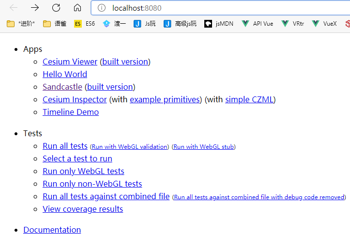

[TOC]

## Cesium 仓库代码

github最近上不去呀, 在gitee中找了个[副本](https://gitee.com/jiang24gdufs/cesium)(版本为1.79.1), 上传到了百度云

clone下来后执行, install, start命令, 打开页面, 参考步骤 [$](http://cesium.xin/wordpress/archives/28.html)



其中文档不知道为何build失败, 最重要的是Sandcastle(沙堡), 其功能为

+ 浏览当前版本的一些功能特性
+ 一个可运行的代码库
+ 新建一个页面，进行代码测试
+ 导出测试代码
+ ...

先浏览一遍沙盒里的所有示例，Cesium能做什么，做成什么样，心里有数
做自己需要的功能时，查找到相关示例代码，弄懂，最好浏览一遍用到的模块的API
如果是深入研究的话，就需要有对WebGL有更深层次的了解
用它做自己感兴趣的项目。。。

> 文档需要先执行 `generateDocumentation` 命令就可以正常访问

## Cesium.Math [api](http://cesium2.marsgis.cn/forcesium/Build/Documentation/Math.html?classFilter=Math)

数值/转换

1. Degrees - 度数
2. Radians - 弧度

- #### Cesium.Math.toDegrees(radians) → Number[Core/Math.js 452](https://github.com/CesiumGS/cesium/blob/1.70/Source/Core/Math.js#L452)

  Converts radians to degrees.

  | Name      | Type   | Description                      |
  | :-------- | :----- | :------------------------------- |
  | `radians` | Number | The angle to convert in radians. |

  ##### Returns:

  The corresponding angle in degrees.

- #### Cesium.Math.toRadians(degrees) → Number[Core/Math.js 438](https://github.com/CesiumGS/cesium/blob/1.70/Source/Core/Math.js#L438)

  Converts degrees to radians.

  | Name      | Type   | Description                      |
  | :-------- | :----- | :------------------------------- |
  | `degrees` | Number | The angle to convert in degrees. |

  ##### Returns:

  The corresponding angle in radians.


## 坐标转换 [cesium 坐标转换](http://www.pingtaimeng.com/article/detail/id/397587)


## input[type=checkbox] 

多选框在鼠标点击获取焦点之后, 键下空格后会切换选中状态

```js
input.addEventListener('keyup', e=>{
	e.code === 'Space' && e.preventDefault();
}, false)
```


## Angular 架构图

Angular 2 应用程序应用主要由以下 8 个部分组成：

- 1、模块 (Modules)
- 2、组件 (Components)
- 3、模板 (Templates)
- 4、元数据 (Metadata)
- 5、数据绑定 (Data Binding)
- 6、指令 (Directives)
- 7、服务 (Services)
- 8、依赖注入 (Dependency Injection)

下图展示了每个部分是如何相互工作的：


- 组件和模板共同定义了 Angular 的视图。
  - 组件类上的装饰器为其添加了元数据，其中包括指向相关模板的指针。
  - 组件模板中的指令和绑定标记会根据程序数据和程序逻辑修改这些视图。
- 依赖注入器会为组件提供一些服务，比如路由器服务就能让你定义如何在视图之间导航。

图中的模板 (Templates)是由 Angular 扩展的 HTML 语法组成，组件 (Components)类用来管理这些模板，应用逻辑部分通过服务 (Services)来完成，然后在模块中打包服务与组件，最后通过引导根模块来启动应用。


### 模块

模块由一块代码组成，可用于执行一个简单的任务。

Angular 应用是由模块化的，它有自己的模块系统：NgModules。

每个 Angular 应该至少要有一个模块(根模块)，一般可以命名为：AppModule。

Angular 模块是一个带有 @NgModule 装饰器的类，它接收一个用来描述模块属性的元数据对象。

几个重要的属性如下：

- **declarations （声明）** - 视图类属于这个模块。 Angular 有三种类型的视图类： 组件 、 指令 和 管道 。
- **exports** - 声明（ declaration ）的子集，可用于其它模块中的组件模板 。
- **imports** - 本模块组件模板中需要由其它导出类的模块。
- **providers** - 服务的创建者。本模块把它们加入全局的服务表中，让它们在应用中的任何部分都可被访问到。
- **bootstrap** - 应用的主视图，称为根组件，它是所有其它应用视图的宿主。只有根模块需要设置 bootstrap 属性中。

一个最简单的根模块:

```ts
// app/app.module.ts 文件：
import { NgModule }      from '@angular/core';
import { BrowserModule } from '@angular/platform-browser';
@NgModule({
  imports:      [ BrowserModule ],
  providers:    [ Logger ],
  declarations: [ AppComponent ],
  exports:      [ AppComponent ],
  bootstrap:    [ AppComponent ]
})
export class AppModule { }
```

接下来我们通过引导根模块来启动应用，开发过程通常在 main.ts 文件中来引导 AppModule ，代码如下：

```ts
// app/main.ts 文件：
import { platformBrowserDynamic } from '@angular/platform-browser-dynamic';
import { AppModule } from './app.module';
 
platformBrowserDynamic().bootstrapModule(AppModule);
```

### 组件(Components)

组件是一个模板的控制类用于处理应用和逻辑页面的视图部分。

组件是构成 Angular 应用的基础和核心，可用于整个应用程序中。

组件知道如何渲染自己及配置依赖注入。

组件通过一些由属性和方法组成的 API 与视图交互。

创建 Angular 组件的方法有三步：

- 从 @angular/core 中引入 Component 修饰器
- 建立一个普通的类，并用 @Component 修饰它
- 在 @Component 中，设置 selector **自定义标签**，以及 template **模板**

------

### 模板(Templates)

Angular模板的默认语言就是HTML。

我们可以通过使用模板来定义组件的视图来告诉 Angular 如何显示组件。以下是一个简单是实例：

```
<div>
网站地址 : {{site}}
</div>
```

在Angular中，默认使用的是双大括号作为插值语法，大括号中间的值通常是一个组件属性的变量名。

------

### 元数据(Metadata)

元数据告诉 Angular 如何处理一个类。

考虑以下情况我们有一个组件叫作 Component ，它是一个类，直到我们告诉 Angular 这是一个组件为止。

你可以把元数据附加到这个类上来告诉 Angular Component 是一个组件。

在 TypeScript 中，我们用 装饰器 (decorator) 来附加元数据。

```ts
@Component({
   selector : 'mylist',
   template : '<h2>菜鸟教程</h2>'
   directives : [ComponentDetails]
})
export class ListComponent{...}
```

@Component 装饰器能接受一个配置对象，并把紧随其后的类标记成了组件类。

Angular 会基于这些信息创建和展示组件及其视图。

@Component 中的配置项说明：

- **selector** - 一个 css 选择器，它告诉 Angular 在 父级 HTML 中寻找一个 `<mylist>` 标签，然后创建该组件，并插入此标签中。
- **templateUrl** - 组件 HTML 模板的地址。
- **directives** - 一个数组，包含 此 模板需要依赖的组件或指令。
- **providers** - 一个数组，包含组件所依赖的服务所需要的依赖注入提供者。 (也可以通过构造函数的参数传入给组件需要的服务)

------

### 数据绑定(Data binding)

数据绑定为应用程序提供了一种简单而一致的方法来显示数据以及数据交互，它是管理应用程序里面数值的一种机制。

通过这种机制，可以从HTML里面取值和赋值，使得数据的读写，数据的持久化操作变得更加简单快捷。

如图所示，数据绑定的语法有四种形式。每种形式都有一个方向——从 DOM 来、到 DOM 去、双向，就像图中的箭头所示意的。


- **插值** : 在 HTML 标签中显示组件值。

  ```
  <h3>
  {{title}}
  
  </h3>
  ```

- **属性绑定**: 把元素的属性设置为组件中属性的值。

  ```
  
  ```

- **事件绑定**: 在组件方法名被点击时触发。

  ```
  <button (click)="onSave()">保存</button>
  ```

- **双向绑**: 使用Angular里的NgModel指令可以更便捷的进行双向绑定。

  ```html
  <input [value]="currentUser.firstName"
         (input)="currentUser.firstName=$event.target.value" >
  ```

- **组件双向绑定 [Angular - 双向绑定](https://angular.cn/guide/two-way-binding)**

  双向绑定为应用中的组件提供了一种共享数据的方式。使用双向绑定绑定来侦听事件并在父组件和子组件之间同步更新值。

  

------

### 指令（Directives）

Angular模板是动态的 。当 Angular 渲染它们时，它会根据指令对 DOM 进行修改。

指令是一个带有"指令元数据"的类。在 TypeScript 中，要通过 @Directive 装饰器把元数据附加到类上。

在Angular中包含以下三种类型的指令：

- 属性指令：以元素的属性形式来使用的指令。
- 结构指令：用来改变DOM树的结构
- 组件：作为指令的一个重要子类，组件本质上可以看作是一个带有模板的指令。

```
<li *ngFor="let site of sites"></li>
<site-detail *ngIf="selectedSite"></site-detail>
```

*ngFor 告诉 Angular 为 sites 列表中的每个项生成一个 `<li>` 标签。

*ngIf 表示只有在选择的项存在时，才会包含 SiteDetail 组件。

------

### 服务(Services)

Angular2中的服务是封装了某一特定功能，并且可以通过注入的方式供他人使用的独立模块。

服务分为很多种，包括：值、函数，以及应用所需的特性。

例如，多个组件中出现了重复代码时，把重复代码提取到服务中实现代码复用。

以下是几种常见的服务：

- 日志服务
- 数据服务
- 消息总线
- 税款计算器
- 应用程序配置

以下实例是一个日志服务，用于把日志记录到浏览器的控制台：

```
export class Logger {
  log(msg: any)   { console.log(msg); }
  error(msg: any) { console.error(msg); }
  warn(msg: any)  { console.warn(msg); }
}
```

------

### 依赖注入

> 控制反转（Inversion of Control，缩写为IoC），是面向对象编程中的一种设计原则，可以用来减低计算机代码之间的耦合度。其中最常见的方式叫做依赖注入（Dependency Injection，简称DI），还有一种方式叫"依赖查找"（Dependency Lookup）。
>
> 通过控制反转，对象在被创建的时候，由一个调控系统内所有对象的外界实体，将其所依赖的对象的引用传递给它。也可以说，依赖被注入到对象中。
>
> 在传统的开发模式中，调用者负责管理所有对象的依赖，循环依赖一直是梦魇，而在依赖注入模式中，这个管理权交给了注入器(Injector)，它在软件运行时负责依赖对象的替换，而不是在编译时。这种控制反转，运行注入的特点即是依赖注入的精华所在。

Angular 能通过查看构造函数的参数类型，来得知组件需要哪些服务。 例如， SiteListComponent 组件的构造函数需要一个 SiteService:

```
constructor(private service: SiteService) { }
```

当 Angular 创建组件时，会首先为组件所需的服务找一个注入器（ Injector ） 。

注入器是一个维护服务实例的容器，存放着以前创建的实例。

如果容器中还没有所请求的服务实例，注入器就会创建一个服务实例，并且添加到容器中，然后把这个服务返回给 Angular 。

当所有的服务都被解析完并返回时， Angular 会以这些服务为参数去调用组件的构造函数。 这就是依赖注入 。


## [NgModule 简介](https://angular.cn/guide/architecture-modules)

Angular 应用是模块化的，它拥有自己的模块化系统，称作 *NgModule*。 

一个 NgModule 就是一个容器，用于存放一些内聚的代码块，这些代码块专注于某个应用领域、某个工作流或一组紧密相关的功能。 

它可以包含一些组件、服务提供者或其它代码文件，其作用域由包含它们的 NgModule 定义。 

它还可以导入一些由其它模块中导出的功能，并导出一些指定的功能供其它 NgModule 使用。

每个 Angular 应用都至少有一个 NgModule 类，也就是[根模块](https://angular.cn/guide/bootstrapping)，它习惯上命名为 `AppModule`，并位于一个名叫 `app.module.ts` 的文件中。*引导*  *bootstrapping* 这个根模块就可以启动你的应用。

虽然小型的应用可能只有一个 NgModule，不过大多数应用都会有很多*特性模块*。

应用的*根模块*之所以叫根模块，是因为它可以包含任意深度的层次化子模块。

### `@NgModule` 元数据

NgModule 是一个带有 `@NgModule()` 装饰器的类。

`@NgModule()` 装饰器是一个函数，它接受一个元数据对象，该对象的属性用来描述这个模块。

其中最重要的属性如下:

- `declarations`（可声明对象表） —— 那些属于本 NgModule 的[组件](https://angular.cn/guide/architecture-components)、指令、管道。
- `exports`（导出表） —— 那些能在其它模块的*组件模板*中使用的可声明对象的子集。
- `imports`（导入表） —— 那些导出了**本**模块中的组件模板所需的类的其它模块。
- `providers` —— 本模块向全局服务中贡献的那些[服务](https://angular.cn/guide/architecture-services)的创建器。 这些服务能被本应用中的任何部分使用。（你也可以在组件级别指定服务提供者，这通常是首选方式。）
- `bootstrap` —— 应用的主视图，称为根组件。它是应用中所有其它视图的宿主。(只有根模块才应该设置这个 `bootstrap` 属性)。

下面是一个简单的根 NgModule 定义：

```ts
// src/app/app.module.ts
import { NgModule } from '@angular/core';
import { BrowserModule } from '@angular/platform-browser';
@NgModule({
  imports:      [ BrowserModule ],
  providers:    [ Logger ],
  declarations: [ AppComponent ],
  exports:      [ AppComponent ],
  bootstrap:    [ AppComponent ]
})
export class AppModule { } 
// 把 AppComponent 放到 exports 中是为了演示导出的语法，这在本例子中实际上是没必要的。 
// 根模块没有任何理由导出任何东西，因为其它模块永远不需要导入根模块。
```

### 示例: ng统一引入模块

```ts
// sub-view.module.ts
import { ZorroAntModule } from '@app/zorro-ant.module';
import { DragDropModule } from '@angular/cdk/drag-drop';

import { ProfileComponent } from './profile/profile.component';
import { EchartComponent } from './profile/echartDialog/echart.component';

@NgModule({
    declarations: [
        // 自定义模块
        ProfileComponent,
        EchartComponent
    ],
    imports: [
        // 自定义模块引入的模块 (库)
        ZorroAntModule,
    	DragDropModule,
    ]
})
```

NgModule 是一个带有 `@NgModule()` 装饰器的类。`@NgModule()` 装饰器是一个函数，它接受一个元数据对象，该对象的属性用来描述这个模块。其中最重要的属性如下。

- `declarations`（可声明对象表） —— 那些属于本 NgModule 的[组件](https://angular.cn/guide/architecture-components)、指令、管道。
- `exports`（导出表） —— 那些能在其它模块的组件模板中使用的可声明对象的子集。
- `imports`（导入表） —— 那些导出了本模块中的组件模板所需的类的其它模块。
- `providers` —— 本模块向全局服务中贡献的那些[服务](https://angular.cn/guide/architecture-services)的创建器。 这些服务能被本应用中的任何部分使用。（你也可以在组件级别指定服务提供者，这通常是首选方式。）
- `bootstrap` —— 应用的主视图，称为*根组件*。它是应用中所有其它视图的宿主。只有根模块才应该设置这个 `bootstrap` 属性。


### NgModule 和组件

NgModule 为其中的组件提供了一个**编译上下文环境**。

根模块总会有一个根组件，并在引导期间创建它。 但是，任何模块都能包含任意数量的其它组件，这些组件可以通过路由器加载，也可以通过模板创建。

那些属于这个 NgModule 的组件会**共享同一个编译上下文环境**。


组件及其模板共同定义**视图**。组件还可以包含**视图层次结构**，它能让你定义任意复杂的屏幕区域，可以将其作为一个整体进行创建、修改和销毁。 

一个视图层次结构中可以混合使用由不同 NgModule 中的组件定义的视图。 

这种情况很常见，特别是对一些 UI 库来说。


当你创建一个组件时，它直接与一个叫做**宿主视图**的视图关联起来。

宿主视图可以是视图层次结构的根，该视图层次结构可以包含一些**内嵌视图**，这些内嵌视图又是其它组件的宿主视图。 

这些组件可以位于相同的 NgModule 中，也可以从其它 NgModule 中导入。 树中的视图可以嵌套到任意深度。

视图的这种层次结构是 Angular 在 DOM 和应用数据中检测与响应变更时的关键因素。

### NgModule 和 JavaScript 的模块

NgModule 系统与 JavaScript（ES2015）用来管理 JavaScript 对象的模块系统不同，而且也没有直接关联。 

这两种模块系统不同但**互补**。你可以使用它们来共同编写你的应用。


## NgModule - decorator [*link*](https://angular.cn/api/core/NgModule#ngmodule)

把一个类标记为 NgModule，并提供配置元数据。

| 选项                                                         | 说明                                                         |
| :----------------------------------------------------------- | :----------------------------------------------------------- |
| [`providers?`](https://angular.cn/api/core/NgModule#providers) | 在当前模块的注入器中可用的一组可注入对象。                   |
| [`declarations?`](https://angular.cn/api/core/NgModule#declarations) | 属于该模块的一组组件、指令和管道（统称[可声明对象](https://angular.cn/guide/glossary#declarable)）。 |
| [`imports?`](https://angular.cn/api/core/NgModule#imports)   | 这里列出的 NgModule 所**导出**的[可声明对象](https://angular.cn/guide/glossary#declarable)可用在当前模块内的模板中。 |
| [`exports?`](https://angular.cn/api/core/NgModule#exports)   | 此 NgModule 中声明的一组组件、指令和管道可以在**导入**了本模块的模块下任何组件的模板中使用。 导出的这些可声明对象就是该模块的公共 API。 |
| [`entryComponents?`](https://angular.cn/api/core/NgModule#entryComponents) | 定义此 NgModule 中要编译的组件集，这样它们才可以动态加载到视图中。 |
| [`bootstrap?`](https://angular.cn/api/core/NgModule#bootstrap) | 当该模块引导时需要进行引导的组件。列在这里的所有组件都会自动添加到 `entryComponents` 中。 |
| [`schemas?`](https://angular.cn/api/core/NgModule#schemas)   | 该 NgModule 中允许使用的声明元素的 schema（HTML 架构）。 元素和属性（无论是 Angular 组件还是指令）都必须声明在 schema 中。 |
| [`id?`](https://angular.cn/api/core/NgModule#id)             | 当前 NgModule 在 `getModuleFactory` 中的名字或唯一标识符。 如果为 `undefined`，则该模块不会被注册进 `getModuleFactory` 中。 |
| [`jit?`](https://angular.cn/api/core/NgModule#jit)           | 如果存在，则该指令/组件将被 AOT 编译器忽略。它会保留在发布代码中，并且 JIT 编译器会尝试在运行时在浏览器中对其进行编译。为了确保其行为正确，该应用程序必须导入 `@angular/compiler` 。 |

以下是本人使用Angular后对此元数据属性个人口语化的理解

**providers**：将本模块所有在组件中注入的服务，在这里提前定义好，否则在此模块中使用这个服务会有错误提示。

**declaration**：在这里声明一些模块中要使用到的一些组件，指令，管道等。

**imports**：导入一些模块，比如说我把所有的指令构成一个模块 我使用其中某些指令的时候，我可以选择导入整个指令模块。也可以导入一些通过npm install 安装的一些模块导入其中，才可以使用。

**exports**：导出组件or指令管道等，以供引用此模块的模块可以使用此模块的组件or 指令管道等。

**exporyComponents**：entry component 表示 angular 的入口组件，可以引导组件是一个入口组件，Angular 会在引导过程中把它加载到 DOM 中。 其它入口组件是在其它时机动态加载的。字面上的意义，但是啥时候用呢，比如，我要弹出一个组件，那么这个组件是要动态加载到DOM中了吧，这个时候就需要将这个组件xxxComponent写上了。

**bootstrap**:这个模块启动的时候应该启动的组件，上面代码可以看到AppModule是作为根模块的启动组件。

**schemas**：不属于Angular的组件或者指令的元素或者属性都需要在这里进行声明。


### providers 

```ts
providers?: Provider[]
```

在这里列出了提供者的依赖项可用于注入到任何组件、指令、管道或该注入器下的服务。 

引导用的 NgModule 使用的是根注入器，可以为应用中的任何部件提供依赖。

惰性加载的模块有自己的注入器，通常它是根注入器的一个子注入器。 

惰性加载的服务，其作用范围局限于这个惰性加载模块的注入器。

如果惰性加载模块也提供了 `UserService`，则任何在该模块的上下文中创建的组件（比如通过路由导航）都会获得该服务的一个局部实例， 而不是根注入器中的全局实例。 

而外部模块中的组件仍然会使用由它们的注入器提供的实例。

#### 范例

下面的例子定义了一个类，它被注册在 HelloWorld 这个 NgModule 的注入器下：

```ts
class Greeter {   
    greet(name:string) {     return 'Hello ' + name + '!';   } 
} 
@NgModule({  
    providers: [    Greeter  ] }) 
class HelloWorld {  
    greeter:Greeter;   // 使用了 providers 注入的 Greeter
    constructor(greeter:Greeter) {    this.greeter = greeter;  } }
```


### declaration(声明)

```ts
declarations?: Array<Type<any> | any[]>
```

在模板中可用的选择器（selector）包括那些直接声明在这里的可声明对象和导入的那些 NgModule 中所导出的可声明对象。

可声明对象必须属于也只能属于一个模块。 如果你尝试把同一个类声明在多个模块中，那么编译器就会报错。 要注意不能声明那些从其它模块中导入的类 (不能重复的意思)。

#### 范例

下面的例子允许 CommonModule 使用 `NgFor` 指令。

```ts
@NgModule({  
    declarations: [NgFor] }) 
class CommonModule { }
```


### imports(导入)

```ts
imports?: Array<Type<any> | ModuleWithProviders<{}> | any[]>
```

模板可以使用来自任何导入模块中所导出的可声明对象，包括它们从别的模块导入后重新导出的。

 	例如，`ModuleA` 导入了 `ModuleB` 并导出了它 (**导入并导出的意思是?**)，就会让 `ModuleB` 中的可声明对象也同样在那些导入了 `ModuleA` 的模块中可用。 (有一种借用能力的意思) 

#### 范例

下列例子允许 `MainModule` 使用 `CommonModule` 中导入的任意可声明对象：

```ts
@NgModule({  
    imports: [CommonModule] }) 
class MainModule { }
```


### bootstrap

```ts
bootstrap?: Array<Type<any> | any[]>
```


# Angular 的 NgModule 是为了解决什么问题？ [知乎](https://www.zhihu.com/question/376817427)

