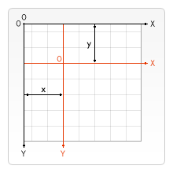

## general toolbar 

cdkDropList

`import { CdkDragDrop, moveItemInArray } from '@angular/cdk/drag-drop';`

CDK (Component Dev Kit.) [@angular/cdk](https://www.npmjs.com/package/@angular/cdk)

`@angular/cdk` ---- Library that helps you author custom UI components with common interaction patterns (帮助您创作具有通用交互功能的自定义UI组件的库)  [Docs](https://material.angular.io/cdk/categories) ~ 文档兼容各个版本


## 快速识别组件

可以通过 标签名来匹配 @component 装饰器中的选择器


## web3d 安装部署


## [CanvasRenderingContext2D](https://www.canvasapi.cn/CanvasRenderingContext2D)

属性

方法

## [CanvasRenderingContext2D.transform()](https://www.canvasapi.cn/CanvasRenderingContext2D/translate)

方法可以对Canvas坐标系进行整体位移，实际开发常用来改变其它变换方法的变换中心点。黑色为原始坐标系，红色为移动后的坐标系。



关联的其他方法: rotate()

CanvasRenderingContext2D.rotate() 给Canvas画布添加旋转矩阵, 顺时针方向，单位是弧度。

默认**旋转中心点**是Canvas的左上角(0, 0)坐标点


上图是旋转中心点为左上角, 下图进行了translate坐标移位后再旋转 

## [CanvasRenderingContext2D.scale()](https://www.canvasapi.cn/CanvasRenderingContext2D/scale#&introduction)

CanvasRenderingContext2D.scale()用来缩放Canvas画布的坐标系，只是影响坐标系，之后的绘制会受此方法影响，但之前已经绘制好的效果不会有任何变化。

`context.scale(x, y);`

x: Number ~ Canvas坐标系水平缩放的比例。支持小数，如果值是-1，表示水平翻转。
y: Number ~ Canvas坐标系垂直缩放的比例。支持小数，如果值是-1，表示垂直翻转。


## [Math_mdn](https://developer.mozilla.org/zh-CN/docs/Web/JavaScript/Reference/Global_Objects/Math)


### [Math.hypot](https://developer.mozilla.org/zh-CN/docs/Web/JavaScript/Reference/Global_Objects/Math/hypot)

`Math.hypot()` 函数返回所有参数的平方和的平方根, 比 `Math.sqrt()` 更简单也更快，还避免了幅值过大的问题。

Hypotenuse ~ 意为: 斜边


## HTML 引入js模块的方法

```html
<script type="module">
import A from './a.js';

</script>
```

必须是相对路径, 不能以file形式打开html;


## 喜丧

人在死亡面前是很渺小的，极限寿命也不过一百岁左右，能够达到这个极限的人，寥寥无几。

八十岁是大多数人比较容易达到的，接近极限的年纪。

而人事无常，还有很多人，他们在儿童少年时、青壮年时、甚至刚到中年，便已早早死去，他们是不幸的，相比他们，能够活到六七十岁已经很不容易，八十岁就算是高寿了，是十分幸运的事。

但死亡是悲哀的，没有人能逃过死亡，更无力抗衡这种悲哀。

既然死亡的悲哀不可抗拒，那就喜乐接受它的到来，在死亡的悲哀和高寿的幸运中，我们选择了把高寿的幸运留下来，称作喜丧，这是中国人礼赞生命的最高智慧。
