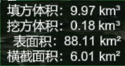

[TOC]

## 接入 smart3d 新功能

替换node_modules/smart3d模块

方量分析功能概况: 填平区域范围内的地形(有高于平面挖方, 低于平面的填方) [竞品](http://cesium.marsgis.cn/cesium-example/editor.html#62_measure_volume)

~ 文档

~ smart3d.d.ts, 要把接口的内容完整的copy到 smart3d 声明文件中呀, 挺麻烦的, ~ 这个是smart3d中配套API的声明文件, 一般不是由应用小组来修改, 发布cdk时已经包含

~ service

具体应用层面的优化

1. 绘制线条 (海拔 ~ 转换) ~ 添加标注 ~ 直线/测量 (由API增加外墙的outline, 而不是动态计算[存在误差])

2. 绘制顶面 (海拔 ~ 转换) ~ 添加标注 ~ 不规则面 ~ 跟MaxHeight动态 (可能需要新建一个图层) ~ 由API增加该功能

3. 柱面高度 动态更改 ~ API? (增加点选) ~ 最高点/最低点/自定义(点选)作为基准面

4. 获取海拔, 填充label ~ 测量 ~ 高度测量

5. 结果展示

6.  思考API的不足

7. 补充: 

   1. 添加label图层  (ok)

      ```js
      this.layer = this.viewer.entities.add(new Cesium.EntityCollection());
      this.layer.entityCollection.add({ // 添加点并设置样式
            position: cartesian,
            point: {
              pixelSize: this.nodePixel,
              color: Cesium.Color.YELLOW.withAlpha(0.9),
              disableDepthTestDistance: 1000000,
            },
          });
      ```

   2. 取点 作为基准面高度 (ok)
   
   3. 绘制时如果只绘制两个点而不成面, 就会有交互上的问题 ~ 参考测量 ~ 面积
   
   4. 绘制结果能透视到底边, 底边需要清除, 清除的是画区域的
   
   5. 右键删除?
   
      
   
   

方量分析API 需要修改的部分:

1. 柱面高度与基准面的高度一直 (动态设置高度或者调用某个API的方法能够同步)
2. 几何模型增加外墙outline (也需要保持高度一致)
3. cdk demo 需要使用上你开放的配置项, 

### 绘制棱

取点 ~ [最高点 (or 基准面)] ~ 计算棱长 ~ 单位换算 ~ 获取垂直方向上的点 ~ 两点成线 

1. 两点成线  ----  (`measure.service.ts ~ addLine() #1099` )
2. 笛卡尔坐标转成{经纬度, 高度} ---- (`measure.service.ts ~ getHeight() #569` )
3. 经纬度转换成笛卡尔坐标 `degreesToCartesian (封装的) ~ Cesium.Cartesian3.fromDegrees(lng, lat, height, ellipsoid, result)(原始API) `
4. 

**绘制事件钩子**

1. #### activeEvent ---- 激活绘制事件

2. #### anchorEvent ---- 锚点事件监听，当在绘制线、面时候才起作用

3. #### drewEvent ---- 绘制结束事件

   当绘制模式是 DrawMode.Point 时，返回绘制点和点图元 (`Cartesian3`, `PointPrimitive`)
   当绘制模式是 DrawMode.Line 时，返回绘制点集合和线图元 ([`Cartesian3`, ...], `Primitive` || `GroundPolylinePrimitive`)
   当绘制模式是 DrawMode.Polygon 时，返回绘制点集合和面图元 ([`Cartesian3`, ...], `Primitive` || `GroundPrimitive`)
   当绘制模式是 DrawMode.Point 时，返回绘制点和Billboard (`Cartesian3`, `Billboard`)

4. #### movingEvent ---- 鼠标滑动事件监听，当在绘制线、面时候才起作用

**量测事件钩子**

1. #### activeEvent

2. #### measuredEvent ---- 量测结束事件

   当量测模式是 MeasureMode.Distance 时，返回距离和绘制点 (distance, [point1, point2])
   当量测模式是 MeasureMode.Area 时，返回面积和绘制点 (area, [point1, ...])
   当量测模式是 MeasureMode.DVH 时，返回结果和绘制点 ({distance, horizontal, vertical}, [point1, ...])
   当量测模式是 MeasureMode.Angle 时，返回角度和绘制点 (angle, [point1, ...])

3. 因为内部依赖了绘制事件作为其属性, 也同样可以访问事件钩子

   ```js
   const mh = new MeasureHandler({ /* ... */});
   mh.drawHandler.anchorEvent.addEventListener(result=>{})
   ```

   

## 绘制几何模型控制显示隐藏


## 动态label 



label [Label - Cesium Documentation](https://cesium.com/docs/cesiumjs-ref-doc/Label.html?classFilter=label), 左对齐, + 3个 `\t` 能使表面积后面的冒号对齐


修改label.text更改文本 `entity.label.text._value`

修改position.value更改定位信息 `entity.position._value`

值类型:

addLabel (cartesian)

this.cutOrFillControl._center ~ `Cartographic`

updated(center) ~ `Cartesian3 `

注意坐标转换

```js
const nCarto = cloneDeep(this.cutOrFillControl._center);
nCarto.height = this.cutOrFillControl.datumHeight;

this.resultLabel.position._value = Cesium.Cartographic.toCartesian(nCarto);
```


## 注意节奏

刘恽伟 3-22 14:46:09
你要先给高燕确定好，看要做哪些功能，然后再分析我们API需要提供什么，我觉得这样才是最可行的

刘恽伟 3-22 14:46:37
而不是先做API，再做功能，功能做出来了再重新设计 然后又重新改API


最基础的是知道自己能做到哪一步

哪一步可以抽离成API

再分析如果联调
