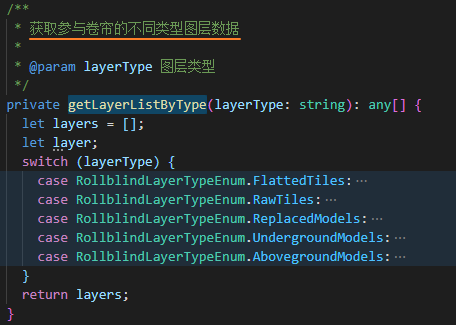
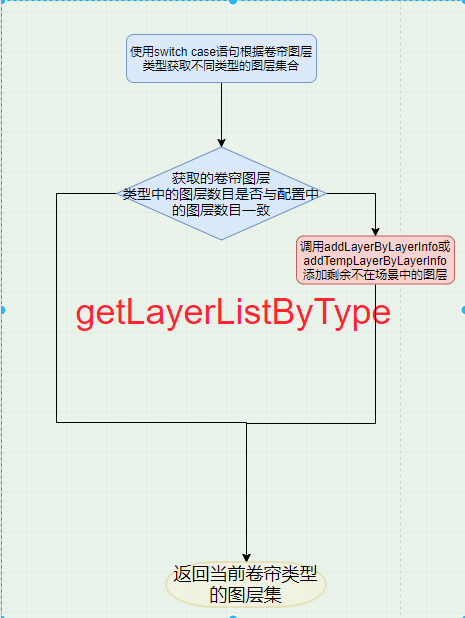
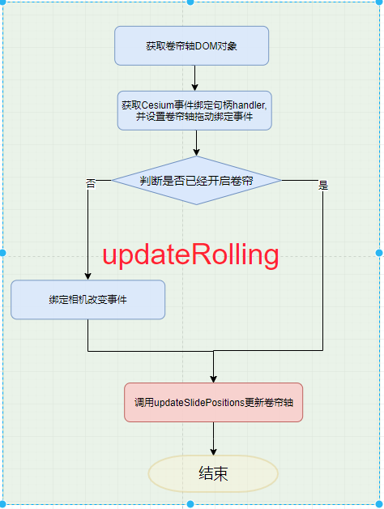
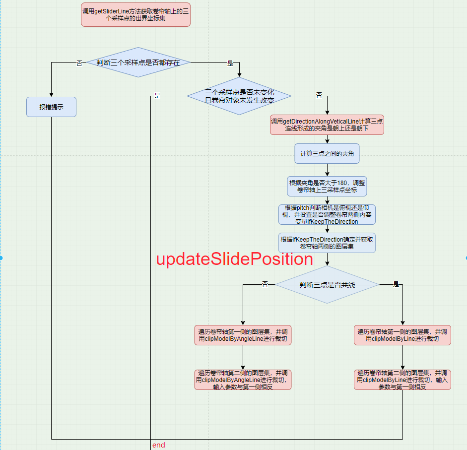
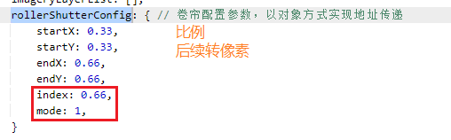
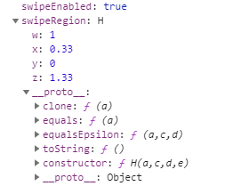
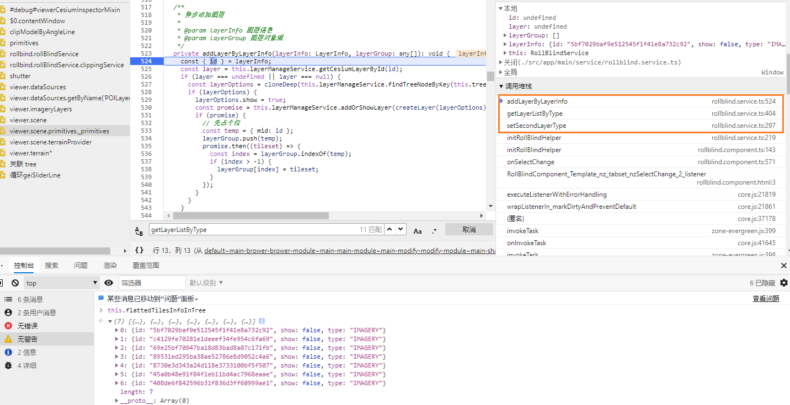
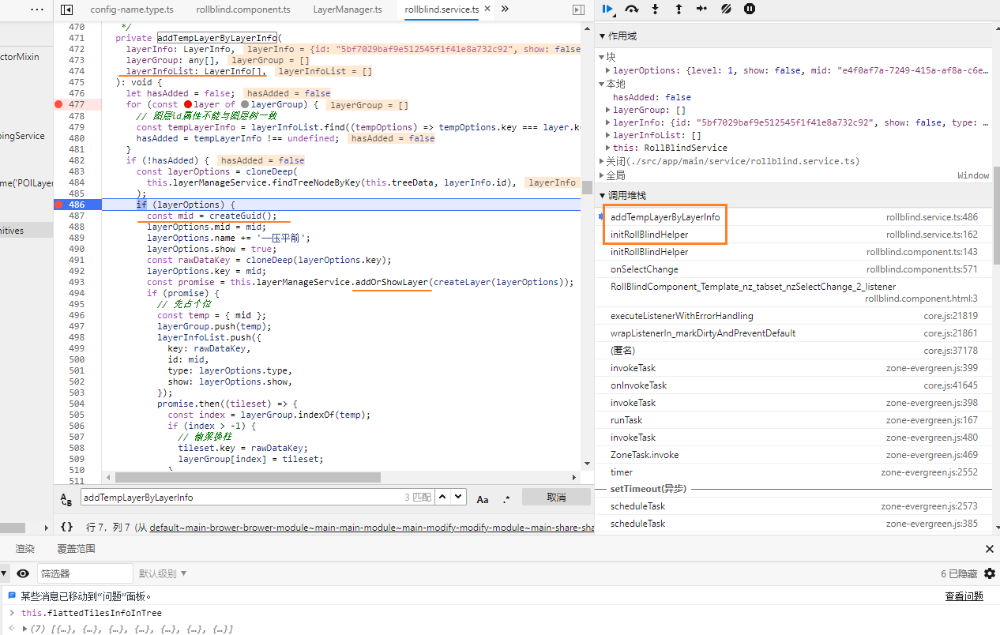

[TOC]

## 卷帘模式

rollbind

rollblind-data-config.component

`rollblind.service`

slider 分割线位于 `app-map` 组件下 ~ smart3d.viewer ~ (是走document.createElement创建的 `createSlider~rollbind.component.ts`) ~ append进了`viewer.container`

`updateRolling => updateSlidePositions ~ rollbind.service` 事件 **核心流程**

`Cesium.ScreenSpaceEventHandler` Cesium的事件监听

`Cesium.ScreenSpaceEventType` 事件类型 ~ 枚举类型


卷帘核心逻辑分两步:

1. 读取配置并初始化
   1. 加入图层
2. 拖动交互更新边界


[交接文档](./卷帘模式.docx)

使用[迅捷画图](https://www.liuchengtu.com/lct/#Xec26036d04a7e912dc904ce22298001b) 打开 [流程图_xsd](./功能流程图-卷帘模式.xsd)

(不过这个在线软件只能看, 不充60块钱不能用的舒服)


`基础功能 ---- getLayerListByType`





可以通过观察 `viewer.scene.primitives._primitives.map(p=>`${p.id}-${p.name}-${p.type}`)` 来判断是否有正确添加到场景中

updateRolling 逻辑示意图: 





`getDirectionAlongVeticalLine` 就是求三点的递增还是递减来判断方向


## 增加的标绘与底图卷帘

主要是通过id检索到对应的图层然后处理吧...


### ScreenSpaceEventType.Members

| Name                | Type   | Description                                                  |
| :------------------ | :----- | :----------------------------------------------------------- |
| `LEFT_DOWN`         | Number | [左键按下]Represents a mouse left button down event.         |
| `LEFT_UP`           | Number | [左键弹起]Represents a mouse left button up event.           |
| `LEFT_CLICK`        | Number | [左键单击]Represents a mouse left click event.               |
| `LEFT_DOUBLE_CLICK` | Number | [左键双击]Represents a mouse left double click event.        |
| `RIGHT_DOWN`        | Number | Represents a mouse left button down event.                   |
| `RIGHT_UP`          | Number | Represents a mouse right button up event.                    |
| `RIGHT_CLICK`       | Number | Represents a mouse right click event.                        |
| `MIDDLE_DOWN`       | Number | Represents a mouse middle button down event.                 |
| `MIDDLE_UP`         | Number | Represents a mouse middle button up event.                   |
| `MIDDLE_CLICK`      | Number | Represents a mouse middle click event.                       |
| `MOUSE_MOVE`        | Number | [鼠标移动]Represents a mouse move event.                     |
| `WHEEL`             | Number | Represents a mouse wheel event.                              |
| `PINCH_START`       | Number | [在触摸面上发生两指事件的开始]Represents the start of a two-finger event on a touch surface. |
| `PINCH_END`         | Number | [两指事件在触摸面上的结束]Represents the end of a two-finger event on a touch surface. |
| `PINCH_MOVE`        | Number | [触摸表面上两指事件的变化]Represents a change of a two-finger event on a touch surface. |


使用了三种: 

1. LEFT_DOWN === PINCH_START ~~ SliderMove -- 控制标志位开启
2. LEFT_UP === PINCH_END ~~ SliderStopMove -- 控制标志位关闭
3. MOUSE_MOVE === PINCH_MOVE ~~ ModelMove -- 更新 #826 ~ 不断触发 ~ 未节流/防抖

```js
{	// move 的传参
    endPosition: Cartesian2 {x: 9, y: 144}
    startPosition: Cartesian2 {x: 4, y: 224}
}
```

回调函数一般会传入**触发前后的坐标(向量)**, 只有一个坐标的事件那只有一个点了

该笛卡尔坐标不确定是基于什么来判断的

​	---- 确定以DOM元素盒子作为坐标系 [10 * 881]

​	 X = [-0.25, 9.75] / [-0.75, 9.25] ---- 负值从何而来?


## 核心功能

1. 两侧图层加载
2. 更新图层边界 

`updateSlidePositions`  => <u>逐像素更改?</u>


---- 参考超图提供的源码思路 [rollerShutter](http://support.supermap.com.cn:8090/webgl/examples/webgl/editor.html#rollerShutter) `图层-layerList` ~ 

```js
watch: this.setRollerShutterSplit(this.viewer.scene, this.rollerShutterConfig);
```

(超图用于计算自定义分隔框)

`Layer.swipeEnabled = new Cesium.Rectangle()`; 控制可视范围



### 补充可以简化/优化的部分

1. 分界线可以只有一个元素, 不必要父子
2. 拖动的跟随效果不佳, move 事件是否可以使用节流, 事件绑定/解绑是否重复, Event - Map 简化
3. 纪录图层前后显示状态的处理可以抽离成一个函数 `getCesiumLayerById 这一块`
4. `LayerManager.ts getInstance(Layer)` 如果layer.id === undefined, 依然可以匹配; **使用`import { createLayer } from '../libs/Layer';`来包裹一下layerOption**可以减替换成正确的参数
5. updateRolling 中的事件解绑没有正确获取函数的索引值

6. 退出后没有正确remove添加的layer

   1. #493/161  getLayerListByType/setFirstLayerType 添加倾斜数据

      ```js
      for (const layerInfo of this.flattedTilesInfoInTree) {
          this.addTempLayerByLayerInfo(layerInfo, this.rawTiles, this.tempTilesLayerInfoList);
      }
      ```

      

      `this.layerManageService.addOrShowLayer(createLayer(layerOptions));`

   2. #404 flattedTilesInfoInTree 添加压平数据

      `this.addLayerByLayerInfo(layerInfo, this.flattedTiles);`

      

      

   3. destroy 清除了什么数据

      1. #327 删除临时图层 -》压平前倾斜

         ```js
         for (const tiledLayerInfo of this.tempTilesLayerInfoList) {
             this.layerManageService.removeLayerById(tiledLayerInfo.id);
         }
         ```

         

      2. clear 时仅设置了隐藏, 我更改为了Remove


## new smart3d.Viewer(container, options) [_cdk_](http://172.16.11.220:8011/smartmap/smart3d/#/api)

场景视图，继承于cesiumjs的[Viewer](http://southsmart.com/smartmap/smart3d/cesiumdoc/Viewer.html)类，保留下viewer一些属性和方法

