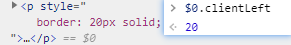
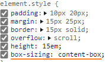
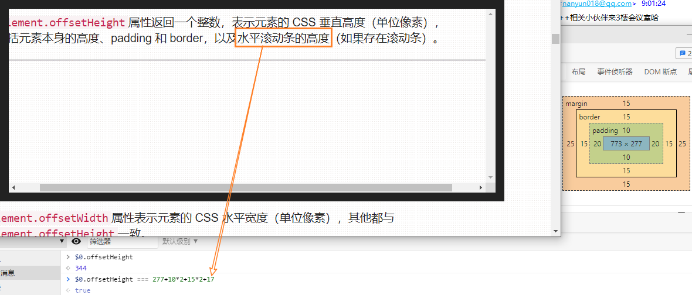
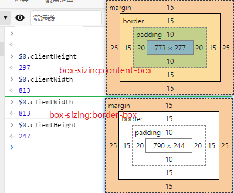

## Element.xxxLeft/xxxTop

**offsetLeft**

`Element.offsetLeft`返回当前元素左上角相对于`Element.offsetParent`节点的水平位移，`Element.offsetTop`返回垂直位移，单位为像素。通常，这两个值是指**相对于父节点的位移**。

​	`Element.offsetParent`属性返回最靠近当前元素的、并且 CSS 的`position`属性不等于`static`的上层元素。

**clientLeft**

`Element.clientLeft`属性等于元素节点左边框（left border）的宽度（单位像素）; 

​	`Element.clientLeft` 返回上边框的宽度

如果没有设置左边框，或者是行内元素（`display: inline`），该属性返回`0`。该属性总是返回整数值，如果是小数，会四舍五入。



**scrollLeft**

滚动条

## Element.xxxWidth/xxxHeight

**offsetWidth/offsetHeight** [readonly]

`Element.offsetHeight`属性返回一个整数，表示元素的 **CSS 垂直高度（单位像素）**，包括元素<u>本身的高度、padding 和 border，以及水平滚动条的高度</u>（如果存在滚动条）。

> 受 box-sizing 属性影响, CSS中设置的height不一定等于offsetHeight,(如果box-sizing设置为border-box则值与height属性的计算值一致)
>
> content-box则上述计算一致

`Element.offsetWidth`属性表示元素的 CSS 水平宽度（单位像素），其他都与`Element.offsetHeight`一致。

如果元素的 CSS 设为不可见（比如`display: none;`），则返回`0`。





**clientWidth/clientHeight**

`Element.clientWidth`属性返回元素节点的 CSS 宽度，**只对块级元素有效**，只包括元素<u>本身的宽度和`padding`</u> (不包括`border`、`margin`)，如果有垂直滚动条，还要减去垂直滚动条的宽度。这个值始终是整数，如果是小数会被四舍五入。

`Element.clientHeight`属性返回一个整数值，表示元素节点的 CSS 高度（单位像素），只对块级元素生效，对于<u>行内元素返回`0`</u>。如果块级元素没有设置 CSS 高度，则返回实际高度。



> `document.documentElement`的`clientHeight`属性，返回当前视口的高度（即浏览器窗口的高度），等同于`window.innerHeight`属性减去水平滚动条的高度（如果有的话）。
>
> `document.body`的高度则是网页的实际高度。
>
> 一般来说，`document.body.clientHeight`大于`document.documentElement.clientHeight`。

----

`Element.offsetHeight`和`Element.offsetWidth` 只比`Element.clientHeight`和`Element.clientWidth`多了边框的高度或宽度。

**scrollWidth/scrollHeight** [readonly]

`Element.scrollHeight`属性返回一个整数值（小数会四舍五入），表示当前元素的总高度（单位像素），包括溢出容器、当前不可见的部分。

它<u>包括`padding`</u>，但是<u>不包括`border`、`margin`以及水平滚动条</u>的高度（如果有水平滚动条的话），还<u>包括伪元素（`::before`或`::after`）的高度</u>。

`Element.scrollWidth`属性表示当前元素的总宽度（单位像素），其他地方都与`scrollHeight`属性类似。这两个属性只读。

```js
// 返回网页的总高度
document.documentElement.scrollHeight
document.body.scrollHeight
document.body.clientHeight
// 视口高度
document.documentElement.clientHeight
```


## 插件 git history--Available Commands

- View Git History (git log) (git.`viewHistory`)
- View File History (git.`viewFileHistory`)
- View Line History (git.`viewLineHistory`)


## BoundingRectangle [$](https://cesium.com/docs/cesiumjs-ref-doc/BoundingRectangle.html?classFilter=BoundingRectangle)

`unpack` : Retrieves an instance from a packed array.

Returns: The modified result parameter or a new BoundingRectangle instance if one was not provided.

​				修改后的结果参数；如果未提供，则为新的BoundingRectangle实例。

```js
a = new BoundingRectangle();
BoundingRectangle.unpack([0,1,2,3],0, a);
// a {x: 0, y: 1, width: 2, height: 3}
rect.unpack([0,1,2,3,4,5,6],2, a)
// a {x: 2, y: 3, width: 4, height: 5}
```


## 加载图层 (地形)

会使用在卷帘中..

影像底图/矢量底图 `background-map ~ handleDefaultLayerChange` [ 二者只能选其一 ]

地形`background-map ~ handlerTerrainLayerChange`

底图选择的数据是写死在`baseLayer.ts`中的


图层 `layers-manage.ts`

```ts
// 获取store里的layerTreeData(图层树数组)
this.store
    .select(LayerTreeState.selectLayerTreeData)
    .pipe(take(1), takeUntil(this.unsubscribe$))
    .subscribe((data) => {
    this._layerTreeData = [...data] || [];
});
```

```js
[
	{
		checked: true,
        children: (11) [{…}, {…}, {…}, {…}, {…}, {…}, {…}, {…}, {…}, {…}, {…}],
        expanded: true,
        key: "4add96b68c9e1dba91ea23f4f9ca0cef",
        selected: false,
        title: "模型数据",
        type: "group",
	}
]
// children中为图层数据, 外层为组
children: [
    {
category: "MODEL"
checked: true
expanded: false
isLeaf: true
key: "827aef5480fe889a890d54a872ffc27d"
level: 1
mid: "fbdafe5b-cc3a-430b-90a5-1e4334c86f29"
modelMatrix: {0: 0.759610756256145, 1: -0.35759487018033503, 2: 0.5432470964493801, 3: 0, 4: 0.18657221057660345, 5: 0.9199838202632648, 6: 0.3447036128245694, 7: 0, 8: -0.6230427828170924, 9: -0.16048576034803358, 10: 0.7655468708739528, 11: 0, 12: -10081.751200094353, 13: -2705.7734961165115, 14: -3571.346380572766, 15: 1}
name: "南方测绘石头模型（V2.0）"
selected: false
show: true
title: "迎门石"
type: "MODEL"
url: "http://172.16.11.71:8070/sgeocserver/mapserver/manager/visit/NFCHST/48c7d9630bf24e9a8f02e2f03974a3e6/data/layer"
    }
]
```

搜索获取所有图层数据的代码 `LayerTreeState.selectLayerTreeData`

1. 图层数管理组件
2. 卷帘模式
3. editoraxis

请求成功后`dispatch(LayerTreeAction.LoadSuccess)`传出数据, 可以在store中读取到数据

`bootstrap.service.ts` 中再读取图层数据去加载

```js
this.store
    .select(LayerTreeState.selectLayerTree)
    .pipe(take(2), takeLast(1), takeUntil(this.unsubscribe$))
    .subscribe((data: LayerTreeStateModel) => {
    this.layerTreeData = data;

    if (this.layerTreeData.treeData.length !== 0) {
        this.layerManageService.initLayerTree(this.layerTreeData.treeData); // 加载图层
    }
});
```


`getOptionsByScheme`  `通过图层找到方案配置或者默认配置，会把配置合并返回`


## 图层与瓦片

#### VectorTilesLayer ---- 矢量瓦片图层

#### WmtsLayerPrimitive ---- 图层加载方式

#### SmartImageryProvider ---- 自主切片工具影像地图提供器

#### Vector2DTilePrimitive ---- 二维矢量瓦片图元

#### HexagonalGridImageryProvider 


## 图层管理

- 通过图层id查找

  ```js
  // 通过ID获取回Cesium图层对象，可能包含Cesium3DTileset/ImagerLayer/DataSource
  viewer.scene.primitives._primitives; 
  viewer.scene.imageryLayers._layers;
  viewer.dataSources._dataSources;
  ```

  

- 

