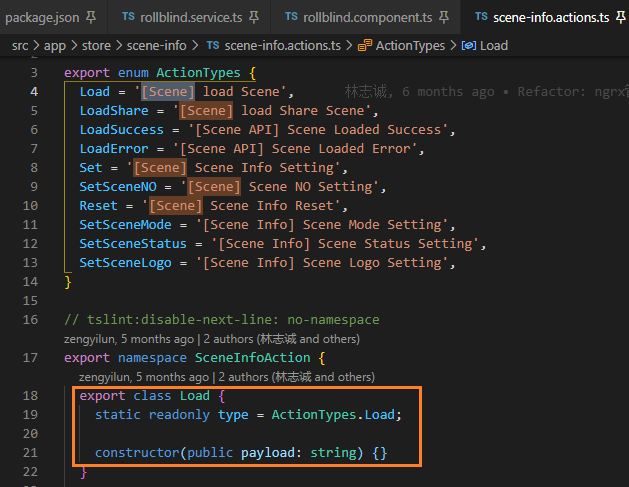
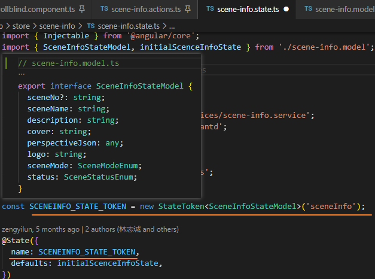

[TOC]

## Appearance  [_](https://cesium.com/docs/cesiumjs-ref-doc/Appearance.html)


## GeometryAttributes [_](https://cesium.com/docs/cesiumjs-ref-doc/GeometryAttribute.html)


## canvas 库[fabric](http://fabricjs.com/)


## [g6 可视化引擎](http://antv-2018.alipay.com/zh-cn/g6/3.x/index.html)


## ts 类型推断

`a: boolean = false;`

提交时: `Type boolean trivially inferred from a boolean literal, remove type annotation ` `从一个布尔字面值推导出的类型布尔，删除类型注释`

`a = false;`


## Refactor: ngrx管理库更换为ngxs]

[NgRx](https://ngrx.io/)是一个以Redux为灵感的状态管理器，并经常在Angular社区中使用。就像它的名字表示的，它严重依赖于RXJS流。


[Introduction - NGXS](https://www.ngxs.io/)是一个可选的库，它还将类似Redux的状态管理引入到Angular中。相对于NgRx，NGXS为了减少样板文件，NGXS大量使用类和装饰器，并且如果类是你的事情，这方面可能是影响你二选一的重要因素。


```diff
// package.json
-    "@ngrx/effects": "~9.2.0",
-    "@ngrx/store": "~9.2.0",
-   "@ngrx/store-devtools": "~9.2.0",

+    "@ngxs/store": "^3.7.0",
+    "@ngxs/devtools-plugin": "^3.7.0",

```

[ngxs/store - github.com)](https://github.com/ngxs/store)

ngxs文档 [_](https://www.ngxs.io/)


### NGXS4个概念

Store: **Global state** container, action dispatcher and selector

​			 (**全局状态**容器、动作分派器和选择器)

Actions: Class describing the action to take and its associated metadata

​			 (描述要采取的操作及其相关元数据的类)

State: Class definition of the state

​			(状态的类定义)

Selects: State slice selectors

​			(状态切片选择器)

These concepts create a circular control flow traveling from a component dispatching an action, to a store reacting to the action, back to the component through a state select.

这些概念创建了一个循环控制流，该循环控制流从一个组件分发一个动作，到一个对该动作做出反应的存储，再通过状态选择返回到该组件。


- 创建**actions**

  ```ts
  // animal.action.ts
  export class AddAnimal {
    static readonly type = '[Zoo] Add Animal';
    constructor(public name: string) {}
  }
  ```

  

  action 是一个class, 内部包含一个静态的type标识其类型 ---- dispatch 时会**构造实例并传参**

  <u>难道是dispatch这个action之后就会更改store中的state -> state[type] mutate</u>

- 调度action

  ```ts
  import { Store } from '@ngxs/store';
  import { AddAnimal } from './animal.actions';
  
  @Component({ ... })
  export class ZooComponent {
    constructor(private store: Store) {}
  
    addAnimal(name: string) {
      this.store.dispatch(new AddAnimal(name)); // 引入了action, 提供给dispatch
      this.store.dispatch(new AddAnimal(name)).subscribe(() => this.form.reset());
        // 订阅 dispatch 返回的Observable
    }
  }
  ```

  `dispatch` function actually returns an Observable, so we can subscribe to it and do something after it was successful.

  The Observable that a dispatch returns has a void type, this is because there can be multiple **states** that listen to the same `@Action`,therefore it's not realistically possible to return the **state** from these actions since we don't know the form of them.

  分派返回的可观察对象有一个void类型，这是因为可能有多个**状态**监听相同的`@Action`，因此从这些动作返回**状态**实际上是不可能的，因为我们不知道它们的形式。

  如果您需要在此之后获得状态，只需使用链中的@Select，如：

- ```ts
  import { Store, Select } from '@ngxs/store';
  import { Observable } from 'rxjs';
  import { withLatestFrom } from 'rxjs/operators'; // 引入操作符
  import { AddAnimal } from './animal.actions';
  
  @Component({ ... })
  export class ZooComponent {
  
    @Select(state => state.animals) animals$: Observable<any>;
  
    constructor(private store: Store) {}
  
    addAnimal(name: string) {
      this.store
        .dispatch(new AddAnimal(name))
        .pipe(withLatestFrom(this.animals$)) // pipe ~ 管
        .subscribe(([_, animals]) => {
          // do something with animals
          this.form.reset();
        });
    }
  
  }
  ```

  

  #### action

  - simple action----boolean

    ```ts
    export class FeedAnimals {
      static readonly type = '[Zoo] Feed Animals';
    }
    ```

    侦听这个action并改变我们的状态，在本例中，我们将翻转一个布尔标志。

  - Actions with Metadata

    通常，您需要一个操作来与它关联一些数据。

    ```ts
    export class FeedZebra {
      static readonly type = '[Zoo] Feed Zebra';
      constructor(public name: string, public hayAmount: number) {
          // 构造函数中的参数将自动作为实例的属性, 同时也是该action的携带的metadata
      }
    }
    ```

  #### action 命名

  Commands are actions that tell your app to do something. They are usually triggered by user events such as clicking on a button, or selecting something. (命令是告诉您的应用执行某项操作的操作。 它们通常是由用户事件触发的，例如单击按钮或选择某些东西。)

  Names should contain three parts:

  - A context as to where the command came from, `[User API]`, `[Product Page]`, `[Dashboard Page]`.
  - A verb describing what we want to do with the entity.
  - The entity we are acting upon, `User`, `Card`, `Project`.

  名称应包含三个部分：

  - 有关命令来自何处的上下文，[用户API]，[产品页面]，[仪表板页面]。
  - 一个动词，描述我们要对实体执行的操作。
  - 我们所处理的实体，用户，卡，项目。

  使用 NameSpace 分组 action

  ```ts
  export namespace Todo {
      export class Add {
          static readonly type = '[Todo] Add';
          constructor(public payload: any) {}
      }
  }
  ```

#### state

状态是带有装饰器的类，用于描述元数据和动作映射。 要定义状态容器，让我们创建一个ES2015类，并使用State装饰器对其进行装饰。

```ts
import { Injectable } from '@angular/core'; // ng的注入, 装饰器
import { State } from '@ngxs/store'; // ngxs的状态, 装饰器

@State<string[]>({
  name: 'animals',
  defaults: []
})
@Injectable()
export class AnimalsState {}
```

In the state decorator, we define some metadata about the state. These options include:

- `name`: The name of the state slice.(状态切片) 

  > Note: The name is a **required parameter** and must be **unique** for the entire application.

  Names must be object property safe, (e.g. no dashes, dots, etc).

- `defaults`: Default set of object/array for this state slice.

- `children`: Child sub state associations.

state 也可以参与依赖注入。 这是自动连接的，因此您要做的就是将依赖项注入到构造函数中。

#### state Token [可选]

使用 state Token 来替换 state 的`name`

```ts
const ZOO_STATE_TOKEN = new StateToken<ZooStateModel>('zoo');
// token 通过定义对应的 model 来创建

@State({
  name: ZOO_STATE_TOKEN,
  defaults: {
    feed: false // 状态, 以下action处会读取
  }
})
@Injectable()
export class ZooState {
  constructor(private zooService: ZooService) {}
}
```





#### action

state 通过`@Action`装饰器监听action。 action装饰器接受一个`action类`或 `action类数组`。

**simplie action**

定义一个state, 监听 `FeedAnimals` action

```ts
import { Injectable } from '@angular/core';
import { State, Action, StateContext } from '@ngxs/store';

export class FeedAnimals {
  static readonly type = '[Zoo] FeedAnimals';
}

export interface ZooStateModel {
  feed: boolean;
}

@State<ZooStateModel>({
  name: 'zoo',
  defaults: {
    feed: false
  }
})
@Injectable()
export class ZooState {
  @Action(FeedAnimals) // @action 装饰器, 接受了一个antion类表示监听
  feedAnimals(ctx: StateContext<ZooStateModel>) { // 回调, 传参, StateContext为自带的类型
    const state = ctx.getState();
    ctx.setState({
      ...state,
      feed: !state.feed
    });
  }
}
```

The `feedAnimals` function has one argument called `ctx` with a type of `StateContext`. 

 This context state has a slice pointer and a function  `setState` exposed to set the state.

​	此上下文状态具有一个切片指针和一个用于设置状态的函数。

`getState()` method will always return the freshest state slice from the global store each time it is accessed.

​	每次访问时，getState（）方法将始终从全局store中返回最新的状态切片。

This ensures that when we're performing **async** operations the state is always fresh. If you want a snapshot, you can always clone the state in the method.

​	这样可以确保当我们执行**异步**操作时，状态始终是新鲜的。 如果要快照，则始终可以在方法中克隆状态。


#### Actions with a payload

```ts
import { Injectable } from '@angular/core';
import { State, Action, StateContext } from '@ngxs/store';

// This is an interface that is part of your domain model
export interface ZebraFood {
  name: string;
  hay: number;
  carrots: number;
}

// naming your action metadata explicitly makes it easier to understand what the action
// is for and makes debugging easier.
export class FeedZebra {
  static readonly type = '[Zoo] FeedZebra';
  constructor(public zebraToFeed: ZebraFood) {}
}

export interface ZooStateModel {
  zebraFood: ZebraFood[];
}

@State<ZooStateModel>({ // 定义 state 模型
  name: 'zoo',
  defaults: {
    zebraFood: []
  }
})
@Injectable()
export class ZooState {
  @Action(FeedZebra) // 接受action类
  feedZebra(ctx: StateContext<ZooStateModel>, action: FeedZebra) { // 回调传参ctx+payload
    const state = ctx.getState();
    ctx.setState({ // 重新赋值
      ...state,
      zebraFood: [
        ...state.zebraFood,
        // this is the new ZebraFood instance that we add to the state
        action.zebraToFeed // dispatch(new FeedZebra(zebraFood: ZebraFood)) 上携带的参数
      ]
    });
  }
}
```

在此示例中，我们有代表该action的第二个参数，我们解构它以提取name, hay, carrots，然后用它们更新状态。

还有一个快捷方式`patchState`功能，使更新状态更容易。在这种情况下，您只传递您想要更新的状态的属性，并且它处理其余部分。以上功能可简化为：

```ts
@Action(FeedZebra)
feedZebra(ctx: StateContext<ZooStateModel>, action: FeedZebra) {
  const state = ctx.getState();
  ctx.patchState({ // 更新状态, zebraFood
    zebraFood: [
      ...state.zebraFood,
      action.zebraToFeed,
    ]
  });
}
```

`setState` 函数也能传入一个回调函数来使用, 回调函数会被传入state, 并且需要返回最新的state, 该功能必须满足所有不变性的考虑。

```ts
@Action(MyAction)
public addValue(ctx: StateContext, { payload }: MyAction) {
  ctx.setState({ ...ctx.getState(), value: payload  });
}
// same as
@Action(MyAction)
public addValue(ctx: StateContext, { payload }: MyAction) {
    // function get state, and must return new state
  ctx.setState((state) => ({ ...state, value: payload })); 
}
```

> 不过iscene中没有getState和setState函数的痕迹

#### async actions

action可以执行异步操作并在操作后更新状态:

```ts
import { Injectable } from '@angular/core';
import { State, Action, StateContext } from '@ngxs/store';
import { tap } from 'rxjs/operators';

export class FeedAnimals {
  static readonly type = '[Zoo] FeedAnimals';
  constructor(public animalsToFeed: string) {}
}

export interface ZooStateModel {
  feedAnimals: string[];
}

@State<ZooStateModel>({
  name: 'zoo',
  defaults: {
    feedAnimals: []
  }
})
@Injectable()
export class ZooState {
  constructor(private animalService: AnimalService) {}

  @Action(FeedAnimals)
  feedAnimals(ctx: StateContext<ZooStateModel>, action: FeedAnimals) {
      // 调用异步服务 ~ pipie: 管 ~ tap: 水龙头
    return this.animalService.feed(action.animalsToFeed).pipe(
      tap(animalsToFeedResult => {
        const state = ctx.getState();
        ctx.setState({
          ...state,
          feedAnimals: [...state.feedAnimals, animalsToFeedResult]
        });
      })
    );
  }
}
```

在此示例中, 调用了animalService.feed方法, 然后根据结果更新状态`setState`.

可以保证`state is fresh`, 因为state属性是`当前状态切片的getter`

You might notice I returned the Observable and just did a `tap`. If we return the Observable, the framework will automatically subscribe to it for us, so we don't have to deal with that ourselves. Additionally, if we want the stores `dispatch` function to be able to complete only once the operation is completed, we need to return that so it knows that.

您可能会注意到我**返回了Observable**，只是`tap`了一下。 如果我们返回Observable，框架将自动为我们订阅它，因此我们不必自己处理。 

另外，如果我们希望store `dispatch` 函数仅在操作完成后才能完成，则需要返回该值，以便它知道。

从示例来看, `.pipe` 前面返回的结果是一个异步操作Promise

> `.pipe` 应用在iScene中相当多, 但看接口是Observable.d.ts中的方法 ~ Angular ~ Observable

**Observables are not a requirement**, you can **use promises too**. 

We could swap that observable chain to look like this:

```ts
export class ZooState {
  constructor(private animalService: AnimalService) {}

  @Action(FeedAnimals)
  async feedAnimals(ctx: StateContext<ZooStateModel>, action: FeedAnimals) {
    const result = await this.animalService.feed(action.animalsToFeed);
    const state = ctx.getState();
    ctx.setState({
      ...state,
      feedAnimals: [...state.feedAnimals, result]
    });
  }
}
```


#### Dispatching Actions From Actions

希望action 分发另一个action，则可以使用状态上下文对象中包含的`dispatch`功能

```ts
/**
 * Simple Example
 */
@Action(FeedAnimals)
feedAnimals(ctx: StateContext<ZooStateModel>, action: FeedAnimals) {
    const state = ctx.getState();
    ctx.setState({
        ...state,
        feedAnimals: [...state.feedAnimals, action.animalsToFeed]
    });

    return ctx.dispatch(new TakeAnimalsOutside());
}
/**
 * Async Example
 */
@Action(FeedAnimals)
feedAnimals2(ctx: StateContext<ZooStateModel>, action: FeedAnimals) {
    return this.animalService.feed(action.animalsToFeed).pipe(
        tap(animalsToFeedResult => {
            const state = ctx.getState();
            ctx.patchState({
                feedAnimals: [...state.feedAnimals, animalsToFeedResult]
            });
        }),
        mergeMap(() => ctx.dispatch(new TakeAnimalsOutside())) 
        // 文档中也没找到这个mergeMap函数的引入方式
    );
}
```


#### select

Selects are functions that slice a specific portion of state from the global state container.

In CQRS and Redux patterns, we keep READ and WRITE separated. This pattern also exists in NGXS. When we want to read data out of our store, we use a select operator to retrieve this data.

In NGXS, there are two methods to select state, we can either call the `select` method on the `Store` service or use the `@Select` decorator. First let's look at the `@Select` decorator.

Selects 是从全局状态容器中切片状态的特定部分的函数。

在CQRS和Redux模式中，我们将READ和WRITE分开。 NGXS中也存在此模式。

当我们想从商店中读取数据时，我们使用**select运算符来检索该数据**。

在NGXS中，有两种选择状态的方法，我们可以在`Store`服务上调用`select`方法，也可以使用`@Select`装饰器。 首先让我们看一下`@Select`装饰器。

#### Select Decorators

You can select slices of data from the store using the `@Select` decorator. 

It has a few different ways to get your data out, whether passing the <u>state class</u>, a <u>function</u>, a <u>different state class</u> or a <u>memoized selector</u>.

您可以使用`@Select`装饰器从store中选择数据切片。它有几个不同的方式来获取您的数据，无论是通过状态类、函数、不同的状态类还是记忆选择器。

```ts
import { Select } from '@ngxs/store';
import { ZooState, ZooStateModel } from './zoo.state';

@Component({ ... })
export class ZooComponent {
  // Reads the name of the state from the state class
  @Select(ZooState) animals$: Observable<string[]>;

  // Uses the pandas memoized selector to only return pandas
  @Select(ZooState.pandas) pandas$: Observable<string[]>;

  // Also accepts a function like our select method
  @Select(state => state.zoo.animals) animals$: Observable<string[]>;

  // Reads the name of the state from the parameter
  @Select() zoo$: Observable<ZooStateModel>;
}
```

补充: xxx$ 为 `rxjs.Subject`创建的通信对象 [rxjs.subject](https://rxjs.dev/api/index/class/Subject)

#### Store Select Function

store 可以访问 select 方法

```ts
import { Store } from '@ngxs/store';

@Component({ ... })
export class ZooComponent {
  animals$: Observable<string[]>;

  constructor(private store: Store) {
    this.animals$ = this.store.select(state => state.zoo.animals);
  }
}
```

This is most helpful to programmatic selects where we can't statically declare them with the select decorator.

There is also a `selectOnce` that will basically do `select().pipe(take(1))` for you automatically as a shortcut method.

This can be useful in route guards where you only want to check the current state and not continue watching the stream. It can also be useful for unit testing.

这对于无法使用select装饰器静态声明它们的编程选择非常有用。

还有一个`selectOnce`基本上会自动为您执行`select().pipe(take(1))`作为快捷方式。

这在仅希望检查当前状态而不希望继续观看流的路由守卫中很有用。 它对于单元测试也很有用。


#### Snapshot Selects

 `selectSnapshot`允许您提取原始值

对于需要获得静态值但无法使用可观察值的情况，这非常有帮助。

一个很好的使用案例将是一个拦截器，需要从身份验证状态获得令牌。

```ts
@Injectable()
export class JWTInterceptor implements HttpInterceptor {
  constructor(private store: Store) {}

  intercept(req: HttpRequest<any>, next: HttpHandler): Observable<HttpEvent<any>> {
    const token = this.store.selectSnapshot<string>( // store 选择快照读取token
        (state: AppState) => state.auth.token);
    req = req.clone({
      setHeaders: {
        Authorization: `Bearer ${token}`
      }
    });

    return next.handle(req);
  }
}
```

#### Memoized Selectors

通常，您会在几个不同的地方使用相同的选择器，或者拥有您希望与组件分开的复杂选择器。

NGXS有一个`@Selector`装饰, 该装饰器将记住该函数的性能，并自动对要处理的状态部分进行切片。

```ts
import { Injectable } from '@angular/core';
import { State, Selector } from '@ngxs/store';

@State<string[]>({
  name: 'animals',
  defaults: []
})
@Injectable()
export class ZooState {
  @Selector() // 装饰器
  static pandas(state: string[]) {
    return state.filter(s => s.indexOf('panda') > -1);
  }
}
```

 the `state` is just the local state for this `ZooState` class. Now in our component, we simply do:

```ts
@Component({ ... })
export class AppComponent {
  @Select(ZooState.pandas) pandas$: Observable<string[]>;
  // pandas$ will only return animals with the name panda in them.
}
```

IScene中的例子

```ts
// toolbar.component.ts
@Select(UserInfoState.userInfo('realName')) username$: Observable<string>;

// 设置用户名
this.username$.subscribe((name) => { // select -> subscribe -> do sth.
    this.username = name;
});

// or store.select -> subscribe
// 获取状态store里的scene-info
this.store.select(SceneInfoState.selectSceneInfo).subscribe((state) => {
    this.sceneInfo = state;
});
```

#### Selector Options [_doc_](https://www.ngxs.io/concepts/select)

todo...


## 原型面试题


## 原型面试题

```
function Ofo() {}

function Bick() {
 this.name = 'mybick'
}

var myBick = new Ofo()
Ofo.prototype = new Bick()
var myBick2 = new Ofo()
console.log(myBick.name)
console.log(myBick2.name)
console.log(myBick.constructor)
console.log(myBick2.constructor)
```

