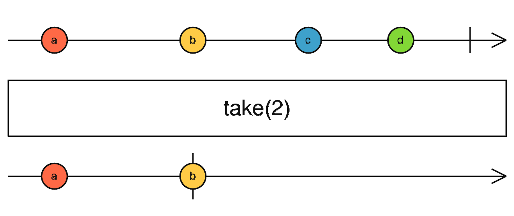

[toc]

## 今日鸡汤

一个美国程序员[分享](https://briancasel.com/impatient-execution/)自己的工作方法，其中有一条是 **"要么不做，要做就做完"**。

他的意思是，不要给自己留下做了一半的活。因为这意味着你需要再回来，继续把它做完；你会挂念这件事情，它就像一个钟摆，过一段时间就会重新出现在你的脑海，时不时烦扰着你。

你的目标应该是，当天就把这件事情做完，从此不必再去碰它，第二天继续做下一件事就行了。如果遇到一天做不完的大项目，那就把它分解成一个个小步骤，每天完成一个步骤。

我觉得他说得很好，但是这句话比较重要的，其实是前半句：**有些事情不要去做**。事情是做不完的，而你的时间和精力是有限的，不要只想着如何才能把事情做完，还要学会不做那些不应该做的事情。

某种程度上，不做比做完更困难。因为通常来说，做完一件事，多多少少都有一些好处，不做意味着你要放弃一些眼前的好处，这并不容易。

最糟糕的一种情况是，某个项目不值得做，但是你已经做了，为了不要浪费已经投入的成本，于是你进一步投入，在泥坑里面越陷越深。等到项目最后失败的时候，你大伤元气，一蹶不振。项目管理有一个很重要的原则，叫做"尽快失败"，就是为了防止这种情况。[胡适先生](http://www.ruanyifeng.com/blog/2007/02/hushih_s_switch_part_i.html)原来学农科，专业是果树栽培，他觉得实在没意思，大学读到一半就改学哲学，后来当上了北大校长。如果他没有放弃，想着拿完农科文凭再说，那他大概就不会有以后的成就了。总之，**对于那些没希望的项目，放弃得越早越好。**


## Angular - Observable & Rx.js [doc](https://angular.cn/guide/observables-in-angular)

### Angular 中的可观察对象(observables)

Angular 使用可观察对象作为处理各种常用异步操作的接口。比如：

- `EventEmitter` 类派生自 `Observable`。
- HTTP 模块使用可观察对象来处理 AJAX 请求和响应。
- 路由器和表单模块使用可观察对象来监听对用户输入事件的响应。

**在组件之间传递数据**

Angular 提供了一个 `EventEmitter` 类，它用来通过组件的 [`@Output()` 装饰器](https://angular.cn/guide/inputs-outputs#output) 发送一些值。

`EventEmitter` 扩展了 [RxJS `Subject`](https://rxjs.dev/api/index/class/Subject)，并添加了一个 `emit()` 方法，这样它就可以发送任意值了。

当你调用 `emit()` 时，就会把所发送的值传给订阅上来的观察者 (subscribed observer) 的 `next()` 方法。

示例: 

```html
<!-- 组件监听了 open 和 close 事件 -->
<app-zippy (open)="onOpen($event)" (close)="onClose($event)"></app-zippy>
```


```ts
@Component({
  selector: 'app-zippy',
  template: `
    <div class="zippy">
      <div (click)="toggle()">Toggle</div>
      <div [hidden]="!visible">
        <ng-content></ng-content>
      </div>
    </div>
  `,
})
export class ZippyComponent {
  visible = true;
  @Output() open = new EventEmitter<any>();
  @Output() close = new EventEmitter<any>();

  toggle() {
    this.visible = !this.visible;
    if (this.visible) {
      this.open.emit(null); // open事件触发
    } else {
      this.close.emit(null); // close事件触发
    }
  }
}
```

### HTTP [link](https://angular.cn/guide/observables-in-angular#http)

Angular 的 `HttpClient` 从 HTTP 方法调用中返回了可观察对象。

例如，`http.get(‘/api’)` 就会返回可观察对象。

相对于基于承诺（Promise）的 HTTP API，它有一系列优点：

- 可观察对象不会修改服务器的响应（和在承诺上串联起来的 `.then()` 调用一样）。反之，你可以使用一系列操作符来按需转换这些值。
- HTTP 请求是可以通过 `unsubscribe()` 方法来取消的。
- 请求可以进行配置，以获取进度事件的变化。
- 失败的请求很容易重试。


引入angular内置模块的地址, 以 [ HttpClient ](https://angular.cn/api/common/http/HttpClient) 为例:

`https://angular.cn/api/common/http/HttpClient` 为网页地址

其模块路径为: [API](https://angular.cn/api) > [@angular/common](https://angular.cn/api/common) > [@angular/common/http](https://angular.cn/api/common/http)

取最末尾的路径:

`import { HttpClient } from '@angular/common/http';`

> [api](https://angular.cn/api) 参考手册中可以查看所有的内置模块


## rxjs库 [ng文档](https://angular.cn/guide/rx-library)

响应式编程是一种面向数据流和变更传播的异步编程范式（[Wikipedia](https://zh.wikipedia.org/wiki/响应式编程)）。

RxJS（响应式扩展的 JavaScript 版）是一个使用**Observable(可观察对象)**进行响应式编程的库，它让组合异步代码和基于回调的代码变得更简单。参阅 [RxJS 官方文档](https://rxjs.dev/guide/overview)。

RxJS 提供了一种对 `Observable` 类型的实现，直到 `Observable` 成为了 JavaScript 语言的一部分并且浏览器支持它之前，它都是必要的。这个库还提供了一些工具函数，用于创建和使用可观察对象。这些工具函数可用于：

- 把现有的异步代码转换成可观察对象
- 迭代流中的各个值
- 把这些值映射成其它类型
- 对流进行过滤
- 组合多个流


RxJS 提供了一些用来创建可观察对象的函数。这些函数可以简化根据某些东西创建可观察对象的过程，比如事件、定时器、承诺等等。比如

```ts
import { from } from 'rxjs';

// Create an Observable out of a promise
const data = from(fetch('/api/endpoint'));
// Subscribe to begin listening for async result
data.subscribe({ 
  next(response) { console.log(response); },
  error(err) { console.error('Error: ' + err); },
  complete() { console.log('Completed'); }
});
```

```ts
import { fromEvent } from 'rxjs';

const el = document.getElementById('my-element');

// Create an Observable that will publish mouse movements
const mouseMoves = fromEvent(el, 'mousemove');

// Subscribe to start listening for mouse-move events
const subscription = mouseMoves.subscribe((evt: MouseEvent) => {
  // Log coords of mouse movements
  console.log(`Coords: ${evt.clientX} X ${evt.clientY}`);

  // When the mouse is over the upper-left of the screen,
  // unsubscribe to stop listening for mouse movements
  if (evt.clientX < 40 && evt.clientY < 40) {
    subscription.unsubscribe();
  }
});
```

## 操作符

操作符是基于可观察对象构建的一些对集合进行复杂操作的函数。RxJS 定义了一些操作符

操作符接受一些配置项，然后返回一个以来源可观察对象为参数的函数。当执行这个返回的函数时，这个操作符会观察来源可观察对象中发出的值，转换它们，并返回由转换后的值组成的新的可观察对象。下面是一个简单的例子：

```ts
// map 操作符
import { of } from 'rxjs';
import { map } from 'rxjs/operators';

const squareValues = map((val: number) => val * val); // map 返回Observable
const nums = of(1, 2, 3);
const squaredNums = squareValues(nums); 

squaredNums.subscribe(x => console.log(x)); // Observable.subscribe
// Logs
// 1
// 4
// 9
```

pipe (管道) : 可以使用**管道**来把这些操作符链接起来。

管道让你可以<u>把多个由操作符返回的函数组合成一个</u>。

`pipe()` 函数以你要组合的这些函数作为参数，并且返回一个新的函数，当执行这个新函数时，就会顺序执行那些被组合进去的函数。 

应用于某个可观察对象上的一组操作符就像一个处理流程 —— 也就是说，对你感兴趣的这些值进行处理的一组操作步骤。这个处理流程本身不会做任何事。你需要调用 `subscribe()` 来通过处理流程得出并生成一个结果。

```ts
// Standalone pipe function - 独立管道功能
import { of, pipe } from 'rxjs';
import { filter, map } from 'rxjs/operators';

const nums = of(1, 2, 3, 4, 5);

// Create a function that accepts an Observable.
const squareOddVals = pipe(
  // 传入两个函数 filter(), map(), 此时不会执行, 等待subscribe时方执行
  filter((n: number) => n % 2 !== 0),
  map(n => n * n)
);

// Create an Observable that will run the filter and map functions
const squareOdd = squareOddVals(nums);

// Subscribe to run the combined functions
squareOdd.subscribe(x => console.log(x));
```

`pipe()` 函数也同时是 RxJS 的 `Observable` 上的一个方法，所以你可以用下列简写形式来达到同样的效果：

```ts
import { of } from 'rxjs';
import { filter, map } from 'rxjs/operators';

const squareOdd = of(1, 2, 3, 4, 5)
  .pipe(
    filter(n => n % 2 !== 0),
    map(n => n * n)
  );

// Subscribe to get values
squareOdd.subscribe(x => console.log(x));
```

### 常用操作符

RxJS 提供了很多操作符，不过只有少数是常用的。 

下面是一个常用操作符的列表和用法范例，参阅 [RxJS API 文档](https://rxjs.dev/api)。

> 注意，对于 Angular 应用来说，我们提倡使用管道来组合操作符，而不是使用链式写法。链式写法仍然在很多 RxJS 中使用着。

| 类别 | 操作                                                         |
| :--- | :----------------------------------------------------------- |
| 创建 | `from`, `fromEvent`, `of from`, `fromPromise`,`fromEvent`, `of` |
| 组合 | `combineLatest`, `concat`, `merge`, `startWith` , `withLatestFrom`, `zip` |
| 过滤 | `debounceTime`, `distinctUntilChanged`, `filter`, `take`, `takeUntil` |
| 转换 | `bufferTime`, `concatMap`, `map`, `mergeMap`, `scan`, `switchMap` |
| 工具 | `tap`                                                        |
| 多播 | `share`                                                      |

- #### 过滤

  1. [take](https://rxjs.dev/api/operators/take)

     Emits only the first `count` values emitted by the source Observable.

     `take<T>(count: number): MonoTypeOperatorFunction<T>`

     **count**: The maximum number of `next` values to emit.

     ```js
     // 以无限的1秒间隔的前5秒观察
     import { interval } from 'rxjs';
     import { take } from 'rxjs/operators';
     
     const intervalCount = interval(1000);
     const takeFive = intervalCount.pipe(take(5));
     takeFive.subscribe(x => console.log(x));
     
     // Logs:
     // 0,1,2,3,4
     ```

     

  2. [takeUntil](https://rxjs.dev/api/operators/takeUntil)

     Emits the values emitted by the source Observable **until** a `notifier` Observable **emits** a value.

     `takeUntil<T>(notifier: Observable<any>): MonoTypeOperatorFunction<T>`

     **notifier**: The Observable whose first emitted value will cause the output Observable of `takeUntil` to stop emitting values from the source Observable.

     ```ts
     this.unsubscribe$ = new Subject();
     this.store
           .select(FunctionListState.getConfigDataBy(modelsDataConfigName))
           .pipe(takeUntil(this.unsubscribe$))
           .subscribe((data: ModelDataState[]) => {
             this.modelsData = cloneDeep(data) || [];
           });
     
     onDestroy() {
     	this.unsubscribe$.next();
         this.unsubscribe$.complete();
     }
     ```

     ```js
     // 每秒打一次，直到第一次点击发生
     import { fromEvent, interval } from 'rxjs';
     import { takeUntil } from 'rxjs/operators';
     
     const source = interval(1000);
     const clicks = fromEvent(document, 'click');
     const result = source.pipe(takeUntil(clicks));
     result.subscribe(x => console.log(x));
     ```

     

     

  3. [filter](https://rxjs.dev/api/operators/filter)

     像[Array.prototype.filter（）](https://developer.mozilla.org/en-US/docs/Web/JavaScript/Reference/Global_Objects/Array/filter)一样 ，它仅在通过标准函数时才从源发出值。

     ```js
     import { fromEvent } from 'rxjs';
     import { filter } from 'rxjs/operators';
     
     const clicks = fromEvent(document, 'click');
     const clicksOnDivs = clicks.pipe(filter(ev => ev.target.tagName === 'DIV'));
     clicksOnDivs.subscribe(x => console.log(x));
     ```

     

     

  4. 

- #### 组合

  1. merge(已弃用) `rxjs/operators.merge => rxjs.merge` [merge](https://rxjs.dev/api/index/function/merge)
  2. concat / zip同上
  3. 

- #### 转换

- 

### 错误处理

todo...

### 重试失败的可观察对象

todo...

### 可观察对象的命名约定

由于 Angular 的应用几乎都是用 TypeScript 写的，你通常会希望知道某个变量是否可观察对象。

虽然 Angular 框架并没有针对可观察对象的强制性命名约定，不过你经常会看到**可观察对象的名字以“$”符号结尾**。

```ts
import { Component } from '@angular/core';
import { Observable } from 'rxjs';

@Component({
  selector: 'app-stopwatch',
  templateUrl: './stopwatch.component.html'
})
export class StopwatchComponent {

  stopwatchValue: number;
  stopwatchValue$: Observable<number>; // Observable

  start() {
    this.stopwatchValue$.subscribe(num =>
      this.stopwatchValue = num
    );
  }
}
```

> new Observable() 的方式在IScene中很少使用, 使用的是 `new Subject()` (rxjs.Subject)


### rxjs.operator [_rxjs_](https://rxjs.dev/guide/operators)

尽管[Observable](https://rxjs.dev/guide/observable)是基础，但RxJS的**运算符**最有用。

运算符是<u>使复杂的异步代码</u>易于以声明的方式组合的基本组成部分。

#### 什么是运算符？

运算符就是**功能**。有两种运算符： **管道运算符** / **创建运算符**

管道**运算符**是可以使用语法通过管道传递给Observables的类型`observableInstance.pipe(operator())`。

这些包括[`filter(...)`](https://rxjs.dev/api/operators/filter)和 [`mergeMap(...)`](https://rxjs.dev/api/operators/mergeMap)。

调用它们时，它们**不会更改**现有的Observable实例。

相反，它们返回一个**新的**Observable，其订阅逻辑基于第一个Observable。

> 管道运算符是一个将Observable作为其输入并返回另一个Observable的函数。
>
> 这是一个纯操作：先前的Observable保持不变。

**管道运算符**本质上是一个纯函数，它将一个Observable作为输入并生成另一个Observable作为输出。订阅输出Observable也将订阅输入Observable。


**创建运算符**是另一种运算符，可以称为独立函数来**创建新的Observable**。

例如：`of(1, 2, 3)`创建一个可观察对象，该对象将依次发出1、2和3。

例如，被调用的运算符[`map`](https://rxjs.dev/api/operators/map)类似于同名的Array方法。就像`[1, 2, 3].map(x => x * x)`生成`[1, 4, 9]`一样，Observable创建如下：

```ts
import { of } from 'rxjs';
import { map, first } from 'rxjs/operators';

map(x => x * x)(of(1, 2, 3)).subscribe((v) => console.log(`value: ${v}`));

// Logs:
// value: 1 
// value: 4
// value: 9

first()(of(1, 2, 3)).subscribe((v) => console.log(`value: ${v}`));

// Logs:
// value: 1
```

请注意，`map`逻辑上必须动态构建，因为必须为其提供映射功能。相比之下，它`first`可能是一个常数，但是仍然是动态构建的。通常，无论是否需要参数，都构造所有运算符

**管道**

**管道运算符**是函数, 可以像普通函数一样使用: `op()(obs)`, 当嵌套/卷积过多时会变得不可读 `op4()(op3()(op2()(op1()(obs))))`, Observables具有一种称为的方法`.pipe()`，该方法可以完成相同的事情，同时更易于阅读：

```js
obs.pipe(
  op1(),
  op2(),
  op3(),
  op3(),
)
```

**创造运算符**

创建运算符是可用于创建具有某些常见预定义行为或通过加入其他Observable的Observable的函数。

创建运算符的典型示例是`interval`函数。它以数字（不是Observable）作为输入参数，并产生Observable作为输出：

```js
import { interval } from 'rxjs';
const observable = interval(1000 /* number of milliseconds */);
```

### Creation Operators

- [`ajax`](https://rxjs.dev/api/ajax/ajax)
- [`bindCallback`](https://rxjs.dev/api/index/function/bindCallback)
- [`bindNodeCallback`](https://rxjs.dev/api/index/function/bindNodeCallback)
- [`defer`](https://rxjs.dev/api/index/function/defer)
- [`empty`](https://rxjs.dev/api/index/function/empty)
- [`from`](https://rxjs.dev/api/index/function/from)
- [`fromEvent`](https://rxjs.dev/api/index/function/fromEvent)
- [`fromEventPattern`](https://rxjs.dev/api/index/function/fromEventPattern)
- [`generate`](https://rxjs.dev/api/index/function/generate)
- [`interval`](https://rxjs.dev/api/index/function/interval)
- [`of`](https://rxjs.dev/api/index/function/of)
- [`range`](https://rxjs.dev/api/index/function/range)
- [`throwError`](https://rxjs.dev/api/index/function/throwError)
- [`timer`](https://rxjs.dev/api/index/function/timer)
- [`iif`](https://rxjs.dev/api/index/function/iif)


**高阶可观察对象**

todo...


**[reference](https://rxjs.dev/api)**


