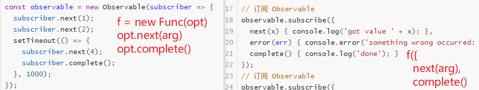

[TOC]

## Layer 接口


### addLayer

`layer-manage.service.ts - addLayer`


## Observable [_](https://rxjs.dev/guide/observable)


```JS
import rxjs from 'rxjs';
const {Observable} = rxjs
console.log(Observable);

// 创建 Observable 
const observable = new Observable(subscriber => {
  subscriber.next(1);
  subscriber.next(2);
  setTimeout(() => {
    subscriber.next(4);
    subscriber.complete();
  }, 1000);
});

console.log('just before subscribe');

// 订阅 Observable
observable.subscribe({
  next(x) { console.log('got value ' + x); },
  error(err) { console.error('something wrong occurred: ' + err); },
  complete() { console.log('done'); }
});
// 订阅 Observable
observable.subscribe({
  next(x) { console.log(' next value' + x); },
  error(err) { console.error('something wrong occurred: ' + err); },
  complete() { console.log('complete'); }
});
console.log('just after subscribe');
/** ---- **/
just before subscribe
got value 1 // 同步
got value 2
 next value1
 next value2
just after subscribe
got value 4 // 异步, 原因是由setTimeout执行
done
 next value4
complete
```

基础模型: 



**订阅Observable类似于调用Function。**

`func.call()` vs `observable.subscribe(func)`

Conclusion:

- `func.call()` means "*give me one value synchronously*"
- `observable.subscribe()` means "*give me any amount of values, either synchronously or asynchronously*"

Observables are **created** using `new Observable` or a creation operator, are **subscribed** to with an Observer, **execute** to deliver `next` / `error` / `complete` notifications to the Observer, and their execution may be **disposed**.

Core Observable concerns:

- **Creating** Observables
- **Subscribing** to Observables
- **Executing** the Observable
- **Disposing** Observables

### Subscribe

`subscribe`函数是描述Observable的最重要部分。让我们看一下subscribe的含义

**Subscribing to Observables**

**Executing Observables**

The code inside `new Observable(function subscribe(subscriber) {...})` represents an "Observable execution", a lazy computation that only happens for each Observer that subscribes. 

 The execution produces multiple values over time, either synchronously or asynchronously.

There are three types of values an Observable Execution can deliver:

- "Next" notification: sends a value such as a Number, a String, an Object, etc.
- "Error" notification: sends a JavaScript Error or exception. [可选]
- "Complete" notification: does not send a value. [可选]

“next”通知是最重要和最常见的类型：它们表示正在传递给订户的实际数据。“error”和“complete”通知在可观察的执行期间只能发生一次，并且只能有一个。

**Disposing Observable Executions**


## Observer [_](https://rxjs.dev/guide/observer)

Observer 是 Observable 的消费者. 是一组回调函数形式的对象，一个用于由所述可观测的递送通知每种类型：`next`，`error`，和`complete`。以下是典型的**Observer对象**的示例：

```js
const observer = {
  next: x => console.log('Observer got a next value: ' + x),
  error: err => console.error('Observer got an error: ' + err), // optional
  complete: () => console.log('Observer got a complete notification'), // optional
};
```

> *Observers are just objects with three callbacks, one for each type of notification that an Observable may deliver.*

To use the Observer, provide it to the `subscribe` of an Observable:

```js
// 要使用Observer，将其提供给Observable.subscribe, 作为参数：
observable.subscribe(observer);
```

订阅Observable时，您也可以只提供回调作为参数，而不必附加到Observer对象，例如：

```
observable.subscribe(x => console.log('Observer got a next value: ' + x));
```

在内部`observable.subscribe`，它将使用第一个回调参数作为`next`处理程序创建一个Observer对象。可以将所有三种类型的回调作为参数提供：

```js
observable.subscribe(  
	x => console.log('Observer got a next value: ' + x),  
	err => console.error('Observer got an error: ' + err),  
	() => console.log('Observer got a complete notification') );
```

Observer就是一个对象, 对象的格式为 `{next(), error(), complete()}`,  传给`observable.subscribe(observer)`也可以拆开来传功能一样


## Subscription [_](https://rxjs.dev/guide/subscription)

**什么是订阅？**订阅是代表可抛弃资源的对象

```js
import { interval } from 'rxjs';

const observable = interval(1000);
const subscription = observable.subscribe(x => console.log(x));
// Later:
// This cancels the ongoing Observable execution which
// was started by calling subscribe with an Observer.
setTimeout(() => {
  subscription.unsubscribe();
}, 4000)
// 0, 1, 2
```

> *A Subscription essentially just has an* `unsubscribe()` *function to release resources or cancel Observable executions.*  
>
> Subscription  实际上仅具有`unsubscribe()`释放资源或取消可观察执行的功能。

**一次取消多个订阅**

```js
import { interval } from 'rxjs';

const observable1 = interval(400);
const observable2 = interval(300);
const observable3 = interval(200);
 
const subscription = observable1.subscribe(x => console.log('first: ' + x));
const childSubscription = observable2.subscribe(x => console.log('second: ' + x));
const childSubscription2 = observable3.subscribe(x => console.log('third: ' + x));
 

subscription.add(childSubscription);
// 通过关联可以取消add进来的所有订阅, 包括子节点添加的
// subscription.add(childSubscription2); 
childSubscription.add(childSubscription2);

 
setTimeout(() => {
  // Unsubscribes BOTH subscription and childSubscription
  subscription.unsubscribe();
}, 1000);
```


## Subject [_ ](https://rxjs.dev/guide/subject) [补充理解](https://blog.csdn.net/qq_34414916/article/details/85201246)

**RxJS `Subject`是一种特殊的Observable类型，它允许将值多播到许多Observer。**

普通的Observable是单播的（每个订阅的Observer拥有Observable的独立执行），而Subject是多播的。

**Every Subject is an Observable as well as Observer.** 每个主题都是Observable & Observer

- Observable ---- Observable.subscribe(Observer) 
  - 从观察者的角度来看，它无法确定观察到的执行是来自 a plain unicast Observable or a Subject.
  - 在主题内部，`subscribe`不调用传递值的新执行。它将给定的观察者简单地注册在观察者列表中，类似于`addListener`其他库和语言
- Observer ---- 
  - It is an object with the methods `next(v)`, `error(e)`, and `complete()`. 
  - 要将新值提供给主题，调用`subject.next(theValue)`，它将被多播到已注册监听subject的Observer。

 ```js
 import { Subject } from 'rxjs';
 const subject = new Subject<number>();
 // Observable 
 subject.subscribe({
   next: (v) => console.log(`observerA: ${v}`)
 });
 subject.subscribe({
   next: (v) => console.log(`observerB: ${v}`)
 });
 // Observer
 subject.next(1);
 subject.next(2);
 
 // Logs:
 // observerA: 1
 // observerB: 1
 // observerA: 2
 // observerB: 2
 ```

subject与observable的模型差异

```js
observable = new Observable(sub=>{
	sub.next(val1);
	sub.next(val2);
})
observable.subscribe(Observer); //直接使用Observer
observable.subscribe({
	next()
})

subject = new Subject();
subject.subscribe(Observer);
subject.subscribe({
    next()
})
subject.next(); 
```

很明显的区别是next的调用主体,  observable是观察者 `subscriber` , subject 是 `subject`本身


## scheduler [_](https://rxjs.dev/guide/scheduler)

todo...


