[TOC]

## 自定义卷帘功能

原来的卷帘功能

​	拆迁: (应用场景: 把一栋楼的倾斜数据压平之后, 再替换成另外一个楼模型, 可以作为拆迁前后的对比参照)

自定义卷帘功能功能拆分:

1. 图层树 * 2
   1. 树数据源共享
      1. 原始树数据 `_layerTreeData`
      2. 备份 `layerTreeData` 用于树的数据源, 会作为引用值改变内部的属性, 所以在**以当前的树节点进行处理时需要备份**
      3. 
   2. 交互和绑定在树上的属性根据order来区分, 调用方法普遍传递order来获取对应的引用值
      1. nzSearchValueChange - 未展开
2. 新增标绘/地形影像/地形
3. 卷帘功能
4. 保存配置 * 重置树状态? `layer-manage.component - initTreeStatus()` 
   1. treeData + configData
   2. `LAYERTREE` + `CONFIG` => `new Source`  ~ when next start, configured by `new Source`
      1. 那如果跟layerTree更新了, new Source无法更新
      2. 无法比较新的图层树与new Source的差异
      3. 如果图层树更新了, 这里不会相应调整, 需要重新配置, selectedLayerNodesKey 不会自行更新, 只能后续充当过滤的判断条件
   3. 


开展前提:

1. 功能池 配置修改

   - `list-container.component.ts`  `handleConfigSetting()`

     ```ts
     // #545
     case OtherDataConfigfigFunctionEnum.rollblind:
             nzContent = RollblindDataConfigComponent; // 打开的配置对象
             width = '400px';
             nzClosable = false;
             nzOnOk = (componentInstance) => componentInstance.handleOnOK();
             break;
     ```

   - `function-map.type.ts`

     

   - `function-list.module.ts`

     ```ts
     @NgModule({
       declarations: [
         FunctionListComponent,
     	...
       ],
       imports: [
         CommonModule,
         FormsModule,
         ReactiveFormsModule,
         ZorroAntModule,
         SsPopoverModule,
         RoamEditPanelModule,
         ViewLocationPanelModule,
         ModelEditPanelModule,
         DialogPOIModule,
         DialogModelModule,
         ColorPickerModule,
         ViewRoamConfigModule,
         ViewRoamPanelModule,
       ],
       providers: [
           ChildrenFuncService, FlattingConfigService, RollblindConfigService],
       exports: [FunctionListComponent],
     })
     ```

     引入组件模块, 使用`@NgModule`声明为组件, 导入通用模块

2. 3


## 保存&读取配置模板

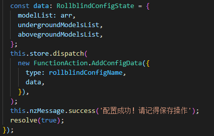

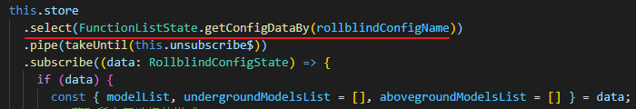

数据来源保持不变, 则保存后的data如果图层树更新, 也不会丢失原来的配置

但是需要重新勾选保存配置


**保存时会明显卡顿**

控制体给出警告: `Application state or actions payloads are too large making Redux DevTools serialization slow and consuming a lot of memory. See https://git.io/fpcP5 on how to configure it.`

可能是因为获取的是Node, 需要转换成string (key) 来保存相应的节点;

使用菜单的数据源, 除了图层树, 都是固定的, 通过key来过滤;


## 树的交互

1. `node.isChecked`
2. `node.isAllChecked`


## 添加图层

1. 标注 -- **DataSource**

   ```js
   this.poiLayer = new Cesium.CustomDataSource('POILayer');
   this.viewer.dataSources.add(this.poiLayer);
   this.poiLayer.entities.add()
   ```

   由于没有在poiPlayer上做细分, 所以不能在控制更小的颗粒,

   

   获取该DataSource,  [DataSourceCollection](http://cesium.xin/cesium/cn/Documentation1.62/DataSourceCollection.html?classFilter=DataSourceCollection).`get` / `getByName`;  

   ```js
   // DataSourceCollection
   viewer.dataSources.getByName('POILayer')
   ```

   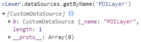

   绘制曲线/平面时, 由于会**临时添加编辑点**(交互点, 交互点两点中点, 会在entities中增加多个实体)

2. 模型 -- **Primitives**

   Model [cn](http://cesium.xin/cesium/cn/Documentation1.62/Model.html?classFilter=Model) [en](https://cesium.com/docs/cesiumjs-ref-doc/Model.html?classFilter=Model)

   ```js
   this.viewer.scene.primitives.add(
       Cesium.Model.fromGltf({
           url: this.configUrl + model,
           scene: this.viewer.scene,
       }),
   );
   ```

   访问: 

   ```js
   viewer.scene.primitives._primitives
   $_.filter(m=>m.type==='model')
   ```

   筛选?  [EntityCollection](http://cesium.xin/cesium/cn/Documentation1.62/EntityCollection.html) ? 以后再考虑优化

   

   3DTileSet

   ```ts
   const tileset = this.viewer.scene.primitives.add(
         new Cesium.Cesium3DTileset({
           url: this.configUrl + model,
           show: true,
         }),
       );
   ```

   二者的在卷帘作用下区别是3DTileset有root属性可以直接用于裁切计算, Model 则不行,

   但是root的Matrix都是相同的, 非引用值, 如果能访问也可以直接传参来计算, *需要突破*, root 非可通过从上往下的方式来获取

   

3.  ---- 以上图层若是未添加, 可能无法正确访问


## 控制数据的裁切

Cesium3DTileset.clippingPlanes : [ClippingPlaneCollection](http://cesium.xin/cesium/cn/Documentation1.62/ClippingPlaneCollection.html) ---- The [`ClippingPlaneCollection`](http://cesium.xin/cesium/cn/Documentation1.62/ClippingPlaneCollection.html) used to selectively disable rendering the tileset.

// bug: 图层交换卷帘就是法向量的正负影响


本地 demo 
<!-- [3D Tiles Clipping Planes](http://localhost:8080/Apps/Sandcastle/index.html?src=3D%20Tiles%20Clipping%20Planes.html) -->
<a href="http://localhost:8080/Apps/Sandcastle/index.html?src=3D%20Tiles%20Clipping%20Planes.html" target="_blank">3D Tiles Clipping Planes</a>

从demo中可以看出平面一侧的渲染被裁切掉了, 如果做比对, 那么就应该有两个裁切面,  或者理解为一个裁切面, 裁切方向不同, (好像也可以通过正负的传参值来控制)

.原来的思路就是从线上取`端点 和 中点` 以3个点[从屏幕坐标 (二维)-> viewer.scene.pickPosition[$](https://cesium.com/docs/cesiumjs-ref-doc/Scene.html#pickPosition) 转为空间坐标 (三维)]获取裁切平面, 其中取点中存在像素偏移处理: 

1. 任取3点来成面的想法来提升过滤的效率

2. 垂直卷帘时, 取顶部的端点时, 为了防止取到天空中的无效三维坐标, 以直线中点作为顶点; 改变后处理不变

3. 增加step, 为了防止取点失败, 失败的循环次数过多, 增加了step来减少循环次数, 

4. (偶发)相机位置变化时, 获取的世界坐标点会不等, 需要比对重新计算裁切平面 (这里经常会造成卡顿, 没有及时更新坐标值, 导致一直实例化clipPlane), 

   ```js
   this.updateSlidePositions(
           this.slider.offsetLeft + 5, // 因为有偏移值, 所以无法相等
           this.slider.parentElement.offsetHeight,
           false,
         );
   
   const [upOrRightPoint, midPoint, downOrLeftPoint] = this.getSliderLine();
   
   upOrRightPoint.equals(this.sliderUpOrRightPos) &&
       downOrLeftPoint.equals(this.sliderDownOrLeftPos) &&
       midPoint.equals(this.sliderMidPosition)
   ```

   

   实例化其实也可以更改法向量提升性能`normal._cartesian3 = new Cesium.Cartesian3(0.0, 1.0, 0.0);`

5. 


裁切效果: 

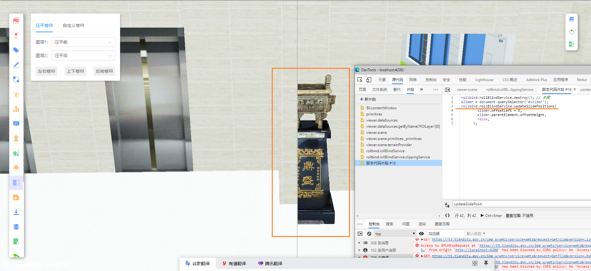

1. 同一个角度执行代码片段也会出现前后结果不一致的情况
2. 俯仰角会影响裁切的法向量的方向. (若是不判断呢)
3. 
4. 传入图层&调用裁切方法
5. 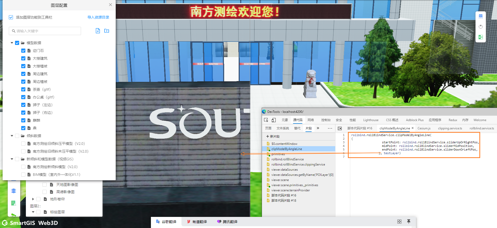


## 影像裁切

设置 [ImageryLayer](http://cesium.xin/cesium/cn/Documentation1.62/ImageryLayer.html?classFilter=imageryL).splitDirection  属性和 [scene](https://cesium.com/docs/cesiumjs-ref-doc/Scene.html?classFilter=scene).imagerySplitPosition  属性

添加多影像设置裁切边界来实现卷帘

1. 控制两个LayerImage的ImagerySplitDirection分别在左右两侧显示
2. imagerySplitPosition  为卷帘线的百分比, 因为此值仅为一维, 且没有横向的, 所以仅支持左右卷帘
3. 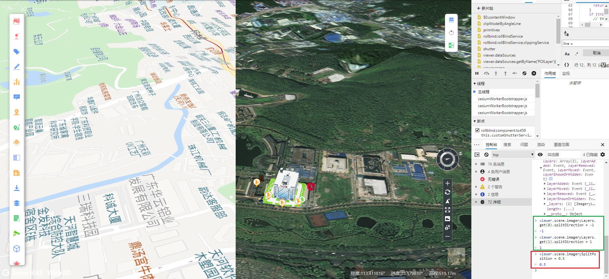

交互:

1. 卷帘一和卷帘二中的影像开关是通用的, 开启其中一个另一个自动开启(默认为关闭状态)

2. 卷帘一影像, 默认选中当前场景中加载的影像, 卷帘二影像初始未选中影像

   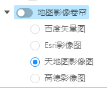

3. 关闭开关后切换卷帘一中的影像, 场景的影像数据会更换

4. 开启开关后呈左侧为初始加载影像, 右侧影像为空的对比状态, 关闭开关后复原; 切换卷帘一中的影像, 左侧的影像数据会更换

   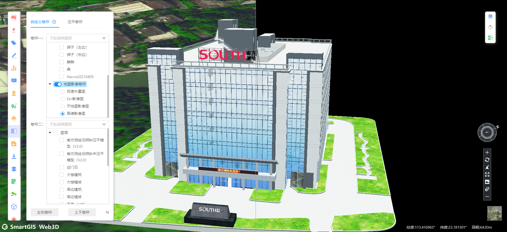

5. 关闭开关后切换卷帘二中的影像, 场景的影像数据会更换(注: 由于加载了两个影像数据, 且卷帘二的优先级高于卷帘一, 所以在未开启开关时, 若选中了卷帘二中的影像, 则优先显示它)

6. 当选中卷帘一和卷帘二中的影像数据并开启开关后则会呈两侧影像对比状态

   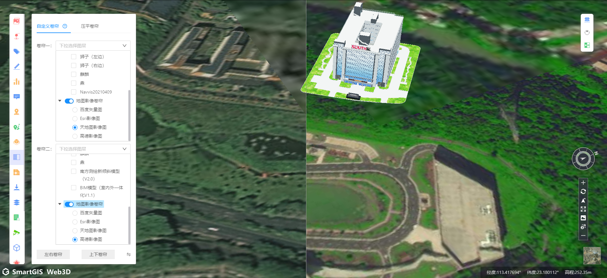

7.  **导入的影像数据， wms/wmts 也可以支持左右卷帘**

   需要再增加一个switch开关来作用上“图层”上的“影像数据”

8. 

## 双边裁切

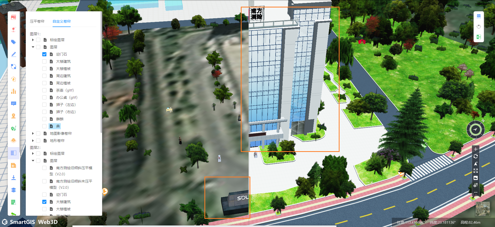

```ts
shutter() {
    const ns1 = this.tree1.getCheckedNodeList();
    const ns2 = this.tree2.getCheckedNodeList();
    this.updateSlidePositions(
      this.slider.offsetLeft + 5,
      this.slider.parentElement.offsetHeight,
      false,
    );
    const line = this.getSliderLine({
      offsetLeftOrTop: this.slider.offsetLeft + 5,
      heightOrWidth: this.slider.parentElement.offsetHeight,
      step: 4,
      direction: this.rollingType,
    });
    ns1.forEach((n) => {
      const layer = this.viewer.scene.primitives._primitives.find((p) => p.id === n.key);
      this.clipModelByAngleLine(
        {
          startPoint: line[0],
          midPoint: line[1],
          endPoint: line[2],
        },
        layer,
      );
    });
    ns2.forEach((n) => {
      const layer = this.viewer.scene.primitives._primitives.find((p) => p.id === n.key);
      this.clipModelByAngleLine(
        {
          startPoint: line[0],
          midPoint: line[1],
          endPoint: line[2],
        },
        layer,
        -1
      );
    });
  }

// positive 控制法向量的方向 以及平面的距离
private clipModelByAngleLine(
    clippingLine: {
      startPoint: Cesium.Cartesian3;
      midPoint: Cesium.Cartesian3;
      endPoint: Cesium.Cartesian3;
    },
    modelLayer: Cesium.Cesium3DTileset,
    positive = 1 // -1 || 1
  ): void {
    if (modelLayer && modelLayer.readyPromise) {
      modelLayer.readyPromise.then(() => {
        const { startPoint, midPoint, endPoint } = clippingLine;
        const normal = this.clippingService.getClipNormalByAngleLine(
          startPoint,
          midPoint,
          endPoint,
          modelLayer.boundingSphere.center,
        );
        const originalPlane = new Cesium.ClippingPlane(normal, 0);

        /* 法向量取反 */
        normal.x *= positive;
        normal.y *= positive;
        normal.z *= positive;

        const firstPoint = this.clippingService.getLocalPosition(
          startPoint,
          modelLayer.boundingSphere.center,
        );
        const distance = Cesium.Plane.getPointDistance(originalPlane, firstPoint);

        const clipPlane = new Cesium.ClippingPlane(normal, -distance * positive);
        // const clipPlane = new Cesium.ClippingPlane(normal, -distance);

        const mat4 = this.clippingService.getClipPlaneMatrix(modelLayer);

        const clippingPlanes = new Cesium.ClippingPlaneCollection({
          edgeWidth: 0.0,
          edgeColor: new Cesium.Color(1.0, 1.0, 0.0, 0.5),
          planes: [clipPlane],
          modelMatrix: mat4,
        });
        modelLayer.clippingPlanes = clippingPlanes;
      });
    }
  }
```

逆向后看更改positive这个变量快速设置界面的法向量方向;

同理闪烁的问题是由于计算的法向量方向相反而出现的:

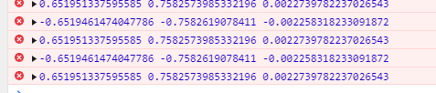

参数相同的情况下出现相反的结果:

```ts
getClipNormalByAngleLine(leftPoint: any, midPoint: any, rightPoint: any, originPoint: any) {
    let up = Cesium.Cartesian3.subtract(leftPoint, midPoint, new Cesium.Cartesian3());
    up = Cesium.Cartesian3.normalize(up, up);
    let right = Cesium.Cartesian3.subtract(rightPoint, midPoint, new Cesium.Cartesian3());
    right = Cesium.Cartesian3.normalize(right, right);
    let normal = Cesium.Cartesian3.cross(right, up, new Cesium.Cartesian3());
    normal = Cesium.Cartesian3.normalize(normal, normal);

    const faEndCartesian = Cesium.Cartesian3.add(
      midPoint,
      Cesium.Cartesian3.multiplyByScalar(normal, 100, new Cesium.Cartesian3()),
      new Cesium.Cartesian3(),
    );

    // 关注法向量产生的计算过程
    const firstPoint = this.getLocalPosition(midPoint, originPoint);
    const secondPoint = this.getLocalPosition(faEndCartesian, originPoint);

    let normalInLocal = Cesium.Cartesian3.subtract(
      secondPoint,
      firstPoint,
      new Cesium.Cartesian3(),
    );
    normalInLocal = Cesium.Cartesian3.normalize(normalInLocal, normalInLocal);
    return normalInLocal;
  }
```

相同的点的不同计算1:

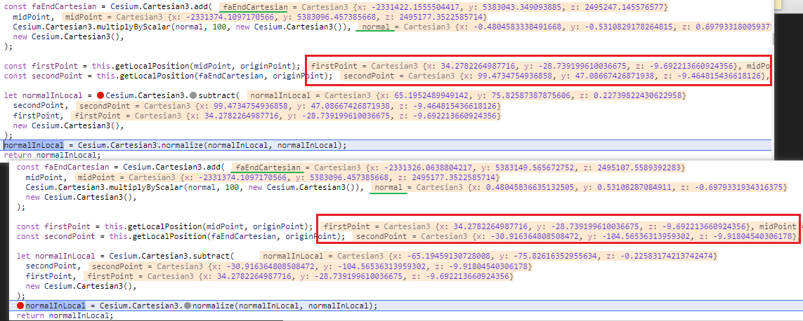

比对下来看到差异为`secondPoint`的结果不一致, 导致后面做向量差的时候正负不同:

但是参与计算的`faEnd` 不相同, 往前推有可能是`getSliderLine` 输出的结果导致的

闪烁时的输出`  console.log(leftPoint, midPoint, rightPoint, originPoint, normalInLocal)`, 其中除了`origin` 原点之外都是来回变化, 相同的参数为何能产出不同的结果呢?...

```js
getClipNormalByAngleLine(leftPoint, midPoint, rightPoint) {
    console.log(leftPoint, midPoint, rightPoint, normalInLocal);
}
```


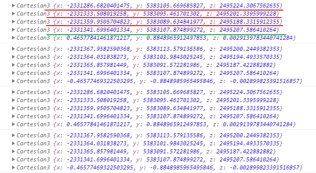

循环执行检测结果,


空间中取的三个点存在共线的情况, 能否改成随机取点?

...

空间静止不动时pickPosition的值时固定的, 

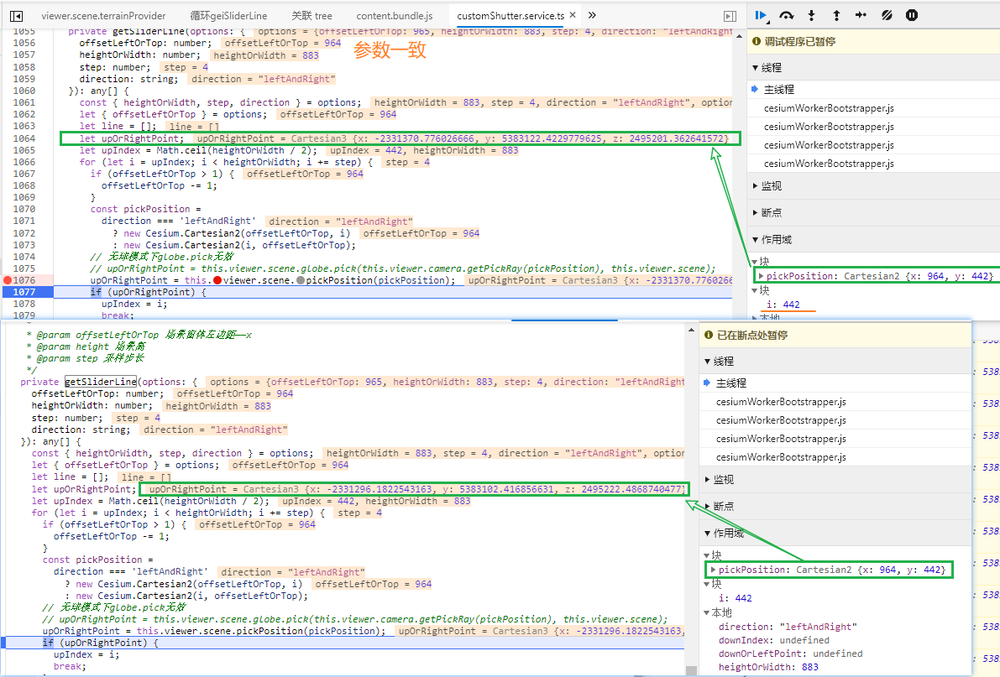

也就是说下面的取点是在场景异动之后再取的, 所以取点变化 有


## 卷帘裁切支持的数据

测试, 非3DTiles的数据

支持, 不支持的原因
