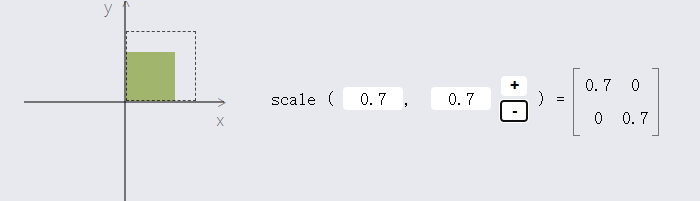
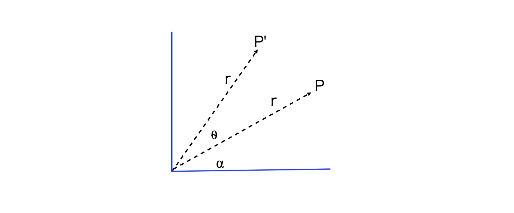
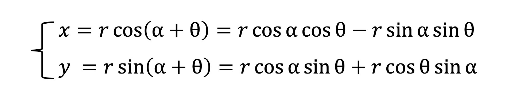

[toc]

旅行是非常棒的经历，但是你不能寄希望于旅行会让你的生活真正发生变革。


## transform & 行列式 (矩阵matrix) [$1](https://robertodip.com/blog/notes-on-linear-transformations/) [geek](https://time.geekbang.org/column/article/259264)

如果将对象视为坐标系统中的一组点，则可以用每个点的位置描述对象的特征，例如其位置和形状。


​							Note how the points change during this scale transformation.

你可以把这些点想象成原点的偏移向量或者n × 1矩阵。

通过使用数学操作修改这些矩阵，您可以有效地更改对象的属性。

可以使用矩阵进行[线性转换](https://en.wikipedia.org/wiki/Linear_map)来转换此向量。例如， 例如：`n = 2`


通过修改此已知矩阵上的值，您可以[缩放](https://robertodip.com/blog/notes-on-linear-transformations/#scale)、[旋转](https://robertodip.com/blog/notes-on-linear-transformations/#rotation)或[剪切](https://robertodip.com/blog/notes-on-linear-transformations/#shear)对象。

您还可以[将多个转换组合](https://robertodip.com/blog/notes-on-linear-transformations/#combining-transformations)成一个矩阵，同时执行所有转换。

这篇文章侧重于二维转换，因为它们更容易理解，但概念在任何空间都有效。

### **2D transformations**

#### **scale**





**Reflection**

scale()中传入 -1 可以得到反射/对称的坐标点


#### **Rotation**

使用旋转变换以相同的角度旋转原点上的每个点。

若要将一个对象ϕ旋转一个角度，需要:


```js
// rotate 的几何运算
class Vector2D {
  ...  
  rotate(rad) {
    const c = Math.cos(rad),
      s = Math.sin(rad);
    const [x, y] = this;

    this.x = x * c + y * -s;
    this.y = x * s + y * c;

    return this;
  }
}
```


我们通过三角函数来简单推导一下: 

假设向量 P 的长度为 r，角度是⍺，现在我们要将它逆时针旋转⍬角，此时新的向量 P’的参数方程为：



因为 rcos⍺、rsin⍺是向量 P 原始的坐标 x0、y0，所以，我们可以把坐标代入到上面的公式中，就会得到如下的公式：


再将它写成矩阵形式，就会得到一个旋转矩阵。


