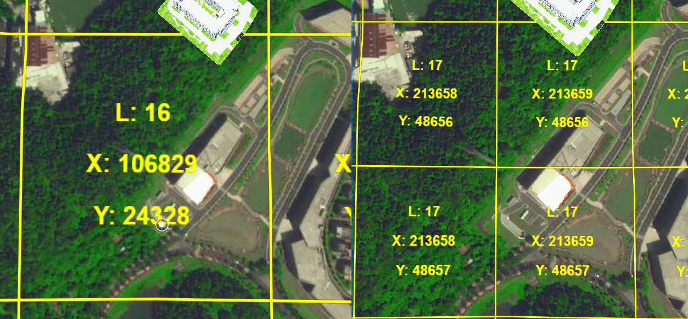

[TOC]

## lod



低级到高级的瓦片 一块 -> 四块, 精度更高


## git

git rebase dev ? `变基分支` [变基](https://git-scm.com/book/zh/v2/Git-%E5%88%86%E6%94%AF-%E5%8F%98%E5%9F%BA)

用法: 当前分支br(非公共分支)上使用 git rebase dev,  与主干保持同步。

​	


git merge/rebase 都可以用于合并分支, 。Rebase 实际上就是取出一系列的提交记录，“复制”它们，然后在另外一个地方逐个的放下去。

Rebase 的优势就是可以创造更线性的提交历史，这听上去有些难以理解。如果只允许使用 Rebase 的话，代码库的提交历史将会变得异常清晰。


上面是merge和rebase的区别:

`merge` 命令。 它会把两个分支的最新快照（`C3` 和 `C4`）以及二者最近的共同祖先（`C2`）进行三方合并，合并的结果是生成一个新的快照（并提交）。

通过合并操作来整合分叉的历史: 提取在 `C4` 中引入的补丁和修改，然后**在 `C3` 的基础上应用一次**。 在 Git 中，这种操作就叫做 **变基（rebase）**。 `rebase` 命令将提交到某一分支上的所有修改都移至另一分支上，就好像“重新播放”一样。

```shell
$ git checkout experiment
$ git rebase master
```

它的原理是首先找到这两个分支（即当前分支 `experiment`、变基操作的目标基底分支 `master`） 的最近共同祖先 `C2`，然后对比当前分支相对于该祖先的历次提交，提取相应的修改并存为临时文件， 然后将当前分支指向目标基底 `C3`, 最后以此将之前另存为临时文件的修改依序应用。


- 本地提交之前，最好把基准点变为需要合并的分支，这样提交 PR/MR 的时侯就不会冲突(本地来解决冲突)
- 不要在公共分支上变基！！！一变其他协作者基本都一堆冲突！除非你们有很清晰的分支管理机制


简单的使用: 

使用pull会有commit message, 

dev 分支变基远程分支进行同步; (dev 分支的信息会减少)

新建的分支 git rebase dev 来进行同步, 使提交信息简洁 (同步dev分支的节点, 也会使得该分支的信息减少)

## [分支的衍合](https://git-reference.readthedocs.io/zh_CN/latest/Git-Branching/Rebasing/)


MR: WIP 表示为不可合并


Squash 表示合并 commit message 为一个, 

