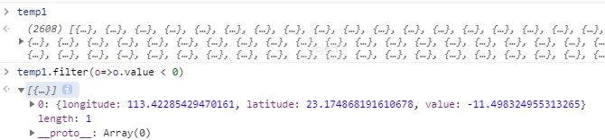

卷帘todo:

1. 修复bug
2. 测试可用数据类型
3. 

## 剖面分析

Lod 会影响结果, 高海拔地区的结果, zoomTo 后会有高度偏差

echart 横轴, 需要根据 step * length 来计算

1. 交互 mouseover 与 click 交互重叠, click after mouseover 具体交互要区分开来
2. 原有的拾取点不准确, 容易拾取两端的一部分数据; 会有负值高度的情况
3. 多次分析会有多个弹窗生成, 共用一个弹窗的话需要更新数据, or 清除弹窗重新渲染

## echart [事件](https://echarts.apache.org/zh/tutorial.html#ECharts%20%E4%B8%AD%E7%9A%84%E4%BA%8B%E4%BB%B6%E5%92%8C%E8%A1%8C%E4%B8%BA)

## echart [基础概念概览](https://echarts.apache.org/zh/tutorial.html#ECharts%20%E5%9F%BA%E7%A1%80%E6%A6%82%E5%BF%B5%E6%A6%82%E8%A7%88)

### echarts 实例

一个网页中可以创建多个 `echarts 实例`。每个 `echarts 实例` 中可以创建多个图表和坐标系等等（用 `option` 来描述）。准备一个 DOM 节点（作为 echarts 的渲染容器），就可以在上面创建一个 echarts 实例。每个 echarts 实例独占一个 DOM 节点。

### 系列(series)

`系列`（[series](https://echarts.apache.org/zh/option.html#series)）是很常见的名词。在 echarts 里，`系列`（[series](https://echarts.apache.org/zh/option.html#series)）是指：一组数值以及他们映射成的图。“系列”这个词原本可能来源于“一系列的数据”，而在 echarts 中取其扩展的概念，不仅表示数据，也表示数据映射成为的图。

所以，一个 `系列` 包含的要素至少有：一组**数值**、图表**类型**（`series.type`）、以及其他的关于这些数据如何映射成图的**参数**。

系列类型（`series.type`）至少有：[line](https://echarts.apache.org/zh/option.html#series-line)（折线图）、[bar](https://echarts.apache.org/zh/option.html#series-bar)（柱状图）、[pie](https://echarts.apache.org/zh/option.html#series-pie)（饼图）、[scatter](https://echarts.apache.org/zh/option.html#series-scatter)（散点图）、[graph](https://echarts.apache.org/zh/option.html#series-graph)（关系图）、[tree](https://echarts.apache.org/zh/option.html#series-tree)（树图）、...

如下图，右侧的 `option` 中声明了三个 `系列`（[series](https://echarts.apache.org/zh/option.html#series)）：[pie](https://echarts.apache.org/zh/option.html#series-pie)（饼图系列）、[line](https://echarts.apache.org/zh/option.html#series-line)（折线图系列）、[bar](https://echarts.apache.org/zh/option.html#series-bar)（柱状图系列），每个系列中有他所需要的数据（[series.data](https://echarts.apache.org/zh/option.html#series.data)）。

类同地，下图中是另一种配置方式，系列的数据从 [数据集 dataset >= echart 4](https://echarts.apache.org/zh/option.html#dataset) 中取：

### 组件 (component)

在系列之上，echarts 中各种内容，被抽象为“组件”。例如，echarts 中至少有这些组件：

1. [xAxis](https://echarts.apache.org/zh/option.html#xAxis)（直角坐标系 X 轴）
2. [yAxis](https://echarts.apache.org/zh/option.html#yAxis)（直角坐标系 Y 轴）
3. [grid](https://echarts.apache.org/zh/option.html#grid)（直角坐标系底板）
4. [toolbox](https://echarts.apache.org/zh/option.html#toolbox)（工具栏组件）
5. [series](https://echarts.apache.org/zh/option.html#series)（系列）
6. [angleAxis](https://echarts.apache.org/zh/option.html#angleAxis)（极坐标系角度轴）
7. [radiusAxis](https://echarts.apache.org/zh/option.html#radiusAxis)（极坐标系半径轴）
8. [polar](https://echarts.apache.org/zh/option.html#polar)（极坐标系底板）
9. [geo](https://echarts.apache.org/zh/option.html#geo)（地理坐标系）
10. [dataZoom](https://echarts.apache.org/zh/option.html#dataZoom)（数据区缩放组件）
11. [visualMap](https://echarts.apache.org/zh/option.html#visualMap)（视觉映射组件）

我们注意到，其实系列（[series](https://echarts.apache.org/zh/option.html#series)）也是一种组件，可以理解为：系列是专门绘制“图”的组件。

如下图，右侧的 `option` 中声明了各个组件（包括系列），各个组件就出现在图中。

注：因为系列是一种特殊的组件，所以有时候也会出现 “组件和系列” 这样的描述，这种语境下的 “组件” 是指：除了 “系列” 以外的其他组件。

### 用 option 描述图表

### 组件的定位

**[类 CSS 的绝对定位]**

多数组件和系列，都能够基于 `top` / `right` / `down` / `left` / `width` / `height` 绝对定位。 这种绝对定位的方式，类似于 `CSS` 的绝对定位（`position: absolute`）。绝对定位基于的是 echarts 容器 DOM 节点。

其中，他们每个值都可以是：

- 绝对数值（例如 `bottom: 54` 表示：距离 echarts 容器底边界 `54` 像素）。
- 或者基于 echarts 容器高宽的百分比（例如 `right: '20%'` 表示：距离 echarts 容器右边界的距离是 echarts 容器宽度的 `20%`）。

如下图的例子，对 [grid](https://echarts.apache.org/zh/option.html#grid) 组件（也就是直角坐标系的底板）设置 `left`、`right`、`height`、`bottom` 达到的效果。

我们可以注意到，`left` `right` `width` 是一组（横向）、`top` `bottom` `height` 是另一组（纵向）。这两组没有什么关联。每组中，至多设置两项就可以了，第三项会被自动算出。例如，设置了 `left` 和 `right` 就可以了，`width` 会被自动算出。

**[中心半径定位]**

少数圆形的组件或系列，可以使用“中心半径定位”，例如，[pie](https://echarts.apache.org/zh/option.html#series-pie)（饼图）、[sunburst](https://echarts.apache.org/zh/option.html#series-sunburst)（旭日图）、[polar](https://echarts.apache.org/zh/option.html#polar)（极坐标系）。

中心半径定位，往往依据 [center](https://echarts.apache.org/zh/option.html#series-pie.center)（中心）、[radius](https://echarts.apache.org/zh/option.html#series-pie.radius)（半径）来决定位置。

**[其他定位]**

少数组件和系列可能有自己的特殊的定位方式。在他们的文档中会有说明。

### 坐标系

## ECharts 中的样式简介

## Cesium 空间坐标转屏幕坐标
