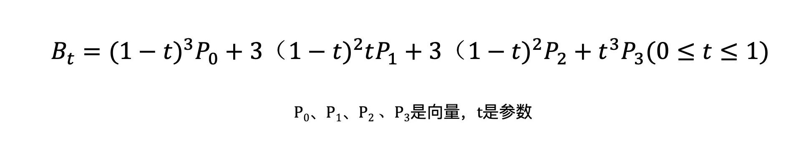

## CANVAS 2D 中的曲线API

圆弧  [arc](https://developer.mozilla.org/zh-CN/docs/Web/API/CanvasRenderingContext2D/arc)

​	圆弧的起点为3点钟方向

圆弧 [arcTo](https://developer.mozilla.org/zh-CN/docs/Web/API/CanvasRenderingContext2D/arcTo)

​	圆弧相切于控制点的两条连线

椭圆 

语法: 

```js
context.ellipse(x, y, radiusX, radiusY, 
	rotation, startAngle, endAngle, anticlockwise);
```

参数: 
各个参数含义和作用如下：

x Number 椭圆弧对应的圆心横坐标。
y Number 椭圆弧对应的圆心纵坐标。
radiusX Number 椭圆弧的**长轴半径**大小。
radiusY Number 椭圆弧的**短轴半径**大小。
rotation Number 椭圆弧的旋转角度，单位是**弧度**。
startAngle Number 圆弧开始的角度，角度从横轴开始算，单位是**弧度**。
endAngle Number 圆弧结束的角度，单位是**弧度**。
anticlockwise（可选）Boolean 弧度的开始到结束的绘制是按照顺时针来算，还是按时逆时针来算。如何设置为true，则表示按照逆时针方向从startAngle绘制到endAngle。

**贝塞尔曲线** [ _ ](https://www.canvasapi.cn/CanvasRenderingContext2D/bezierCurveTo#&introduction)  [mdn](https://developer.mozilla.org/zh-CN/docs/Web/API/CanvasRenderingContext2D/bezierCurveTo)

`CanvasRenderingContext2D.bezierCurveTo()` 是 Canvas 2D API 绘制三次贝赛尔曲线路径的方法。 该方法需要三个点。 第一、第二个点是控制点，第三个点是结束点。

从曲线有两个控制点来看, 曲线方程是三阶贝塞尔曲线（Qubic Bezier Curve）

三阶贝塞尔曲线的参数方程为：



可以看到，与二阶贝塞尔曲线相比，三阶贝塞尔曲线有 4 个点，其中 P0和 P3是起点和终点，P1、P2是控制点，所以三阶贝塞尔曲线有两个控制点。三阶贝塞尔曲线的原理示意图


语法: `context.bezierCurveTo(cp1x, cp1y, cp2x, cp2y, x, y);`
参数
各个参数含义和作用如下：

cp1x Number 第1个控制点的横坐标。
cp1y Number 第1个控制点的纵坐标。
cp2x Number 第2个控制点的横坐标。
cp2y Number 第2个控制点的纵坐标。
x Number 结束点的横坐标
y Number 结束点的纵坐标
起点需要使用 `moveTo` 来修改


## github 看不了图片的问题

https://blog.csdn.net/qq_38232598/article/details/91346392

改 host 文件 `C:\Windows\System32\drivers\etc\hosts` 在文件末尾添加：

```
# GitHub Start 
140.82.113.3      github.com
140.82.114.20     gist.github.com

151.101.184.133    assets-cdn.github.com
151.101.184.133    raw.githubusercontent.com
199.232.28.133     raw.githubusercontent.com 
151.101.184.133    gist.githubusercontent.com
151.101.184.133    cloud.githubusercontent.com
151.101.184.133    camo.githubusercontent.com
199.232.96.133     avatars.githubusercontent.com
151.101.184.133    avatars0.githubusercontent.com
199.232.68.133     avatars0.githubusercontent.com
199.232.28.133     avatars0.githubusercontent.com 
199.232.28.133     avatars1.githubusercontent.com
151.101.184.133    avatars1.githubusercontent.com
151.101.108.133    avatars1.githubusercontent.com
151.101.184.133    avatars2.githubusercontent.com
199.232.28.133     avatars2.githubusercontent.com
151.101.184.133    avatars3.githubusercontent.com
199.232.68.133     avatars3.githubusercontent.com
151.101.184.133    avatars4.githubusercontent.com
199.232.68.133     avatars4.githubusercontent.com
151.101.184.133    avatars5.githubusercontent.com
199.232.68.133     avatars5.githubusercontent.com
151.101.184.133    avatars6.githubusercontent.com
199.232.68.133     avatars6.githubusercontent.com
151.101.184.133    avatars7.githubusercontent.com
199.232.68.133     avatars7.githubusercontent.com
151.101.184.133    avatars8.githubusercontent.com
199.232.68.133     avatars8.githubusercontent.com
199.232.96.133     avatars9.githubusercontent.com

# GitHub End
```

 补充刷新dns命令解决方案

还可以使用`ipconfig/flush`对本地DNS缓存进行一次刷新，如果遇到网络异常，可能是DNS缓存的问题，刷新一下，步骤。

1. windows开始→运行→输入：CMD 按回车键，打开命令提示符窗口。
2. 再输入： `ipconfig /flushdns` 回车,执行命令，可以重建本地DNS缓存。

再附上几个命令：

```shell
ipconfig /displaydns # 显示dns缓存 

ipconfig /flushdns # 刷新DNS记录 

ipconfig /renew # 重请从DHCP服务器获得IP 
```


