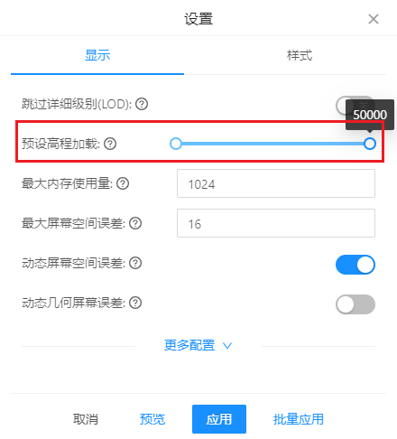
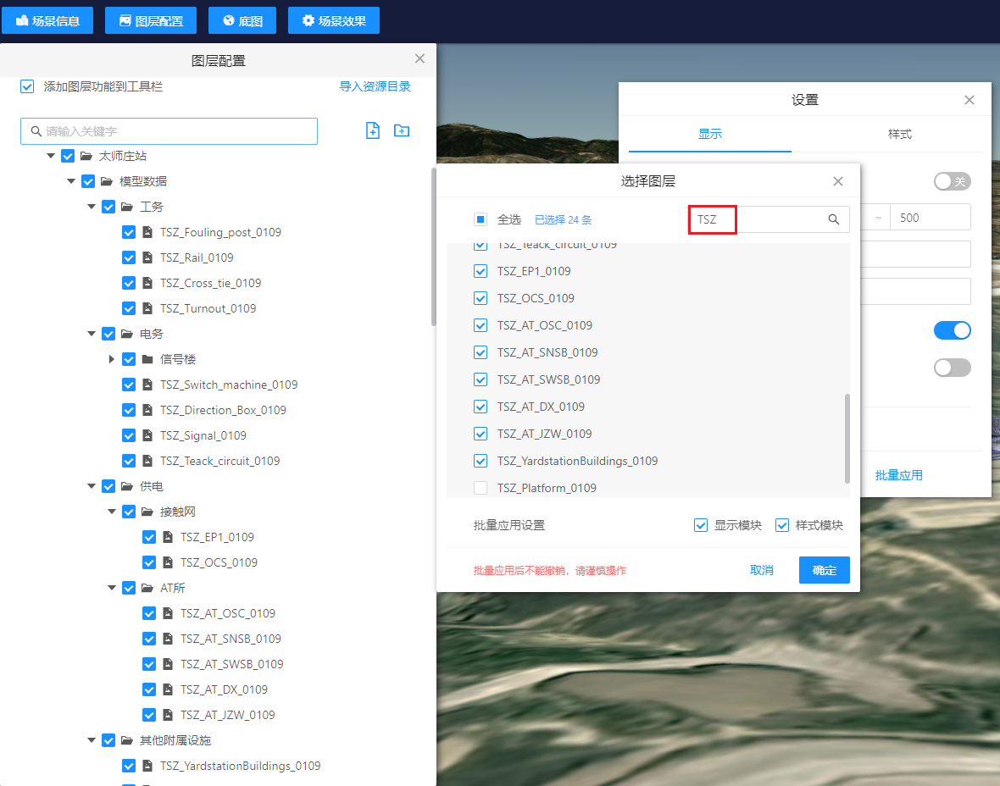
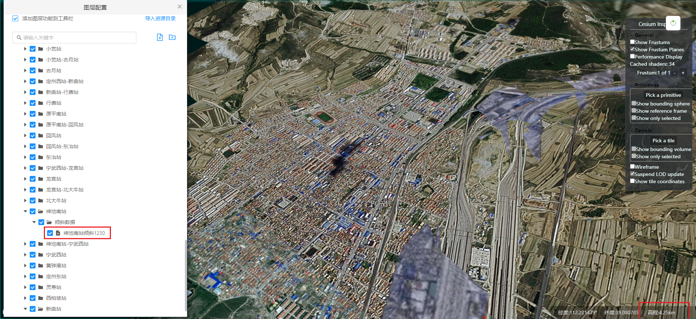
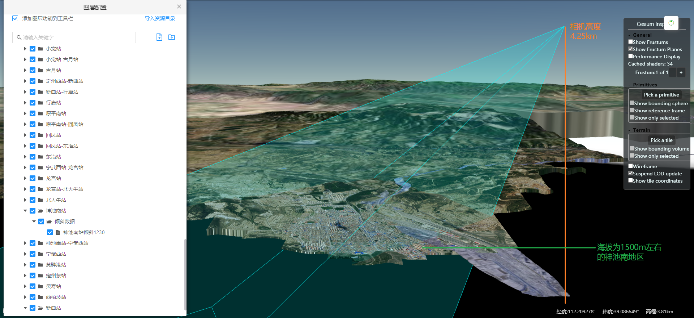
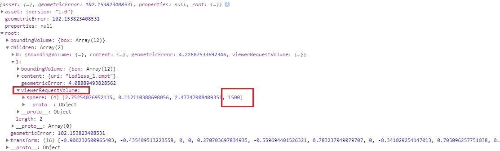

图层加载需求实现效果

图层设置中增加了一项"预设高程加载", 说明为"允许图层可以在设定视角高程范围值内加载，超过或小于该范围值则不加载，且可以批量图层设置", 默认值为`[0, 50000]`(m)

优化点:

1. 初始化时高程匹配了这个范围才会加载图层

   采用"懒加载"的思路,  延迟加载能够快速的进入场景交互阶段, 但是本质上不能解决同时请求加载造成卡顿的问题

2. 加载后如果高程不在这个范围中则会隐藏此图层

   分高程段

3. 最初有做图层延迟加载, 朔黄场景如果使用了延迟加载能让初始化时间减少.  后面考虑到跟图层树交互存在冲突(图层未加载就无法定位等问题)就没保留下来(可能还有其他功能池因为图层未加载导致的冲突). 
   朔黄场景初始化慢的一个重要原因是: 初始化加载图层时同时请求的时候过多, 远超过浏览器网络请求的并发数导致请求时间过长, 所以考虑过延迟加载. 延迟加载本质上不能解决同时请求加载造成卡顿的问题, 只是一种可以考虑的加载策略.

弊端;

1. "懒加载"

   图层未加载时, 图层树上的交互问题

   - 勾选多选框设置图层隐藏/显示无效
   - 定位提示"无法定位"
   - 位置编辑无效

2. 监听相机事件

   始终监听相机的`changed`事件带来一定的性能消耗(已经采用了防抖降低触发频率), 引起调试卡顿不适合在平台中开启()

3. 未与功能池中的功能进行叠加测试

   未加载的图层

4. 

配置参数说明: 图层可以在设定视角高程范围值内加载，超过或小于该范围值则不加载

功能逻辑说明: 

1. 监听camera的changed事件（视角改变指由鼠标左右键拖拽移动、滚轮滚动以及部分执行相机移动的代码触发）, 对每次camera视角改变后获取`camera.positionCartographic` [平台中表示为相机"高程", 朔黄项目中表示为相机"视角高度"], 然后逐一判断此时的相机视角高度是否在各图层中设置的高度范围中, 若在则显示该图层, 不在则隐藏该图层
2. 性能优化: 相机changed事件是一个高频事件, 一次视角移动或者一次滚轮滚动, 都会多次触发. 为了对不必要的changed事件(指移动事件/滚动滚动结束前的事件)作出响应, 对响应的回调函数增加了延迟为200ms的"防抖", 指只对changed事件结束后且200ms内不再有changed事件触发, 才会执行显示/显示图层的操作
3. 始终监听相机的`changed`事件带来一定的性能消耗(已经采用了防抖降低触发频率)

配置使用方法:

1. 在图层配置中选择任意倾斜进行设置

   1. 配置"视角高度范围内加载"参数
   2. 选择"批量应用", "全选"给所有的数据设置一个默认的"视角高度范围内加载"
   3. 举例: 朔黄铁路大部分图层数据所处海拔不超过100m(多数为10-m), 那么可以默认设置参数为"0~750", 即相机在750m高程以下时可观察到图层.(考虑到浏览时相机所在位置的高度也会改变所以增加一部分作为缓冲)
   4. 确认应用后, 选择其他应用了该设置的图层, 点击设置查看"视角高度范围内加载"参数是否为刚刚设置的参数, 确认是否应用成功. 
   5. 定位到该图层, 应用成功后通过鼠标移动/滚动来验证是否正确的显示/隐藏
   6. 该数据仅对影像数据无效
   7. 不会因为配置了相同的范围值而导致性能表现跟之前没有差异, 因为视锥体外的数据不会加载

2. 补充上述范围不适合的图层设置, 以地区为单位进行设置

   1. 举例: 

      1. 神池南站段的海拔高度为1500+m, 可以批量给该站两测的站点设置"视角高度范围内加载"来覆盖上面设置的默认值. 配置"视角高度范围内加载"参数, 如"1400~3000".

      2. "批量应用"选择作用的图层

         1. 根据图层配置中的名称进行搜索

         2. 以"太师庄站"为例("神池南站"数据量过少)进行搜索过滤"批量应用"操作

            

            1. 点击"模型数据"分类下的任一图层设置, 修改"视角高度范围内加载"参数, 搜索"TSZ", 依次勾选过滤后的图层(注意不能点"全选", "全选"不是选择过滤后的数据). 视实际情况可以应用在相邻的站点数据上, 如"太师庄-河间-行别营",  再次搜索关键词"太师庄"过滤, 同样可以应用在其他的图层数据上.
            2. 点击"倾斜数据"分类下的任一图层设置, 修改"视角高度范围内加载"参数, 搜索"太师庄", 依次勾选过滤后的图层(注意不能点"全选", "全选"不是选择过滤后的数据)

         3. 

   2. 按地区应用需要对"倾斜数据"和"模型数据"分别进行一次"批量应用"选择改地区以及与该地区地势相似的地区进行参数设置, 以此来减少配置次数

图层控制隐藏/显示需要处理的优先级问题

图层控制
高层控制
模型细节控制（轻量化）(boundingVolume)

[172.16.11.71:8070 url](http://172.16.11.71:8070/sgeocserver/mapserver/rest/seaweedfs/shtlmxbdzdx1219basisv1/cd8ebc72edd2403e884e58f656983f48/data/layer?userId=cb4badb3-6b00-429e-88ef-5bf27fb9ea5e)

viewerRequestVolumes 这个值是控制瓦片的s 在Cesium中就处理
我们平台上的图层树与高程控制针对的是整个图层数据进行的显示隐藏

## vscode 快速替换同名字符串

选中一段字符 => `ctrl + f2`

