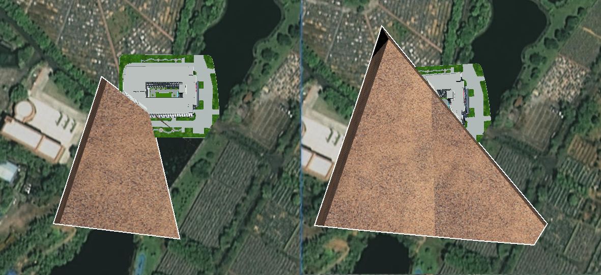
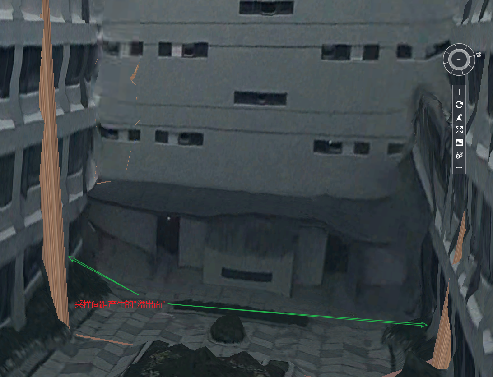

## `<head>`元素的子标签 [head](./head.md)

## 放弃Sass

Sass 优点

使用Sass函数和mixins中的可重用逻辑段可以节省多少时间

### CSS Grid

​	display: grid


### CSS 变量

CSS定制属性不仅可以替换预处理器变量，还可以做更多的事情，它们具有动态更新（而不是在构建时进行编译）的额外好处。这样，就可以在运行时使用Javascript更改值，并在不需使用混合函数和功能胜过级联的函数的情况下对其范围进行限定。


### [mdn grid](https://developer.mozilla.org/zh-CN/docs/Glossary/Grid)

## [display: grid布局教程 - zxx](https://www.zhangxinxu.com/wordpress/2018/11/display-grid-css-css3/)

### [CSS Grid 网格布局教程](https://www.ruanyifeng.com/blog/2019/03/grid-layout-tutorial.html)

Grid 布局与 [Flex 布局](http://www.ruanyifeng.com/blog/2015/07/flex-grammar.html)有一定的相似性，都可以指定容器内部多个项目的位置。但是，它们也存在重大区别。

Flex 布局是轴线布局，只能指定"项目"**针对轴线的位置**，可以看作是**一维布局**。

Grid 布局则是**将容器划分成"行"和"列"，产生单元格**，然后指定"项目所在"的单元格，可以看作是**二维布局**。Grid 布局远比 Flex 布局强大。


## 地形开挖

有一个点不规整, 则开挖效果一般;

选择了隐藏的图层数据, 后面不能传入过滤; 就是场景中隐藏, 控制显示了, 没有改变原来的配置的话 不会更新filter?

图层搜索过滤.


凸多边形表现正常

凹多边形表现不正常



凹多边形的 "凹边" 会直接延长至其他边闭合形成"凸多边形", 多边形的边越多形成的"凸多边形"面积越小


.. 输出技术文档



### 判断多个点的顺逆时针


1. 获取鼠标点击点(鼠标交互点, 简称为"交互点")围成的墙体模型数据
   1. 若两个相邻的交互点相等, 会影响裁切平面的计算 (drawHandler中进行了过滤处理)
2. 添加的几何模型
   1. 垂直方向上的wall
      1. 计算方式, 交互点形成的"闭环"中, 相邻的两点中每隔一小段距离获取对应位置的经纬度, 然后将该将纬度坐标贴在图元/地形上, 得到的点位墙体的点数据 (计算点)
   2. 地面的多边形
3. 添加图元的裁切平面 (通过交互点来计算)
   1. 前置条件: 需要将交互点按逆时针方向输出
   2. 多边形与面平行的判断
4. 性能待提升
5. 调试方式


**将回调函数抽离, 传入固定的点位查看结果差异**

1. 获取上一次的交互点值, 加入判断条件关闭顺逆时针处理
   1. 顺逆时针的差异 (顺时针会出现绘制失败) = 原因未知
2. 


球体裁切 globe[Terrain Clipping Planes](https://sandcastle.cesium.com/?src=Terrain%20Clipping%20Planes.html)

地形开挖的源码与此极度相似


椭球球心(原点)


#### ClippingPlaneCollection.unionClippingRegions

控制裁切平面是并集还是交集,默认是裁切交集区域.. 若是设置并集, 则裁切范围会大很多.可能是因为有重叠.


## 求两个数组中的相同对象


## Array.prototype.includes

没有该方法之前，我们通常使用数组的`indexOf`方法，检查是否包含某个值。

```javascript
if (arr.indexOf(el) !== -1) {
  // ...
}
```

`indexOf`方法有两个缺点，一是不够语义化，它的含义是找到参数值的第一个出现位置，所以要去比较是否不等于`-1`，表达起来不够直观。二是，它内部使用严格相等运算符（`===`）进行判断，这会导致对`NaN`的误判。

简易版 includes polyfill

```js
const contains = (() =>
  Array.prototype.includes
    ? (arr, value) => arr.includes(value)
    : (arr, value) => arr.some(el => el === value)
)();
contains(['foo', 'bar'], 'baz'); // => false
```

另外，Map 和 Set 数据结构有一个`has`方法，需要注意与`includes`区分。

- Map 结构的`has`方法，是用来查找键名的，比如`Map.prototype.has(key)`、`WeakMap.prototype.has(key)`、`Reflect.has(target, propertyKey)`。
- Set 结构的`has`方法，是用来查找值的，比如`Set.prototype.has(value)`、`WeakSet.prototype.has(value)`。
