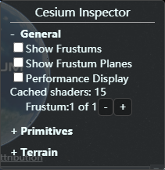
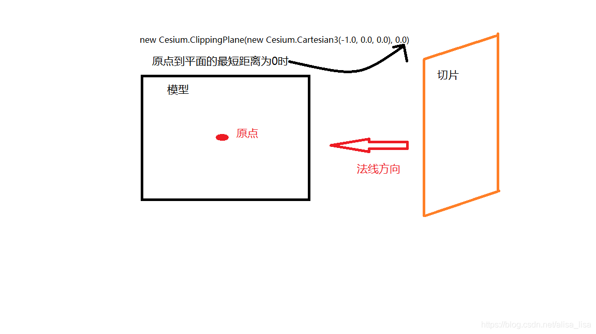
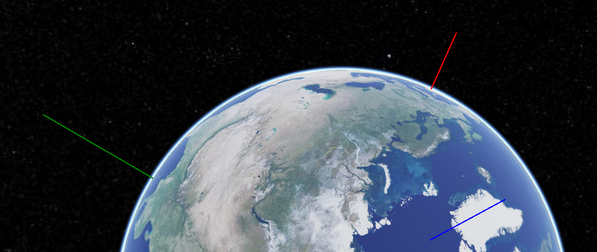
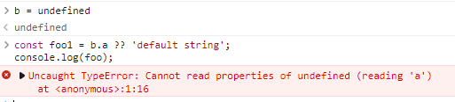
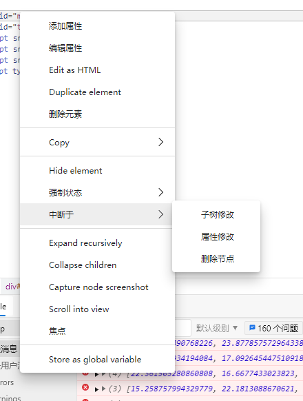

## Cesium 中的mixin

#### viewerCesium3DTilesInspectorMixin(viewer) [源码](https://github.com/CesiumGS/cesium/blob/1.81/Source/Widgets/Viewer/viewerCesium3DTilesInspectorMixin.js#L16)

A mixin which adds the [`Cesium3DTilesInspector`](https://cesium.com/docs/cesiumjs-ref-doc/Cesium3DTilesInspector.html) widget to the [`Viewer`](https://cesium.com/docs/cesiumjs-ref-doc/Viewer.html) widget.

#### viewerCesiumInspectorMixin(viewer) [源码](https://github.com/CesiumGS/cesium/blob/1.81/Source/Widgets/Viewer/viewerCesiumInspectorMixin.js#L21)

A mixin which adds the `CesiumInspector` widget to the Viewer widget. 



#### viewerDragDropMixin(viewer, options) [源码](https://github.com/CesiumGS/cesium/blob/1.81/Source/Widgets/Viewer/viewerDragDropMixin.js#L11)

A mixin which adds default drag and drop support for CZML files to the Viewer widget. 

#### viewerPerformanceWatchdogMixin(viewer, options) [源码](https://github.com/CesiumGS/cesium/blob/1.81/Source/Widgets/Viewer/viewerPerformanceWatchdogMixin.js#L26)

A mixin which adds the [`PerformanceWatchdog`](https://cesium.com/docs/cesiumjs-ref-doc/PerformanceWatchdog.html) widget to the [`Viewer`](https://cesium.com/docs/cesiumjs-ref-doc/Viewer.html) widget.


平台中只有前两种mixin可以使用


## boundingSphere

#### Cesium3DTileset.boundingSphere : [BoundingSphere](https://cesium.com/docs/cesiumjs-ref-doc/BoundingSphere.html)


## ClippingPlane

#### new Cesium.ClippingPlane(normal, distance)

| Name       | Type                                                         | Description                                                  |
| :--------- | :----------------------------------------------------------- | :----------------------------------------------------------- |
| `normal`   | [Cartesian3](https://cesium.com/learn/cesiumjs/ref-doc/Cartesian3.html) | The plane's normal (normalized).                             |
| `distance` | Number                                                       | The shortest distance from the origin to the plane. The sign of `distance` determines which side of the plane the origin is on. If `distance` is positive, the origin is in the half-space in the direction of the normal; if negative, the origin is in the half-space opposite to the normal; if zero, the plane passes through the origin. (原点是指法向量的原点) |

- 创建一个裁切平面，设置平面的法线方向和从原点到平面的最短距离，裁切平面会经过原点，
- 如果距离为正，则原点在法向的方向上；如果距离为负，则原点在法向反方向上；
- 如果距离为零，原点在模型的正中心，如下图所示。
  
- 文档中关于distance的描述: The shortest distance from the origin to the plane. The sign of `distance` determines which side of the plane the origin is on. 
  - If `distance` is positive, the origin is in the half-space in the direction of the normal; 
  - if negative, the origin is in the half-space opposite to the normal; 
  - if zero, the plane passes through the origin.
- 翻译: 从原点到平面的最短距离。 距离的符号确定原点在平面的哪一侧。 
  - 如果`距离`为正，则原点位于法线方向的''半空间''中；
  - 如果为负，则原点位于与法线相反的''半空间''中； 
  - 如果为零，则平面穿过原点。

**裁切保留方向为法线的方向**; 

不过非垂直方向上的方向不够直观, 因为可以旋转场景

需要开启坐标轴辅助`DebugModelMatrixPrimitive`来观察:

```js
viewer.scene.primitives.add(new Cesium.DebugModelMatrixPrimitive())
```



X轴为红色；Y轴为绿色；Z轴为蓝色。 (rgb_xyz)


## 运算符 ?? / ?.

**空值合并**操作符（`??`）是一个逻辑操作符，当左侧的操作数为 [`null`](https://developer.mozilla.org/zh-CN/docs/Web/JavaScript/Reference/Global_Objects/null) 或者 [`undefined`](https://developer.mozilla.org/zh-CN/docs/Web/JavaScript/Reference/Global_Objects/undefined) 时 (不包括空串和其他 `fasly` 值)，返回其右侧操作数，否则返回左侧操作数。

```js
const foo = null ?? 'default string';
console.log(foo);
// expected output: "default string"

const baz = 0 ?? 42;
console.log(baz);
// expected output: 0
```



**不能避免读取报错的问题**


**可选链操作符**( **`?.`** )允许读取位于连接**对象链深处的属性的值**，而不必明确验证链中的每个引用是否有效。

`?.` 操作符的功能类似于 `.` 链式操作符，不同之处在于，**在引用为空**([nullish](https://wiki.developer.mozilla.org/en-US/docs/Glossary/nullish) ) ([`null`](https://developer.mozilla.org/zh-CN/docs/Web/JavaScript/Reference/Global_Objects/null) 或者 [`undefined`](https://developer.mozilla.org/zh-CN/docs/Web/JavaScript/Reference/Global_Objects/undefined)) 的情况下不会引起错误，**该表达式短路返回值是 `undefined`**。与函数调用一起使用时，如果给定的函数不存在，则返回 `undefined`。

当尝试**访问可能不存在的对象属性**时，可选链操作符将会使表达式更短、更简明。在探索一个对象的内容时，如果不能确定哪些属性必定存在，可选链操作符也是很有帮助的。

```js
const adventurer = {
  name: 'Alice',
  cat: {
    name: 'Dinah'
  }
};

const dogName = adventurer.dog?.name;
console.log(dogName);
// expected output: undefined

console.log(adventurer.someNonExistentMethod?.());
// expected output: undefined

// 语法
obj?.prop
obj?.[expr]
arr?.[index]
func?.(args)
```

存在嵌套结构的对象 `obj`。不使用可选链的话，查找一个深度嵌套的子属性时，需要验证之间的引用，例如：

```js
let nestedProp = obj.first && obj.first.second;
```

为了避免报错，在访问`obj.first.second`之前，要保证 `obj.first` 的值既不是 `null`，也不是 `undefined`。如果只是直接访问 `obj.first.second`，而不对 `obj.first` 进行校验，则有可能抛出错误。

```js
// with ?.
let nestedProp = obj.first?.second;
```

通过使用 `?.` 操作符取代 `.` 操作符，JavaScript 会在尝试访问 `obj.first.second` 之前，先隐式地检查并确定 `obj.first` 既不是 `null` 也不是 `undefined`。

**如果`obj.first `是 `null` 或者 `undefined`，表达式将会短路计算直接返回 `undefined`。**

这等价于以下表达式，但实际上没有创建临时变量：

```js
let temp = obj.first;
let nestedProp = 
    ((temp === null || temp === undefined) ? undefined : temp.second);
```


## 调试DOM节点改变



更多调试断点方式:

 [chrome DevTools开发这调试工具之断点调试](https://blog.csdn.net/qq_27324983/article/details/102467199)

[简介 | Frontend Wingman](https://frontendwingman.com/Chrome/)

[【译】你不知道的 Chrome 调试工具技巧 第十六天：断点 (juejin.cn)](https://juejin.cn/post/6844903743889080328)


## [图层树设计](./前端 - 图层树设计.docx)

