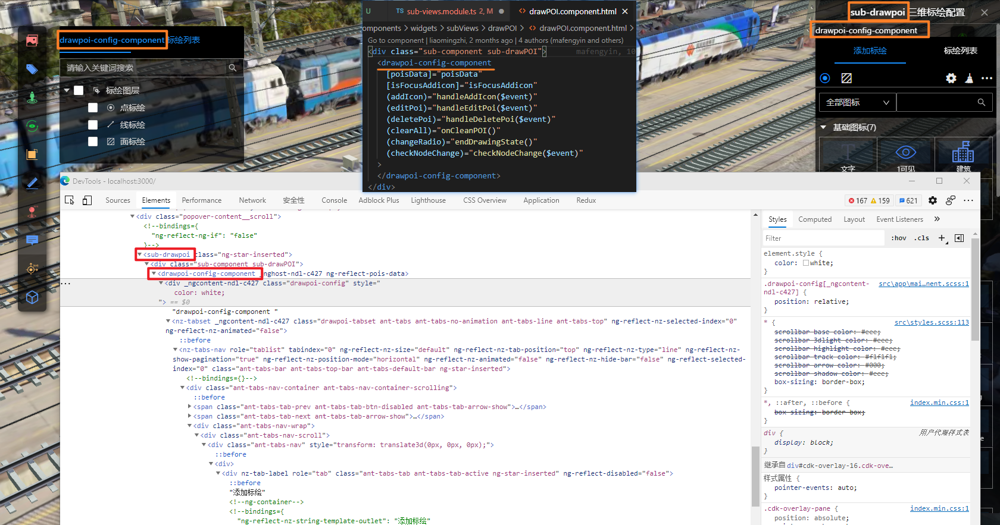
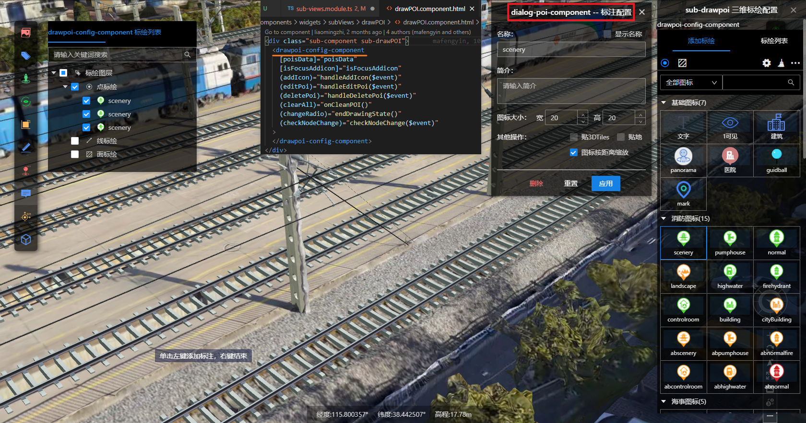
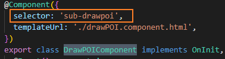

## sh

1. 添加标签 (添加标注) 
   1. 如何保存信息到添加的矢量上(add to store), 使得点击的时候能获取到
   2. addStore的时机 => 得到绘制结果前用默认的结果提前存储
   3. 更新信息 包括点1
      1. 接口关联
      2. 请求回来的数据如何关联到store中, 
         1. 先与defaultValue进行合并然后再dispatch
         2. 
2. 关联模型 (添加模型) -- 屏蔽部分功能
3. 隧道内/场景中过滤矢量
4. 大屏...

## 添加标注组件结构

共享的一个组件 (config-component) 通过create弹窗在左右两侧生成不同的组件, 通过权限过滤内容

对标注的弹窗配置dialog-poi-component

三维平台中对应的组件名称为`DrawPOIComponent`, 

即对应`sub-drawpoi`这个selector

# 如何在iScene中添加新功能 [doc](./基于web3d前端开发培训.docx)

1. 在后台运维管理系统的添加新功能

2. 维护`function-map.json` ,  `function-map.type.ts` 和`function-configurable.type.ts`文件

3. Q：为什么后台运维管理系统中已提供了功能管理了，本地文件中还需要在function-map.type.ts中填写功能内容？

   ​	后台运维管理系统中的功能管理主要是让其他非开发人员**对已有某些功能属性进行管理**，例如：修改名称、图标、图标颜色、分组等。

   ​	而function-map.type.ts更多是**管理非开发人员无法修改和控制的部分**，例如：组件的存在，是否有子项、属性配置弹窗等。

   并非在后台运维管理系统中创建一个功能就能在iScene中使用。需要两者一起才能整出iScene的功能池。

4. Q: function-map.json的作用是什么？
     A：该文件主要为 后台运维管理系统>功能管理中的组件字段提供已有功能选择列表，如下图所示

