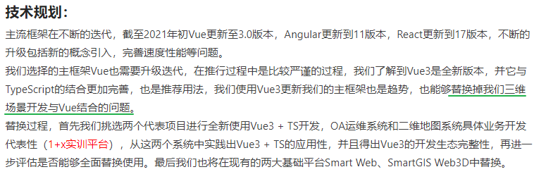
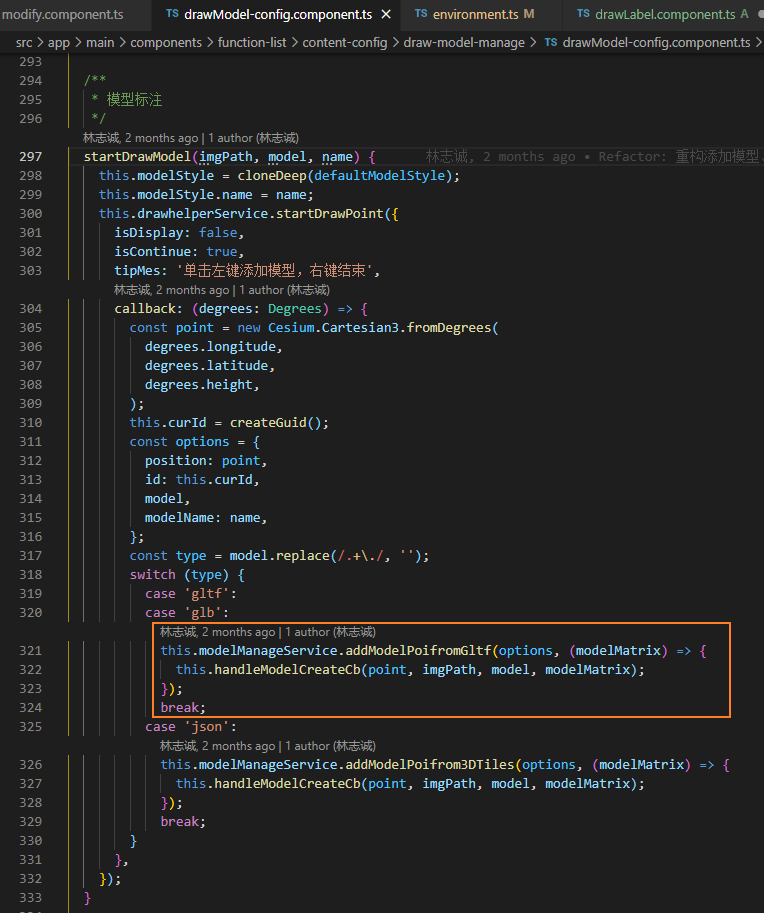

## 不规则图形 [Creating Non-Rectangular Headers | CSS-Tricks](https://css-tricks.com/creating-non-rectangular-headers/)

| Allows complex BG below | Browser support | Shapes creatable |                  |
| :---------------------- | :-------------- | :--------------- | ---------------- |
| Image                   | No              | Yes              | All              |
| SVG                     | No              | Yes              | All              |
| Clip-path               | Yes             | No               | All              |
| Border-radius           | Yes             | Yes              | Elliptical only  |
| Transform: skew         | Yes             | Yes              | Trapezoidal only |

## node_modules 中重复代码计算 

[Only 39% of the functions in node_modules are unique in the default Angular project / Хабр (habr.com)](https://habr.com/ru/post/554334/)

## IScene 中 store 和 接口的作用

store 会统一被save接口获取, 

1. 初始化时会添加到store中
2. 对应的功能配置会从store中读取
3. 修改状态后会dispatch更改
4. 与场景相关的配置项会与store关联

接口是单独服务于某一类需要动态获取的数据

**尽量保证store中的数据格式与接口中的一致**

## 标签管理

1. 是否需要控制隐藏, 接口中传入display: true/false (TODO)
2. 是否需要 brower 保存的标签再能编辑, 接口中传入isBrower: true/false(TODO); isShowName(TODO)
3. 控制标签显示隐藏 (隧道/场景)
4. 界面
5. 设备列表
6. 模型 - 如何允许编辑多次 ? ---- 直接使用模型的数据, 编辑不用单独控制了
7. 构造树形结构, 交互 (批量/单独=>显示/隐藏)
8. 更换标签实体的图片, 图片地址异常
9. 拖动标签后的position保存异常
   1. position = position.getValue()
10. 
11. bug
    1. brower 下的标签定位
    2. 模型-轴编辑

### 项目二次开发遇到的问题

1. IScene功能池中新增一个功能模块, 功能模块与已有功能模块相似, 且需要关联业务数据, 问是在原来的基础上魔改, 还是拷贝一份代码出来删删改改?
2. 进一步问: 如果是拷贝出来开发, ng+ts框架的门槛(对于长期使用Vue的前端开发)略高, 且少量三维交互不可避免, 对于项目来说怎样做会方便开发人员开发和维护?
3. 如何进行同步平台上的更新(项目上派生出一个版本之后如果有自己的界面样式/功能定制会直接影响同步更新的频率)
4. 后续IScene的框架是否会修改? 

## 添加模型

