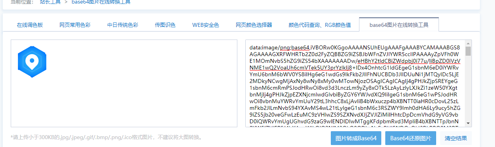

## 前端如何处理接口返回的图片流文件


不加responseType则无法正确获取数据


不同的responseType决定接收到的结果的类型


1. Bolb借助FileReader来读取

   ```js
   var a = new FileReader();
   a.onload = function(e) {
       callback(e.target.result);
   }
   a.readAsDataURL(blob);
   ```

   

2. ArrayBuffer图片转base64进制显示

   ```js
   Src = 'data:image/png;base64,' + btoa(new Uint8Array(ArrayBuffer).reduce((data, byte) => data + String.fromCharCode(byte), ''))
   ```

   

   确认结果, 记得添加前缀`data:image/png;base64,`

3. 


## btoa
