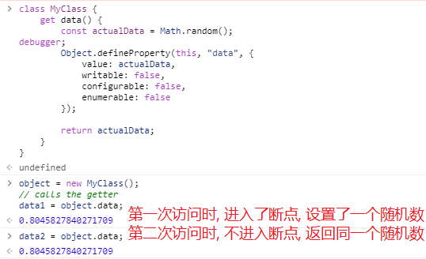
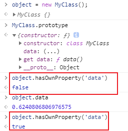
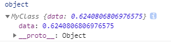
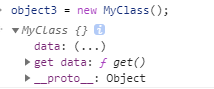

## 准备与领导洽谈

现状:

1. 本人工作现状
2. 工作中遇到的问题

计划:


## js中的懒加载

```js
// 按需加载
class MyClass {
    get data() {
        return someExpensiveComputation();
    }
}
```


```js
// The messy lazy-loading property pattern (凌乱的懒惰加载属性模式)
class MyClass {
    get data() {
        const actualData = someExpensiveComputation();

        Object.defineProperty(this, "data", {
            value: actualData,
            writable: false,
            configurable: false,
            enumerable: false
        });

        return actualData;
    }
}
```

属性再次被定义为类的获取器，但这次它缓存了结果。

调用`Object.defineProperty()`创建一个新的属性`data`具有固定值`actualData`, and is set to not be writable, configurable, and enumerable (to match the getter).

下次访问属性`data`时，它将从新创建的属性中读取，而不是调用获取器



所有计算仅在第一次读取属性时完成。属性的每个后续读取返回缓存版本。

这种模式的缺点是: 属性data一开始是作为类上的取值器`getter`, 也可以理解成是原型上的属性, 但是读取data之后呢却定义到了实例自身的属性上. (另外创建的实例不受影响, 访问data时也会访问取值器`getter`读取随机数)



虽然这种区别在许多情况下并不重要，但了解这种模式很重要，因为当对象被传递时，可能会导致微妙的问题。


```js
// The only-own lazy-loading property pattern for classes
// 类的only-own懒加载属性模式
class MyClass {
    constructor() {
		// 在创建实例时给实例加上属性用来满足访问getter前后都能object.hasOwnProperty("data")
        Object.defineProperty(this, "data", {
            get() {
                const actualData = someExpensiveComputation();

                Object.defineProperty(this, "data", {
                    value: actualData,
                    writable: false,
                    configurable: false
                });

                return actualData;
            },
            configurable: true,
            enumerable: true
        });

    }
}
```



```js
// 对象字面的懒惰加载属性
const object = {
    get data() {
        const actualData = someExpensiveComputation();

        Object.defineProperty(this, "data", {
            value: actualData,
            writable: false,
            configurable: false,
            enumerable: false
        });

        return actualData;
    }
};

console.log(object.hasOwnProperty("data"));     // true
const data = object.data;
console.log(object.hasOwnProperty("data"));     // true
```


### Cesium 中使用的懒加载源码 [$ cesium/CallbackProperty](https://github.com/CesiumGS/cesium/blob/1.82/Source/DataSources/CallbackProperty.js#L14)

**Cesium.CallbackProperty**

A [`Property`](https://cesium.com/docs/cesiumjs-ref-doc/Property.html) whose value is **lazily evaluated** by a callback function.

| Name         | Type                                                         | Description                                                  |
| :----------- | :----------------------------------------------------------- | :----------------------------------------------------------- |
| `callback`   | [CallbackProperty.Callback](https://cesium.com/docs/cesiumjs-ref-doc/CallbackProperty.html#.Callback) | The function to be called when the property is evaluated.    |
| `isConstant` | Boolean                                                      | `true` when the callback function returns **the same value every time**, `false` if the value will change. |

```js
import defined from "../Core/defined.js";
import DeveloperError from "../Core/DeveloperError.js";
import Event from "../Core/Event.js";

function CallbackProperty(callback, isConstant) {
  this._callback = undefined;
  this._isConstant = undefined;
  this._definitionChanged = new Event();
  this.setCallback(callback, isConstant);
}

Object.defineProperties(CallbackProperty.prototype, {
  /**
   * @type {Boolean}
   * @readonly
   */
  isConstant: {
    get: function () {
      return this._isConstant;
    },
  },
  /**
   * Gets the event that is raised whenever the definition of this property changes.
   * The definition is changed whenever setCallback is called.
   * @memberof CallbackProperty.prototype
   *
   * @type {Event}
   * @readonly
   */
  definitionChanged: {
    get: function () {
      return this._definitionChanged;
    },
  },
});

/**
 * Gets the value of the property.
 *
 * @param {JulianDate} [time] The time for which to retrieve the value.  This parameter is unused since the value does not change with respect to time.
 * @param {Object} [result] The object to store the value into, if omitted, a new instance is created and returned.
 * @returns {Object} The modified result parameter or a new instance if the result parameter was not supplied or is unsupported.
 */
CallbackProperty.prototype.getValue = function (time, result) {
  return this._callback(time, result);
};
/**
 * Sets the callback to be used.
 *
 * @param {CallbackProperty.Callback} callback The function to be called when the property is evaluated.
 * @param {Boolean} isConstant <code>true</code> when the callback function returns the same value every time, <code>false</code> if the value will change.
 */
CallbackProperty.prototype.setCallback = function (callback, isConstant) {
  //>>includeStart('debug', pragmas.debug);
  if (!defined(callback)) {
    throw new DeveloperError("callback is required.");
  }
  if (!defined(isConstant)) {
    throw new DeveloperError("isConstant is required.");
  }
  //>>includeEnd('debug');

  var changed = this._callback !== callback || this._isConstant !== isConstant;

  this._callback = callback;
  this._isConstant = isConstant;

  if (changed) {
    this._definitionChanged.raiseEvent(this);
  }
};

/**
 * Compares this property to the provided property and returns
 * <code>true</code> if they are equal, <code>false</code> otherwise.
 *
 * @param {Property} [other] The other property.
 * @returns {Boolean} <code>true</code> if left and right are equal, <code>false</code> otherwise.
 */
CallbackProperty.prototype.equals = function (other) {
  return (
    this === other ||
    (other instanceof CallbackProperty &&
      this._callback === other._callback &&
      this._isConstant === other._isConstant)
  );
};

/**
 * A function that returns the value of the property.
 * @callback CallbackProperty.Callback
 *
 * @param {JulianDate} [time] The time for which to retrieve the value.
 * @param {Object} [result] The object to store the value into, if omitted, a new instance is created and returned.
 * @returns {Object} The modified result parameter or a new instance if the result parameter was not supplied or is unsupported.
 */
export default CallbackProperty;
```


## 大屏字体单位

```css
html{
	font-size:20px;
}  
test1 {
  width: 1.4rem; //1.4 × 20px = 28px
  font-size: 2.5em // 50px;
}
```

- 4096 * 2160： 4K高清显示器toLocaleString


## 对接推送websocket改实例纹理

原纹理图片所在路径, [BillboardGraphics - Cesium Documentation](https://cesium.com/docs/cesiumjs-ref-doc/BillboardGraphics.html#image)

直接给它覆盖了就得了

`entity.billboard.image._value`

`labelManageConfigComponent.labelManageService.getEntityByID('287159b19bc24a2c15fa1ef1447f3f3e').billboard.image._value = ""`
