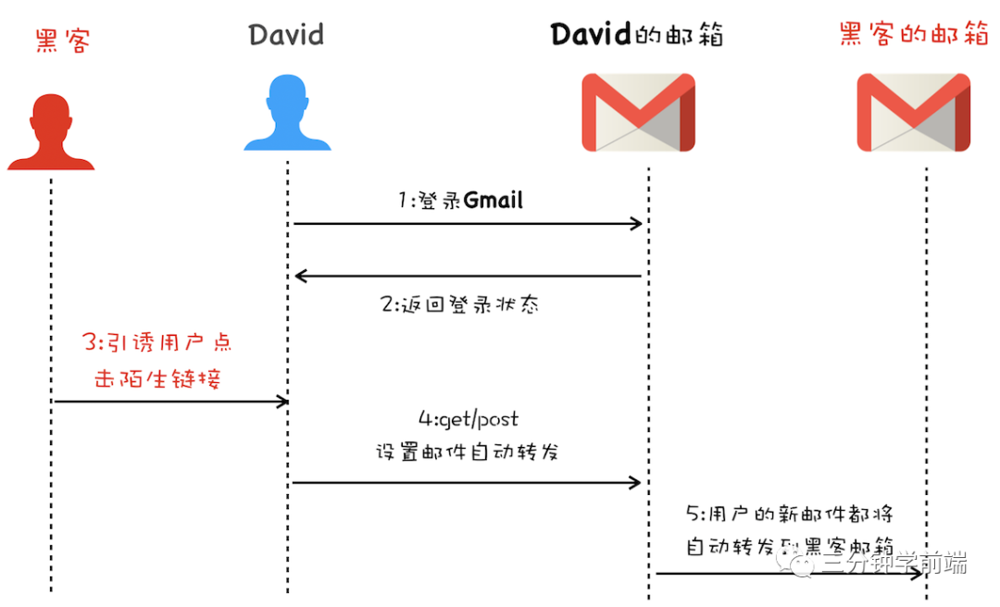
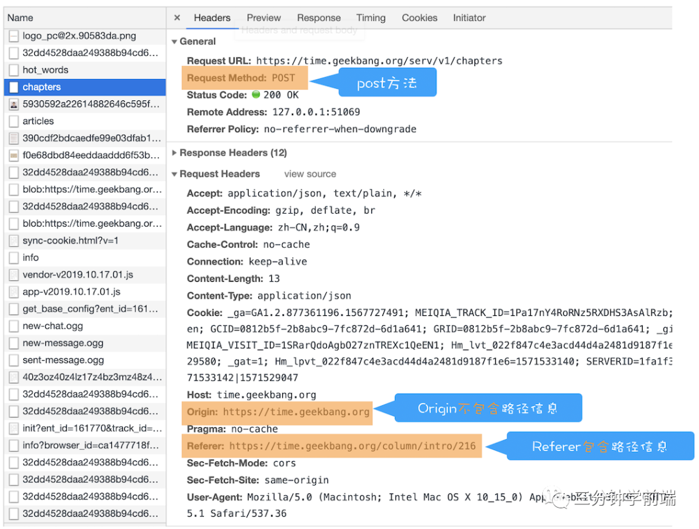

## CSRF

CSRF（Cross-site request forgery）跨站请求伪造，是指攻击者诱导受害者进入第三方网站，在第三方网站中，向被攻击网站发送跨站请求。利用受害者在被攻击网站**已经获取的注册凭证**，绕过后台的用户验证，达到冒充用户对被攻击的网站执行某项操作的目的。

攻击流程如下：

- 受害者登录 http://a.com ，并保留了登录凭证（Cookie）
- 攻击者引诱受害者访问了 http://b.com
- http://b.com 发送了一个请求：http://a.com/act=xx 。浏览器会默认携带 http://a.com 的Cookie。
- http://a.com 接收到请求后，对请求进行验证，并确认是受害者的凭证，误以为是受害者自己发送的请求。
- http://a.com 以受害者的名义执行了act=xx。
- 攻击完成，攻击者在受害者不知情的情况下冒充受害者，让 http://a.com 执行了自己定义的操作。

一个真实的案例：用户 David 在自己邮箱内点击了黑客恶意伪装的链接。黑客在点击的链接里冒充用户(cookie)向 Gmail 服务器发送邮件自动转发请求，导致 David 的邮件都被自动转发到了黑客的邮箱，从而被黑客利用盗取了用户数据。



### 攻击方式

1. **自动发起的get请求**

   ` `

   将支付的接口请求隐藏在 `img` 标签内，在加载这个标签时，浏览器会自动发起 `img` 的资源请求，`a.com` 就会收到包含受害者登录信息的一次跨域请求

2. **自动发起的post请求**

   ```html
   <form action="http://a.com/pay" method=POST>
       <input type="hidden" name="account" value="sisterAn" />
       <input type="hidden" name="amount" value="10000" />
       <input type="hidden" name="for" value="hacker" />
   </form>
   <script> document.forms[0].submit(); </script> 
   ```

   以上两种就是访问页面后(流程中的b页面)就会发起的攻击

3. #### 引诱用户点击链接的 CSRF 

   需要用户点击链接才会触发。这种类型通常是在论坛中发布的图片中嵌入恶意链接，或者以广告的形式诱导用户中招

   ```html
   <div>
      </img> 
     <a href="https://a.com/pay?amount=10000&for=hacker" taget="_blank">
       点击查看更多美女
     </a>
   </div>
   ```

### 总结：CSRF 的产生的条件

- 目标站点一定要有 CSRF 漏洞
- 用户要**登录**过目标站点，并且在浏览器上保持有该站点的登录状态 (session - 追踪用户 /cookie)
- **需要用户打开一个第三方站点**，可以是攻击者的站点，也可以是一些论坛

### 防护策略

#### 1. 利用 Cookie 的 SameSite 属性

通过上面的介绍，我们知道攻击者是**利用用户的登录状态**来发起 CSRF 攻击，而 **Cookie 正是浏览器和服务器之间维护登录状态的一个关键数据**，因此要阻止 CSRF 攻击，我们首先就要考虑在 Cookie 问题

通常 **CSRF 攻击都是从第三方站点发起的，冒用受害者在被攻击网站的登录凭证**，所以我们可以做以下防护：

- 如果是**从第三方站点发起的请求，浏览器禁止发送某些关键 Cookie 数据到服务器**
- 如果是同一个站点发起的请求，那么就需要保证 Cookie 数据正常发送。

**Cookie 中的 SameSite 属性**正是为了解决这个问题的，通过使用 SameSite 可以有效地降低 CSRF 攻击的风险

> SameSite 选项通常有 `Strict` 、`Lax` 和 `None` 三个值。
>
> - Strict：浏览器完全禁止第三方拿到 Cookie
> - Lax：相对宽松一点，在跨站点的情况下，从第三方站点的链接打开或 Get 方式的表单提交这两种方式都会携带 Cookie；除此之外，如 Post 请求、 img、iframe 等加载的 URL，都不会携带 Cookie
> - None：最宽松，在任何情况下都会发送 Cookie 数据
>
> Chrome 80.0 中将 SameSite 的默认值设为 Lax

所以，我们可以将 SameSite 设置为  `Strict` 或 `Lax` 来解决 Cookie 问题 (前端安全处理)


#### 2. 利用同源策略

既然CSRF大多来自第三方网站，那么我们就直接禁止外域（或者不受信任的域名）对我们发起请求

那么该怎么判断请求是否来自第三方站点呢？

在HTTP协议中，每一个异步请求都会携带两个Header，用于标记来源域名：

- **Referer** Header：记录该请求的来源地址（含URL路径）
- **Origin** Header：记录该请求的域名信息（不含URL路径）



**服务器先判断 Origin**，如果请求头中没有包含 Origin 属性，再根据实际情况判断是否使用 Referer 值，看是否是同源请求 (后台安全处理)


#### 3. Token 认证

CSRF的另一个特征是，攻击者无法直接窃取到用户的信息（Cookie，Header，网站内容等），仅仅是**冒用用户的Cookie中的信息**。

启用 Token 认证

- 在用户登录时，服务器生成一个 Token 返回给用户
- 在浏览器端向服务器发起请求时，带上 Token，服务器端验证 Token


## 如何设置cookie的属性

Cookie 是**服务器保存在浏览器**的一小段文本信息，每个 Cookie 的大小一般不能超过4KB。

**浏览器每次向服务器发出请求**，就会自动附上这段信息。

### 增加cookie

服务器如果希望在浏览器保存 Cookie，就要在 HTTP 回应的头信息里面，放置一个`Set-Cookie`字段。

```shell
Set-Cookie:foo=bar
```

一个`Set-Cookie`字段里面，可以同时包括多个属性，没有次序的要求。

```shell
Set-Cookie: <cookie-name>=<cookie-value>; Domain=<domain-value>; Secure; HttpOnly
```

HTTP 回应可以包含多个`Set-Cookie`字段，即在浏览器生成多个 Cookie, 还可以附加 Cookie 的属性。

```shell
Set-Cookie: <cookie-name>=<cookie-value>; Expires=<date>
Set-Cookie: <cookie-name>=<cookie-value>; Max-Age=<non-zero-digit>
Set-Cookie: <cookie-name>=<cookie-value>; Domain=<domain-value>
Set-Cookie: <cookie-name>=<cookie-value>; Path=<path-value>
Set-Cookie: <cookie-name>=<cookie-value>; Secure
Set-Cookie: <cookie-name>=<cookie-value>; HttpOnly
```

**浏览器写入cookie**

`document.cookie`属性用于读写当前网页的 Cookie。

读取的时候，它会返回当前网页的所有 Cookie，前提是该 Cookie 不能有`HTTPOnly`属性。

`document.cookie`属性是可写的，可以通过它为当前网站添加 Cookie。

写入 Cookie 的时候，必须对分号、逗号和空格进行转义（它们都不允许作为 Cookie 的值），这可以用`encodeURIComponent`方法达到。

写入 Cookie 的时候，同时设置了`expires`属性。属性值的等号两边，也是不能有空格的。

```js
document.cookie = "foo=bar; expires=Fri, 31 Dec 2020 23:59:59 GMT;path=/subdirectory;domain=example.com";
```

浏览器写入cookie与它的属性一旦设置完成，就没有办法读取这些属性的值。

浏览器删除一个现存 Cookie 的唯一方法，是**设置**它的`expires`属性为一个过去的日期。

### 修改cookie

如果服务器想改变一个早先设置的 Cookie，必须同时满足四个条件：Cookie 的`key`、`domain`、`path`和`secure`都匹配。

```shell
Set-Cookie: key1=value1; domain=example.com; path=/blog
```

```shell
Set-Cookie: key1=value2; domain=example.com; path=/blog
```

只要有一个属性不同，就会生成一个全新的 Cookie，而不是替换掉原来那个 Cookie。


## CORS

### withCredentials 属性

上面说到，**CORS 请求默认不包含 Cookie 信息**（以及 HTTP 认证信息等）。

如果需**要包含 Cookie 信息**，**一方面要服务器同意**，指定`Access-Control-Allow-Credentials`字段。

```
Access-Control-Allow-Credentials: true
```

**另一方面**，开发者必须在 AJAX 请求中**打开`withCredentials`属性**。

```
var xhr = new XMLHttpRequest();
xhr.withCredentials = true;
```

否则，即使服务器同意发送 Cookie，浏览器也不会发送。或者，服务器要求设置 Cookie，浏览器也不会处理。

但是，如果省略`withCredentials`设置，有的浏览器还是会一起发送 Cookie。

这时，可以显式关闭`withCredentials`。

```SHELL
xhr.withCredentials = false;
```

**如果要发送 Cookie，`Access-Control-Allow-Origin`就不能为***，必须指定明确的、与请求网页一致的域名。

Cookie 依然遵循同源政策，只有用服务器域名设置的 Cookie 才会上传，其他域名的 Cookie 并不会上传，且（跨域）原网页代码中的`document.cookie`也无法读取服务器域名下的 Cookie。
