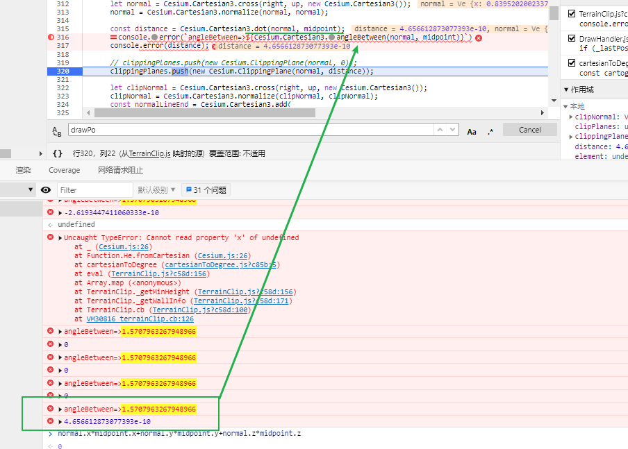

## 两个向量夹角为90度, 但点乘结果不为0?



计算有一定的精度丢失

### 科学计数法

数值也可以采用科学计数法表示，下面是几个科学计数法的例子。

```
123e3 // 123000
123e-3 // 0.123
-3.1E+12
.1e-23
```

科学计数法允许字母`e`或`E`的后面，跟着一个整数，表示这个数值的指数部分。

以下两种情况，JavaScript 会自动将数值转为科学计数法表示，其他情况都采用字面形式直接表示。

**（1）小数点前的数字多于21位。**

```
1234567890123456789012
// 1.2345678901234568e+21

123456789012345678901
// 123456789012345680000
```

**（2）小数点后的零多于5个。**

```
// 小数点后紧跟5个以上的零，
// 就自动转为科学计数法
0.0000003 // 3e-7

// 否则，就保持原来的字面形式
0.000003 // 0.000003
```

4.656612873077393e-10  =字面量=> 0.0000000004656612873077393 近似于零


