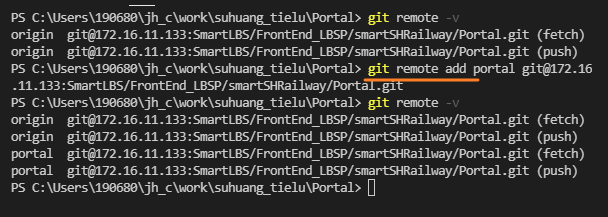
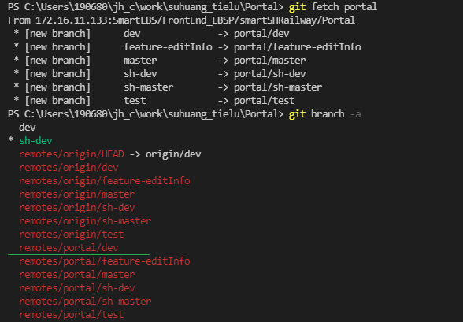

广州白云山：国家级风景名胜区，5A景区

洛阳白云山：世界地质公园、国家级森林公园、国家级自然保护区，5A景区

四川四姑娘山：世界自然遗产、国家级风景名胜区、国家地质公园、国家自然保护区、大熊猫栖息地，4A景区。

你从这些头衔上就可以看出，5A级景区在对于其旅游资源的评价中，是最不值钱的。它不过是接待能力的一个标准而已。

## 监听`<title>`的变化

MutaionObserver

## 更新部署的系统

就这? 替换配置文件. 再整个替换就好了

## fork 派生项目如何同步源项目的代码

在派生项目中使用`git remote add`

`git remote add hunter https://github.com/huntermr/FastAndroid.git`

hunter 为别名(key), 路径为源项目的地址

使用`git fetch hunter`将更新fetch到本地

然后再使用`git rebase`来合并.

一般来说会存在冲突.

需要做出额外的修改后再强推到自己的远程仓库

`git remote remove hunter` 移除

再次同步若git fetch没有正确下载内容到本地, 则需要重新添加后fetch  
