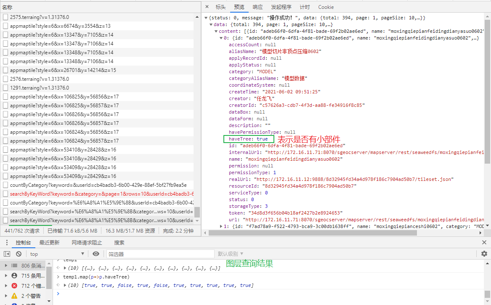
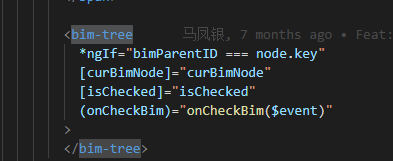

[TOC]

# [8 Hacks For Your Next Tech Resume](https://dev.to/gemography/common-mistakes-in-dev-cvs-2a17)

这篇文章总结了程序员写简历时的几个注意点，下面是其中几个。

- 不要试图提及你掌握的所有技能，这会给人一种"万事通"的感觉。
- 将你的技能分成三个等级："精通"（proficient in）、"有实战经验"（experienced with）、"熟悉"（familiar with）。
- "精通"和"有实战经验"的技能，必须提供细节，要给出项目内容和你的个人成果。


# layers 图层

`promise = this.layerManageService.addOrShowLayer(layer);`

​	`addLayer()`

​		`getOptionsByScheme()` ~ 通过图层找到方案配置或者默认配置，会把配置合并返回

​		`addLayerFromType()` ~ 通过平台数据类型去加载不同图层

​			`addLayerWithRange()`  (TYPE = "WMS" "WMTS" "VECTOR2") or

​			`_addSingleLayer()`

​				`layerManager.add()` ~ 添加图层

​					`_add3DTiles()` ~ 使用 Cesium API添加图层到 PrimitiveCollection中

​						`setCustomValue` + `setPointCloudStyle`/`setMaterialOptions` 

​						~写入自定义属性(如mid,id,type,name) + 设置点云图层样式/设置材质参数

​			`getLayerPromise()` ~ 转换会得到每个创建图层的promise - 基于Cesium提供的属性 `.readyPromise`

​			`handlePromise()` ~ 对图层promise的处理，监听抛出加载成功或失败，并处理下一个队列

`promise.then()`


```ts
// LayerManager.ts
 /**
   * 添加图层
   * @param layer 图层对象
   * @param options 配置项
   *
   * @returns 只有3dtiles添加有返回
   */
add(
    layer: Layer,
    options: any,
): Cesium.Cesium3DTileset | Cesium.ImageryLayer | Cesium.CesiumTerrainProvider {
    if (this.contains(layer)) {
        return;
    }
    if (Cesium.defined(layer.show) && !layer.show) {
        return;
    }
    const type = layer.type;
    this.layerList.push(layer);
    let _layer;
    switch (type) {
        case layerTypesEnum.POINTCLOUD:
        case layerTypesEnum.IMAGERY:
        case layerTypesEnum.MODEL:
        case layerTypesEnum.BIM:
        case layerTypesEnum.GEO3DML:
            _layer = this._add3DTiles(layer, options); break;
        case layerTypesEnum.TERRAIN:
            if (layer.show) _layer = this._addTerrainLayer(layer); break;
        case layerTypesEnum.IMAGEDATA:
            _layer = this._addImageTilesLayer(layer); break;
        case layerTypesEnum.VECTOR:
        case layerTypesEnum.PANORAMICIMAGE:
            _layer = this._addVectorByEntity(layer, options); break;
        case layerTypesEnum.WMS:
            _layer = this._addWMSLayer(layer, options); break;
        case layerTypesEnum.WMTS:
            _layer = this._addWMTSLayer(layer, options); break;
        case layerTypesEnum.VECTOR2:
            _layer = this._addVector2Layer(layer, options); break;
    }
    return _layer;
}
```


## 导入图层

`confirmImport() ~ layers-manage.component.ts`

造树节点

造给图层加载的结构

加载一个模型后, 带有分组的子节点 (BIM 模型)




bimTree,  单独的一个组件




### 图层设置配置覆盖关系

1. 应用
2. 批量应用 (筛选的图层首先会经过类型筛选)
   1. [id]  => [val]
   2. [ids] => [val]

单个的应用直接覆盖, 

多个的应用, 需要把原来的配置清掉, [ids] 中移除对应的id, 再新增一个配置项

**所以一个id始终只有一个配置项 ~ 对应一个图层**
