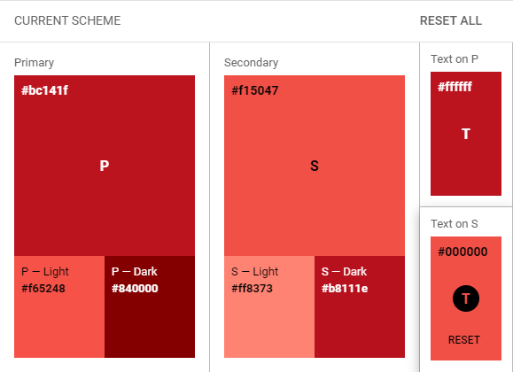
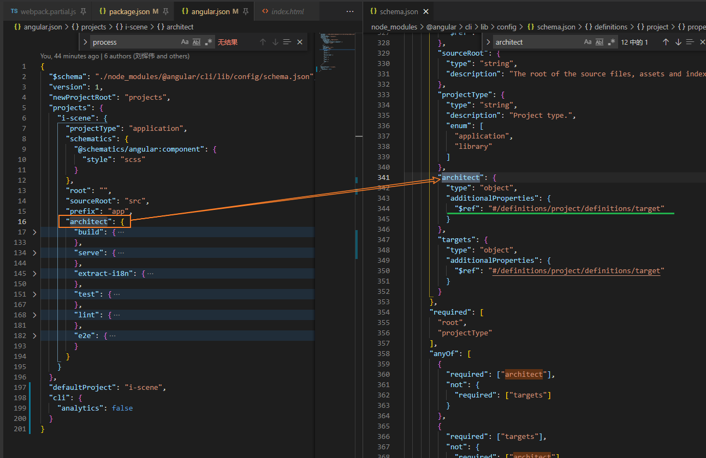
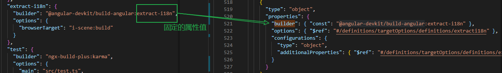
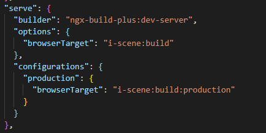
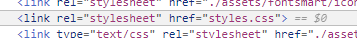

[TOC]

## 主题色

基于UI给的主题来设置库的主题和一些自己写的组件?

1. iScene zoro库
2. 运维+门户 e-ui


## 主题色切换(换肤)

主题色切换究竟是什么，为什么要这么去设计，能解决哪些问题，又会带来哪些问题。

要在客户端动态切换主题颜色，要做的无非是两点：

1. 定义所有元素的颜色样式和主题色的映射关系；
2. 在客户端主题色切换时触发样式切换。


编译时 ~ 运行时


运行时任意切换背景颜色需要考虑的问题是文字在不同背景颜色显示的字体颜色

**[使用 CSS 切换不同背景的字体颜色|CSS 技巧 (css-tricks.com)](https://css-tricks.com/switch-font-color-for-different-backgrounds-with-css/)**


实现方案:

1. css全局变量

   ```js
   body { --themeColor: #0ff; } 
   document.body.style.setProperty('--themeColor', themeColor)
   
   function changeTheme(themeObj) {
     const vars = Object.keys(themeObj).map(key => `--${key}:${themeObj[key]}`).join(';')
     document.documentElement.setAttribute('style', vars)
   }
   ```

2. 1

3. 颜色 -- 参考element-ui [Element](https://element.eleme.cn/#/zh-CN/theme/preview)

4. 作用范围??  css中通过var()获取?

   


element-ui [Element](https://element.eleme.cn/#/zh-CN/component/custom-theme)

config.json + defaultConfig

```json
{"global":{"$--color-primary":"#409EFF"},"local":{}}
```


[定制主题 | NG-ZORRO (ant.design)](https://ng.ant.design/docs/customize-theme/zh)

[定制主题 - Ant Design](https://ant.design/docs/react/customize-theme-cn)

[定制主题 - iView (iviewui.com)](http://v1.iviewui.com/docs/guide/theme)

[默认主题 - Material-UI](https://material-ui.com/zh/customization/default-theme/)

**[Color Tool - Material Design](https://material.io/resources/color/#!/?view.left=0&view.right=0&primary.color=bc141f&secondary.color=f15047&secondary.text.color=000000)**



1. 主题色展示

2. 色值对应的light/dark中显示效果
	3. 文字在色值背景下显示的效果
    4. 1.原色
       2.次色
       3.光和暗变体
                 	5. 如果在对应的区域中正确显示? 大背景区与小背景区? 组件内部样式?
                       	6. 调色板 [Color 颜色 - Material-UI](https://material-ui.com/zh/customization/color/#color-palette)
                       	7. 

### 预定主题

提供暗色系, 浅色系默认提供参考 -- 本地配置

参考 [lodash](https://www.lodashjs.com/docs)

拷贝下来的样式文件, 包含主题切换色 [styles.css](./styles.lodash.css)


### 优雅维护

[NG-ZORRO - Angular UI component library (ant.design)](https://ng.ant.design/docs/customize-theme/zh#切换项目组件主题)


## angular/cli

文档

[Angular - CLI 概览与命令参考手册](https://angular.cn/cli#cli-overview-and-command-reference)

[Angular - Angular CLI 构建器（Builder）](https://angular.cn/guide/cli-builder)

[angular-cli - npm (npmjs.com) ](https://www.npmjs.com/package/angular-cli#usage)

[angular/angular-cli: CLI tool for Angular (github.com)](https://github.com/angular/angular-cli)

angular.json ~ `./node_modules/@angular/cli/lib/config/schema.json` 对应的配置项描述




### angular.json 中一部分配置会作为webpack配置项

```js
// webpack.js
const AngularJson = require('./angular.json');
const buildOptions = AngularJson.projects['i-scene'].architect.build.options;

```

architect 配置项中好像是对ng-cli命令的拓展, 配置后再通过package.json中是scripts命令启动


### angular.json中拓展命令概览

| 命令                                                  | 别名                   | 说明                                                         |
| :---------------------------------------------------- | :--------------------- | :----------------------------------------------------------- |
| [`add`](https://angular.cn/cli/add)                   |                        | 为你的项目添加对外部库的支持                                 |
| [`analytics`](https://angular.cn/cli/analytics)       |                        | 配置 Angular CLI 使用情况度量的收集策略。参见 https://angular.cn/cli/usage-analytics-gathering。 |
| [`build`](https://angular.cn/cli/build)               | `b`                    | 把 Angular 应用编译到给定输出路径下名为 dist/ 的输出目录中。此命令必须在工作空间目录下执行。 |
| [`config`](https://angular.cn/cli/config)             |                        | 从本工作空间的 angular.json 文件中获取或设置 Angular 的配置值。 |
| [`deploy`](https://angular.cn/cli/deploy)             |                        | 为指定的项目或默认项目，执行部署构建器。                     |
| [`doc`](https://angular.cn/cli/doc)                   | `d`                    | 在浏览器中打开 Angular 官方文档中文版 (angular.cn)，并搜索给定的关键字。 |
| [`e2e`](https://angular.cn/cli/e2e)                   | `e`                    | 构建 Angular 应用，并启动开发服务器，然后使用 Protractor 运行端到端测试。 |
| [`extract-i18n`](https://angular.cn/cli/extract-i18n) | `i18n-extract ``xi18n` | 从源码中提取 i18n 消息。                                     |
| [`generate`](https://angular.cn/cli/generate)         | `g`                    | 基于某个原理图生成和/或修改文件。                            |
| [`help`](https://angular.cn/cli/help)                 |                        | 列出可用的命令，及其短描述。                                 |
| [`lint`](https://angular.cn/cli/lint)                 | `l`                    | 针对给定项目目录下的 Angular 应用代码，运行 lint 工具        |
| [`new`](https://angular.cn/cli/new)                   | `n`                    | 创建一个新工作空间和一个初始 Angular 应用。                  |
| [`run`](https://angular.cn/cli/run)                   |                        | 在你的项目中运行一个带有自定义构建器配置的建筑师目标（Architect target）。 |
| [`serve`](https://angular.cn/cli/serve)               | `s`                    | 构建应用，并启动开发服务器，当文件变化时重新构建。           |
| [`test`](https://angular.cn/cli/test)                 | `t`                    | 运行某个项目中的单元测试。                                   |
| [`update`](https://angular.cn/cli/update)             |                        | 更新你的应用及其依赖。参见 https://update.angular.io/        |
| [`version`](https://angular.cn/cli/version)           | `v`                    | 输出 Angular CLI 的版本。                                    |

自定义拓展对应的配置描述也可以通过索引定义到具体的配置项, 原有的预设的执行方式是带ng前缀的:



自定义的启动方式:




### angular.json会将样式文件合并

```json
"styles": [
              "./node_modules/smart3d/dist/smart3d/smart3d.css",
              "src/styles.scss",
              "src/styles/theme/light.css"
            ]
```



三个编译后的内容都会合并到这个styles.css中

## webworker 应用

导入资源目录使用webworker处理 git-hash 11bdf464b92f603bb250878e8d546f1332db710f

`layer-manage.component.ts ~ importDirectory()` + `transformTree.worker.ts`


## smart3d pick

```js
const cartesian = this._viewer.scene.pickPosition(movement.position);
    this.position = cartesian;
    const pickedObject = this._viewer.scene.pick(movement.position);
```

