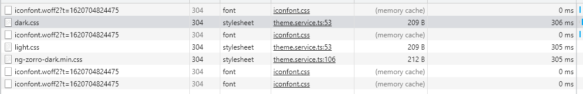

[TOC]

## typroa 键入公式

[使用Typora添加数学公式_姚明明的博客-CSDN博客_typora数学公式](https://blog.csdn.net/mingzhuo_126/article/details/82722455)

## [link rel=alternate网站换肤功能最佳实现](https://www.zhangxinxu.com/wordpress/2019/02/link-rel-alternate-website-skin/)

注: rel="alternate stylesheet" 不能有相同的title, 可能会相当于都默认渲染

替换时, 需要先disabled=true, 再disabled=false才能生效

但是我试了下**直接控制台$0.disabled**也可以禁止渲染啊.. 

---- 切换也会有网络加载 不过是走memory cache;

 **切换可能会有白屏**.. 就是var() 读取不到变量的

切换过快更容易出现, 跟网速有关, 主要是取消禁用后会有一段加载时间导致没有读取到全局变量ng

