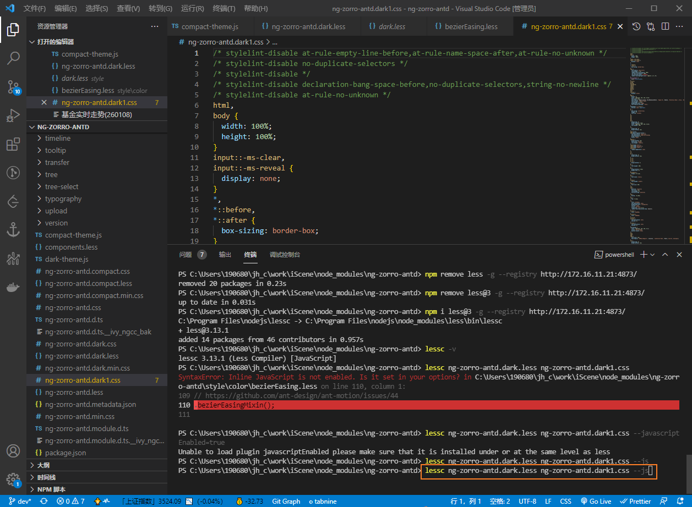
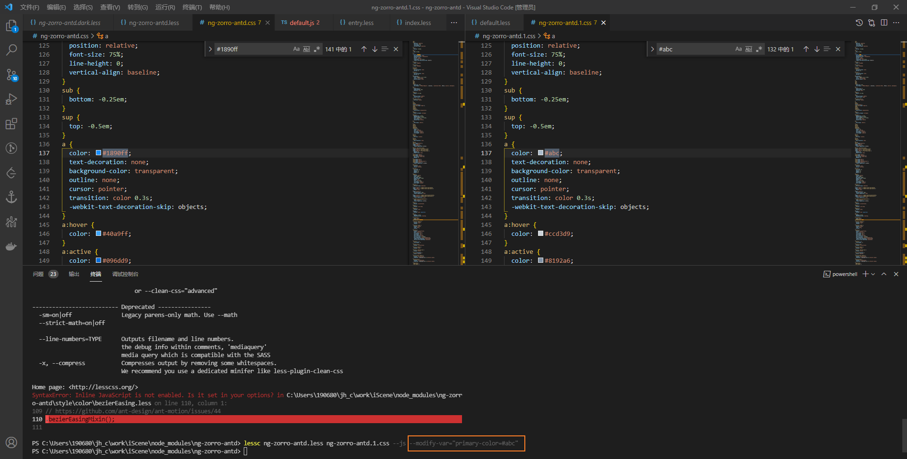
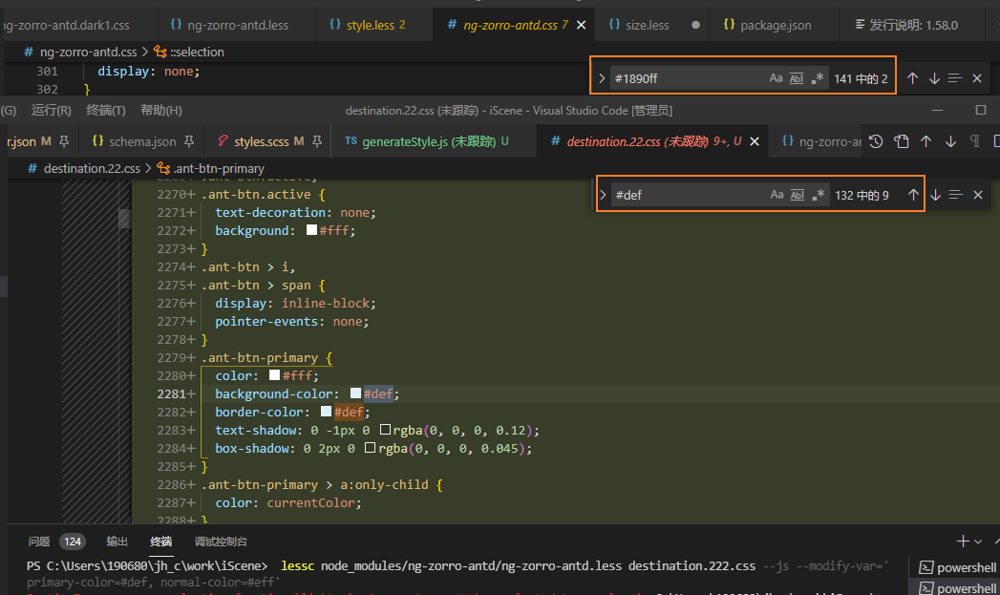
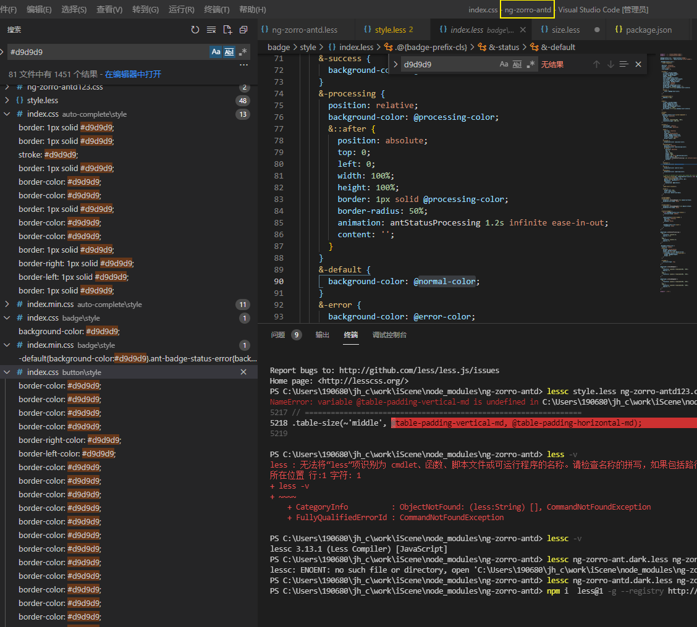
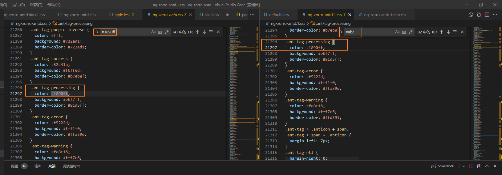
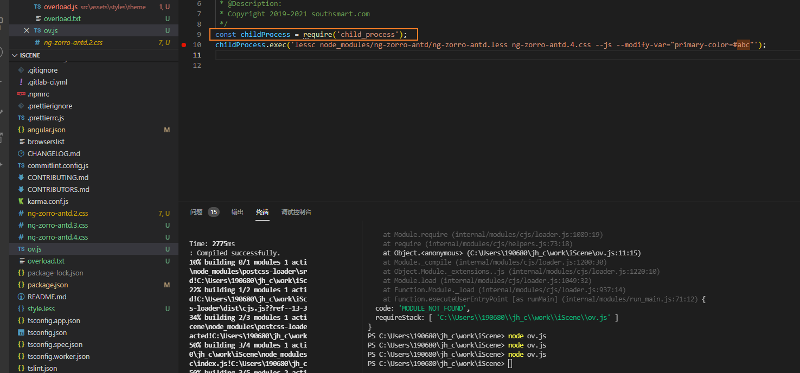
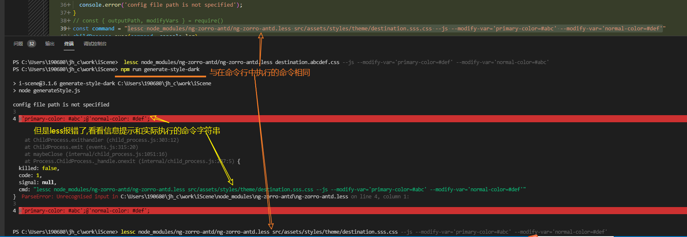
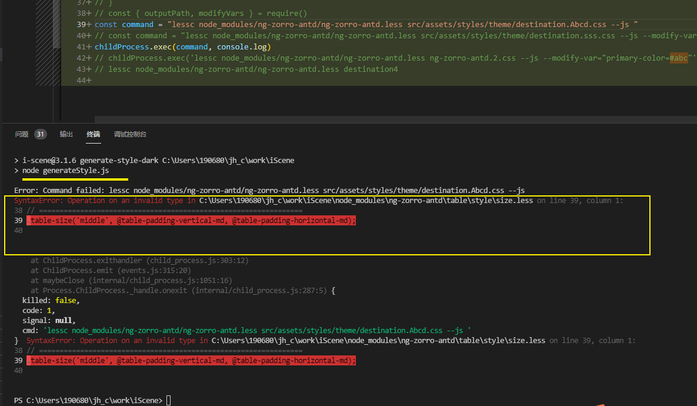
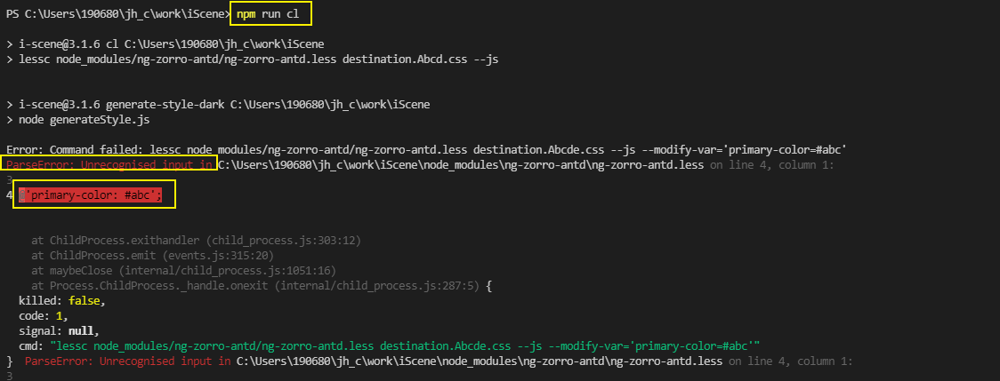
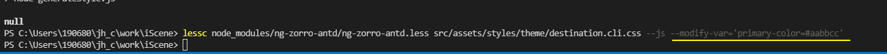

## lock文件

一直有个疑问，不知道有xdm知道不 npm或者yarn都会有一个lock文件来锁版本，以防止依赖不一致。但我们可以直接在package.json里面指定精确的版本号呀，最后也是能达到锁版本的目的 那这两者到底有啥区别呢？为啥还要大费周章去搞个lock文件呢？

json 是项目直接依赖 lock 还有其他依赖和版本

package.json使用语义化版本规范去描述对其他包的直接依赖，lock文件是整个依赖关系树的快照，包含了所有依赖包及其解析版本，会记录你实际安装的版本号及其来源

## [Less.js 用法 ](https://less.bootcss.com/usage/#programmatic-usage)

以脚本的形式使用less来编辑

ng-zoro-antd ui库中使用less的Mixins编写函数

全局编译ui库内部的less

通过Modify Variables覆盖变量, 但不能直接使用css变量作为值, 因为不是浏览器环境. 无法读取到正确用于计算的数值. 需要通知映射关系正确指定

|                                   |                                     |
| :-------------------------------- | :---------------------------------- |
| `lessc --modify-var="color1=red"` | `{ modifyVars: { color1: 'red' } }` |

修改的数量是否足够?

**会有不完全修改的情况.** 可能是其内部不完全访问全局变量导致的, https://github.com/NG-ZORRO/ng-zorro-antd/blob/master/components/style/themes/default.less 暴露的全局变量`normal-color` 只能修改到一个色值.

不过在antd中全局搜索@normal-color确实也只有一个色值.. 默认是#d9d9d9, auto-complete/style, button/style,  calendar/style, cascader/style等组件中直接使用#d9d9d9色值, 不是访问的全局变量@normal-color, 导致无法通过覆盖全局变量修改对应色值,  不确定是否跟库版本(9.3.0)相关...

搜@primary-color. 数量差不多, 但是也有遗漏的.. 原因同上

看看antd - changelog..

不能盲目升级,  可能会影响现有的功能

但是10.x版本上也没有看到对应color的全局覆盖, 我先clone下来全局搜索一遍

修改多个呢?

`--modify-var='primary-color=#def' --modify-var='normal-color=#abc'`

`@component-background: #fff;` 这个需要被正确覆盖.

支持压缩,

如果要在命令行中启动如何合并到Scripts命令中.

通过写到**文件**中使用node来执行脚本生成文件. 生成完文件之后再简化成一条命令, 写到package.json中

怎么写?

可以通过访问node_modules下面的ui库路径在命令行编译..

但是如何通过js写入?

遇到的问题:

1. 路径问题... 项目上访问ui库与库中的相对路径不同.. (node_modules在库中以相对路径访问结果访问到项目根目录了)

通过node child_process 模块直接执行命令行命令来生成文件

如何引入?

1. 模板
2. angular.json 会合并到style.css中
3. 

如何动态切换主题?

1. 考虑不合并在index.html模板中引入两套? 也可以通过动态加载link标签加入主题对应href, 加载后就不要remove, 添加可替换的属性alt和disabled属性来控制不渲染
2. 不需要多次编译, 手动编译

如何优雅的执行命令.

通过scripts加入两个generateStyle --style.config.js

输出路径 + 替换变量 => css in path

如何应用? 如何可选的应用? 如何在项目上更好的应用?

报错问题:

**可能是--modify-var传参的双引号冲突了**, 尝试转义双引号试试?

**less.render 执行会报错**, 编译antd内部样式时出现了

现无法定位原因, 在node执行exec, 传参不正确也会出现这里的报错, 相同类型

这两个less可能读取的是不同的变量... lessc如果不在命令行中执行, 那就一定会报错了... 我服了, 这条路也走不通.. 上面没有使用 `modify-var`, 这样就是宣布gg了?

可行的就是使用全局... 

package中直接使用也不行了..? 报上面同样的错... 看看node能不能改到?

**less@3可以执行... 呜呜呜太难了**

总结下遇到的问题

1. 子进程执行 lessc 命令带 --modify-var 会报错.

2. 

   理解起来的话应该是追加的less代码, 有引号导致解析错误了吧..

   !!!!**--modify-var 去掉引号就可以正确执行了**

3. 命令行直接执行是允许的

   

4. 

 