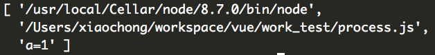

## @import

CSS @import

**@import**
导入其他CSS样式文件。实际上线时候，不建议使用，多请求，阻塞加载之类。但，本地开发可以使用，用做CSS模块化开发，然后使用一些(如grunt)工具进行压缩并合并。但是呢，相比less, sass等还是有不足，就是`@import`语句只能在CSS文件顶部，使得文件的前后关系控制，就不那么灵活。


less @import

“导入”的工作方式和你预期的一样。你可以导入一个 `.less` 文件，此文件中的所有变量就可以全部使用了。如果导入的文件是 `.less` 扩展名，则可以将扩展名省略掉：

```less
@import "library"; // library.less
@import "typo.css";
```


## CSS的@规则 [zxx](https://www.zhangxinxu.com/wordpress/2015/08/know-css-at-rules/)

### 常规规则

所谓“常规规则”指的是语法类似下面的规则：

```
@[KEYWORD] (RULE);
```

**@charset**

​	@charset "utf-8";

**@import**

​	@import 'global.css';

**@namespace**


### 嵌套规则

所谓“嵌套规则”，就是带有花括号`{}`, 语法类似下面的规则：

```
@[KEYWORD] {
  /* 嵌套语句 */
}
```

**@document**

**@font-face**

**@keyframes**

**@media**

**@page**

**@supports**


## [iframe 点击劫持](https://javascript.info/clickjacking)


## 五笔输入法

[学习路线 - 五笔7天速成 (yantuz.cn)](https://wubi.yantuz.cn/jian-jie/xue-xi-lu-xian)


## webComponent [Why I don't use web components - DEV Community](https://dev.to/richharris/why-i-don-t-use-web-components-2cia)


## node 模块如何访问命令行传入的参数

```
node test.js a=1
```

这时候就要用到`process.argv`。他返回当前进程的所有命令行参数，是个数组，前2个元素是node命令路径和被执行的文件路径



所以经常见到 `process.argv.slice(2)`


## 查询一个ul>li列表中某个li的索引

`Array.from(li.parentElement.children).findIndex(e=>e===li)`


## node 模块不支持esm

支持amd, module.exports


## 再次编译less报错的原因?

**可能是--modify-var传参的双引号冲突了**

