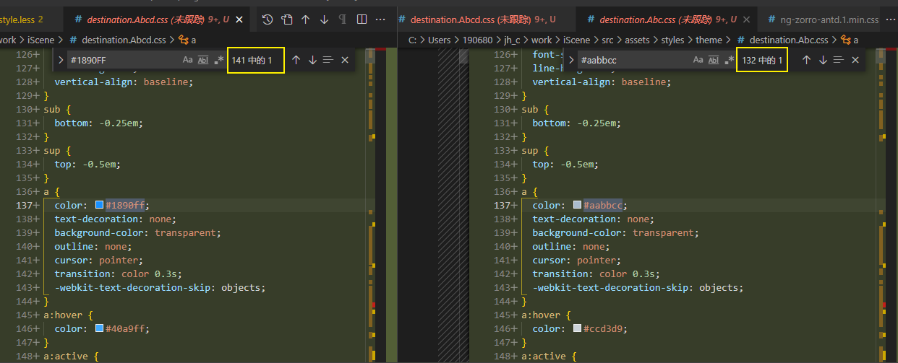
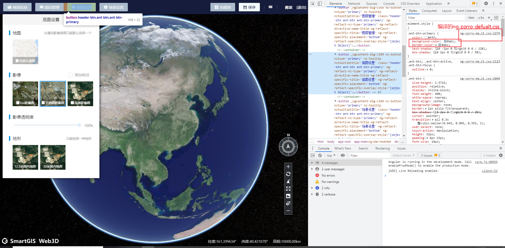
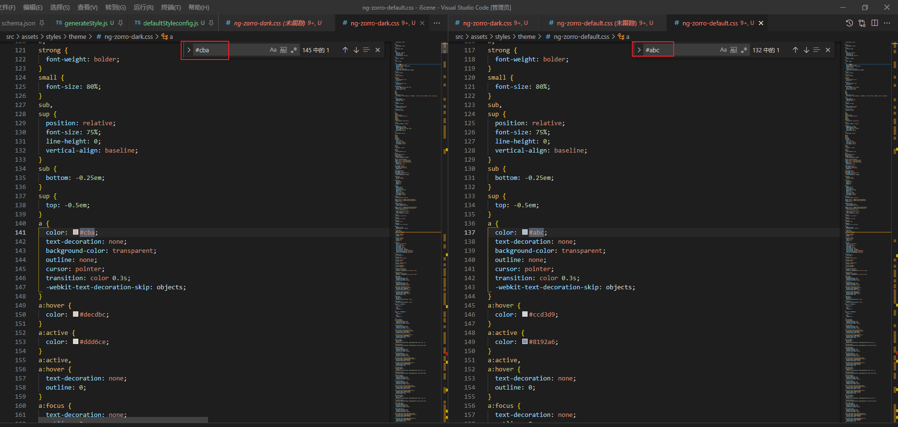

[toc]

## 覆盖面不够

看看antd - changelog..

不能盲目升级,  可能会影响现有的功能

但是10.x版本上也没有看到对应color的全局覆盖

总结, 使用less覆盖其内部样式less声明的全局变量, 但是由于组件内部并非统一访问全局的变量(写死的颜色值), 在覆盖后可能并不能达到覆盖率(100%), 覆盖主色值的132/141

## 成果

注释了style.scss中按模块引入的组件样式, (引入后会覆盖编译的css)

## 维护

不会经常性的执行编译命令,
