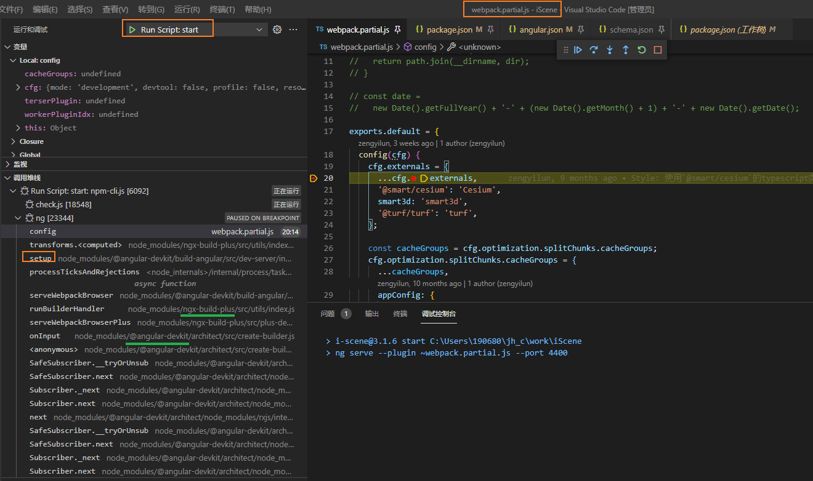

## iScene中webpack参数中的config方法何时执行




## git 文件名称更换导致untrack如何保持?

如何对Git管控的文件进行重命名, 

vscode 的自带的git会自动跟踪标识为R (rename).. 太牛了..

实际上应该是某些命令一起执行了


## 线上环境通过搜索方法名来定位为题..


# [解决TS报错Property 'style' does not exist on type 'Element'](https://www.cnblogs.com/PearlRan/p/10155754.html)

[2339 Property 'style' does not exist on type 'Element'. · Issue #3263 · microsoft/TypeScript (github.com)](https://github.com/Microsoft/TypeScript/issues/3263)


1. 考虑到浏览器中 Element 的接口与派生接口很多

   HTMLElement接口中没有“value”属性，因此您会得到这些.ts错误。HTMLInputElement接口扩展了HTMLElement，并具有“value”属性。

   要针对性的去正确关联接口?

   Element / HTMLElmenet /HTMLLinkElement

   ```ts
   const links = 
         document.querySelectorAll('[title=^theme]') as NodeListOf<HTMLLinkElement>;
   const themeLink = 
         document.querySelector(`[title=theme-${themeType}]`) as HTMLLinkElement;
   ```

   

2. querySelector可能会返回null

