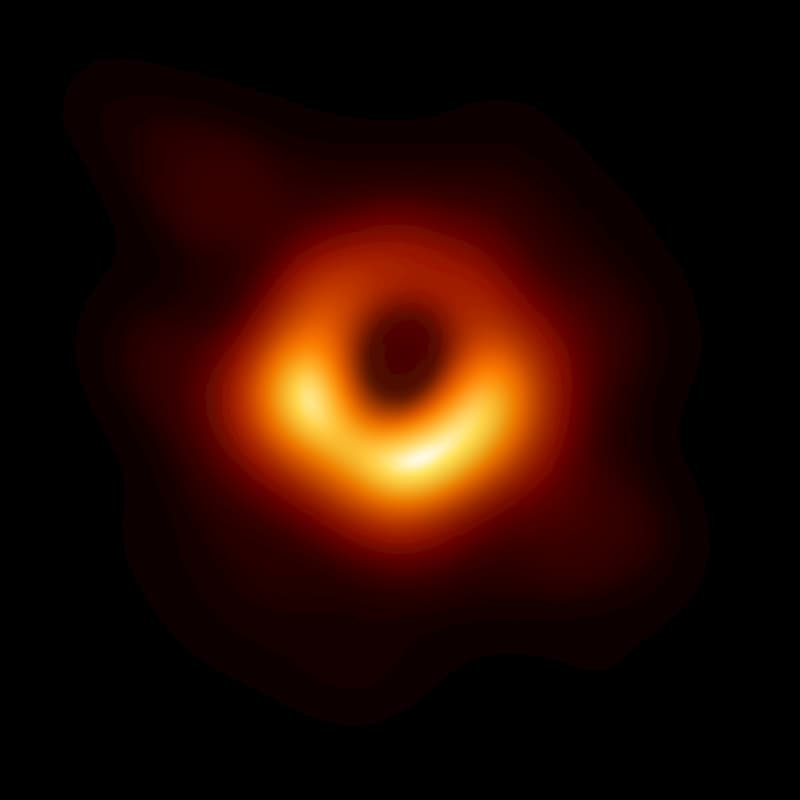
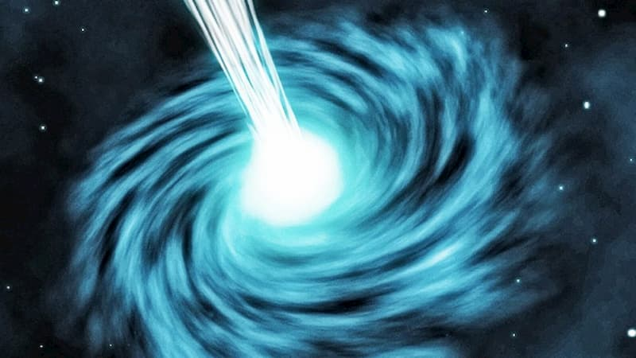
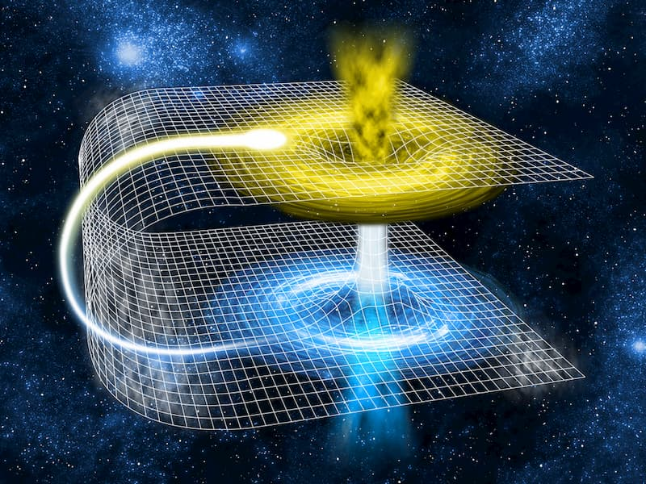
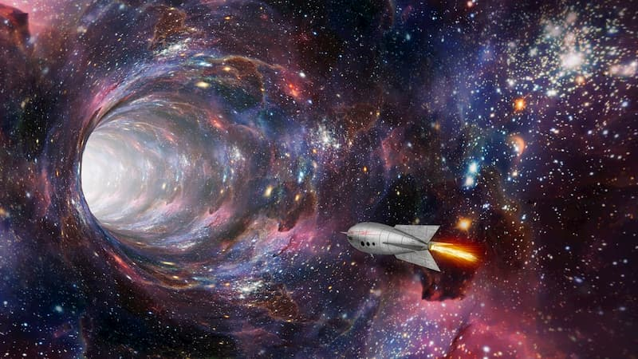

[TOC]

## 虫洞

**虫洞是什么**

摘自何香涛的《追逐类星体》（外语教学与研究出版社，2015）。

要解释虫洞，先要从黑洞说起。

天文学上，黑洞是一个很热门的概念，指的是一个具有巨大引力的星体，可以吸收周围的物质，连光也可以吸收。由于不会产生光，所以无法被看到，因此称为黑洞。

（图片说明：历史上第一张黑洞照片。）

此外，还有一种星体叫做白洞，正好与黑洞相反。黑洞是将物质吸进去，由外向内；白洞则是将物质排斥出来，由内向外，所有的物质都向外喷发。有人认为，许多X射线暴和γ射线暴正是由白洞造成的。

现在让我们设想，一个黑洞的对面正好有一个白洞，它们连在一起。周围的物质被不停地吸入黑洞，由于黑洞的背后是一个白洞，白洞会不停地从黑洞中把物质抽出来，再喷发出去。这里最关键的部位是黑洞和白洞之间的衔接口，给黑洞命名的约翰·惠勒想出了一个新名词，把它叫作"虫洞"，像蛀虫在黑洞和白洞之间蛀的洞。所以，虫洞只是一个通道而已，那里并不存放任何物质。

进一步探究虫洞的物理性质，科学家发现了虫洞还有更大的潜在功能。它不仅能够衔接黑洞和白洞，而且还可以把两个毫无关联的宇宙世界连起来。

广而言之，我们的宇宙就是一个大黑洞，外界看不到我们，我们也看不到外界。现在，可以用虫洞来沟通，相当于在两个宇宙之间搭了一条隧道。这个隧道把两个宇宙的时空连接起来，因此又被称为"时空隧道"。

我们不能认为地球上的人类是宇宙中唯一的高等智慧生命。同样，我们的宇宙也不应该是唯一的宇宙。在我们的宇宙之外，应该存在着一个超级大宇宙。如果把每个宇宙比作一个球泡，会有无数球泡飘浮在超级大宇宙中。根据以往的理论，一个个宇宙泡之间完全隔绝。而现在，只要通过时空隧道，一个宇宙中的人类就可以到另一个宇宙中去访问

## hugo-leetcode-dashboard [#](https://github.com/lryong/hugo-leetcode-dashboard)

✨ 一个 LeetCode 答题看板的生成插件， 支持一键部署到 Hugo 站点。

## quickjs

[quickjs/jsbignum.texi at master · bellard/quickjs (github.com)](https://github.com/bellard/quickjs/blob/master/doc/jsbignum.texi) ---- https://bellard.org/quickjs/  - https://bellard.org/quickjs/quickjs.html

[quickjs-zh/QuickJS: QuickJS是一个小型并且可嵌入的Javascript引擎，它支持ES2020规范，包括模块，异步生成器和代理器。 (github.com)](https://github.com/quickjs-zh/QuickJS)  ---- 带中文文档

## 使用lessc编译时不能用var()

## 
