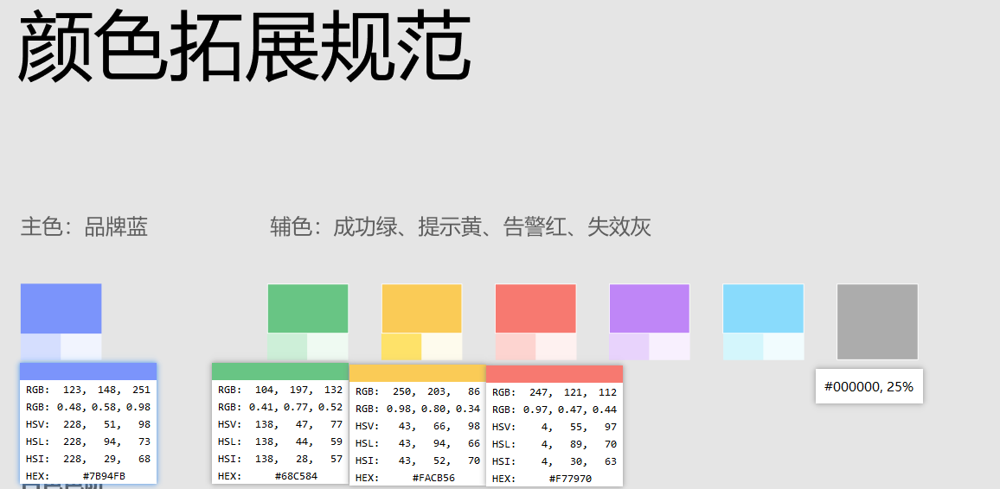
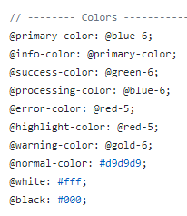
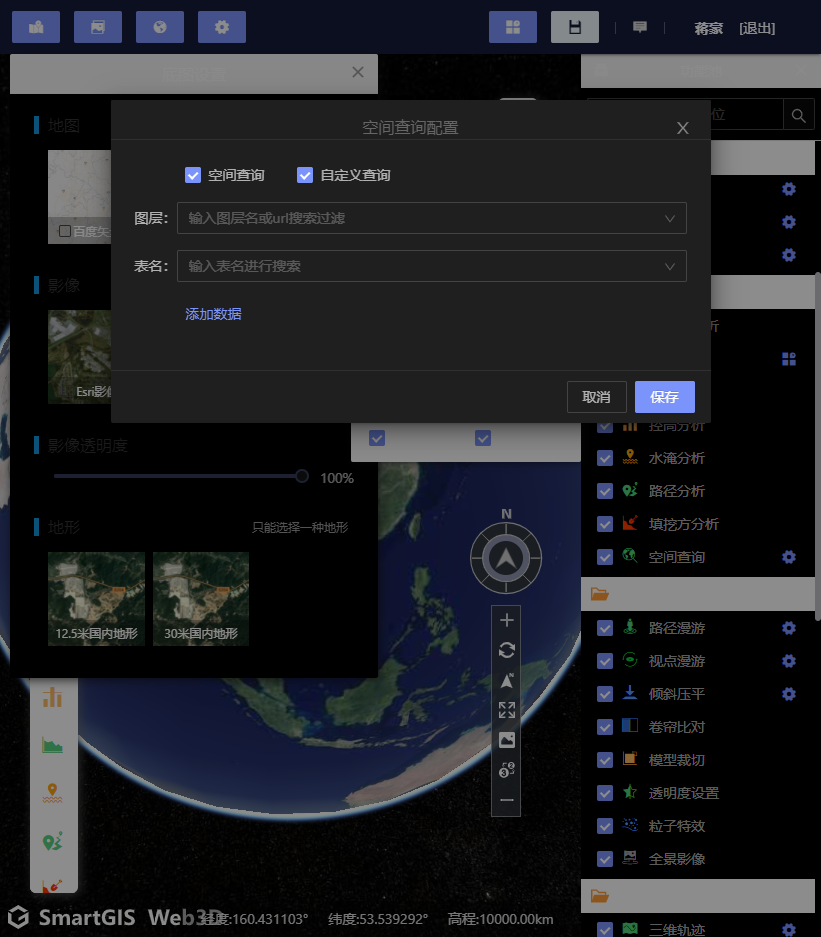
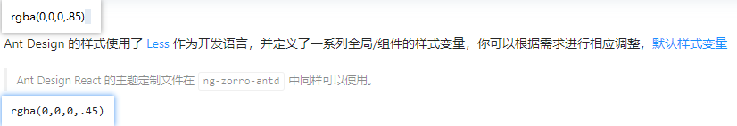
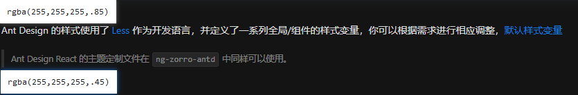
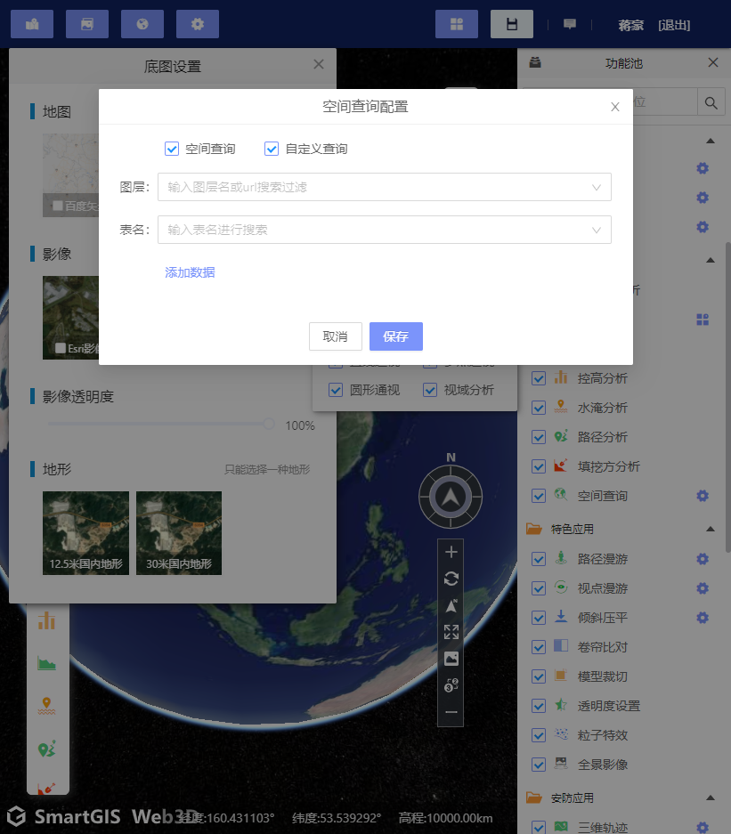

## 主题色覆盖分工

主要工作在CSS变量的替换

1. toolbar
2. 功能池
   1. 功能池各个功能组件内部样式替换(以功能池的分类进行分工)
   2. 1
3. 


## 主题色自定义开发规范

1. 以调试的方式进行开发

   ```ts
   themeService.themeChange(themeType: 'light'|'dark')
   ```

   1. 

2. 


### 举例说明


## 色值统一

文本颜色 背景色 

hover/active/disabled 等表示状态的颜色

标题 + 描述类型分类颜色 

 ---- 是否能使用继承的方式来简化


light.css `--component-background: #fff;`

dark.css `--component-background: #000;`

overwrite.less : `@component-background: #fff;`

darkStyleConfig.js: `component-background: #000`


light/dark.css 用于我们的angular组件

overwrite.less/darkStyleConfig.js 用于覆盖antd组件内部的样式

为了保持主题色统一, 需要统一定义部分全局样式的色值一致

基于颜色拓展规范给定的值可以有如下设置



为了覆盖ng-zorro-antd中的主题色, 需要使用对应的变量名来覆盖



```less
// ng-zorro-antd-overwrite.less
@import '~ng-zorro-antd/ng-zorro-antd.less';
// -------- 自定义参数覆盖 -----------
@primary-color: #7b94fb;
@success-color: #68c584;
@warning-color: #facb56;
@error-color: #f77970;
```

```js
// darkStyleConfig.js
module.exports = {
    // ...
	modifyVars: {
        'primary-color': '#7b94fb',
        'success-color': '#68C584',
        'warning-color': '#facb56',
        'error-color': '#f77970',
      }
}
```

这样处理是为了在深浅主题下都是统一的主题色,  覆盖antd的内容不需要很多, **从实际使用上只需要修改颜色值保持跟自定义的angular组件主题一致**

会有存在覆盖不全的情况: 根据iScene的使用情况来自定义样式覆盖


light/dark.css

- 定义组件背景色

  ```css
  /* light.css*/
  :root {
  	--component-background: #fff;
  }
  /* dark.css*/
  :root {
  	--component-background: #000;
  }
  ```

  antd中也是设置了这个变量名, 如果有需要也可以自定义来覆盖, 最好是深浅色保持一致;

  light/dark.css中CSS变量名的要求是, **同名不同值**, 成对使用

- 组件应用变量

  ```less
  .popover-content {
      background-color: var(--component-background);
  }
  ```

  

- 

- 文本颜色, 深浅模式下都有对比度不至于让文本看不清, 参考 antd 定义了两种文本颜色变量(文字颜色, 描述性文字颜色)

  - `@text-color: fade(@black, 85%);` `  @text-color-secondary: fade(@black, 45%);`
  - `@text-color: fade(@white, 85%);` `  @text-color-secondary: fade(@white, 45%);`
  - 
  - 
  - 
  
- 跟主题色切换无关的变量, 在less中自行定义, 但是如果出现主题切换后未满足视觉需求需要作出调整

 ---- 不过会有样式变化的问题.. 位移了;原因是新加载的css文件覆盖了, 需要调整原有的权重


## ~ 代表依赖的根目录 node_modules [less-loader | webpack 中文网 (webpackjs.com)](https://www.webpackjs.com/loaders/less-loader/#webpack-resolver)

#### webpack resolver

webpack 提供了一种[解析文件的高级机制](https://webpack.js.org/configuration/resolve/)。less-loader 应用一个 Less 插件，并且将所有查询参数传递给 webpack resolver。所以，你可以从 `node_modules` 导入你的 less 模块。只要加一个 `~` 前缀，告诉 webpack 它不是一个相对路径，这样就可以 import 导入 `node_modules` 目录里面的 sass 模块

```css
@import "~bootstrap/less/bootstrap";
```

重要的是只使用 `~` 前缀，因为 `~/` 会解析为主目录。


可以直接导出一个config方法来查看webpack的配置参数

```js
// webpack.js
exports.default = {
	config(cfg){
  		return cfg;
  	}
}
```


## less & sass 不支持通过路径别名导入

vue-loader支持是因为内部进行了分块然后分别再载入到less/sass-loader中

别名处理阶段是在vue-loader中处理的..


在webpack配置别名后, less/scss都不支持通过别名来访问. 初步猜测是因为less/scss-loader中没有正确识别别名导致路径错误.
不过有搜索到vue-loader支持配置别名引入样式文件的案例. 是因为vue-loader拆分style部分后对引入样式的路径进行校正后再传递给下一轮loader.
