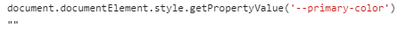

[TOC]

## [广州住房公积金管理中心网站 (gz.gov.cn)](http://gjj.gz.gov.cn/)

[提取公积金](http://gjj.gz.gov.cn/bsfw/qtfw/content/post_6998160.html)

## iScene主题色配置提取

1. 基础主题色
   1. light/dark.css 中使用CSS变量
2. 覆盖的ui库颜色值
   1. overwrite.less 中使用的@声明变量覆盖
3. 两种变量的生效阶段不一样
   1. CSS变量 = > 浏览器环境 (document)
   2. less变量 => node环境编译
4. 两种变量的映射关系不同/作用
   1. CSS两边 => ng组件
   2. less变量 => 覆盖less文件

## 获取定义在HTML上的CSS变量属性值

`CSSStyleDeclaration.getPropertyValue`方法接受 CSS 样式属性名作为参数，返回一个字符串，表示该属性的属性值。

失败的读取方式

1. 
2. 

## 图层树问题

1. 操作条排列不齐
2. rename之后操作条排列不齐
3. 宽度的计算属性, 父级宽度是动态的
4. 宽度检测: `[...$$('.custom-node')].map(e=>getComputedStyle(e).width)`
5. 
6. 初步判断是`display:flex`影响
7. 但是两套组件样式一样, 渲染不同, 令人不解
