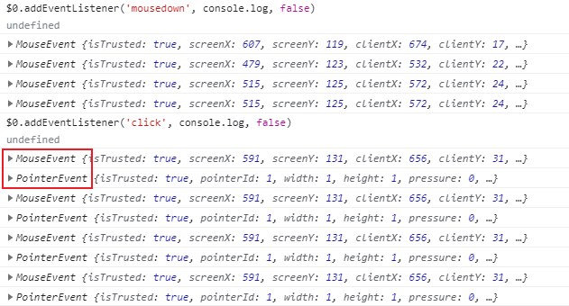

js 长按连续触发

```js
var tid;
var btn = window.document.getElementById("button");
btn.onclick = function(e){
    c++;
    btn.innerHTML = c;
};
btn.onmousedown = function(e){
    tid = setInterval(function(){
        c++;
        btn.innerHTML = c;
    },500);
};
btn.onmouseup = function(e){
    clearInterval(tid);
}
```




`click`事件指的是，用户在同一个位置先完成`mousedown`动作，再完成`mouseup`动作。因此，触发顺序是，`mousedown`首先触发，`mouseup`接着触发，`click`最后触发。

绑定mousedown后, 不用绑定click, 会触发两个不同的鼠标事件
