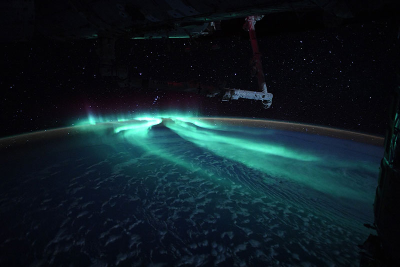
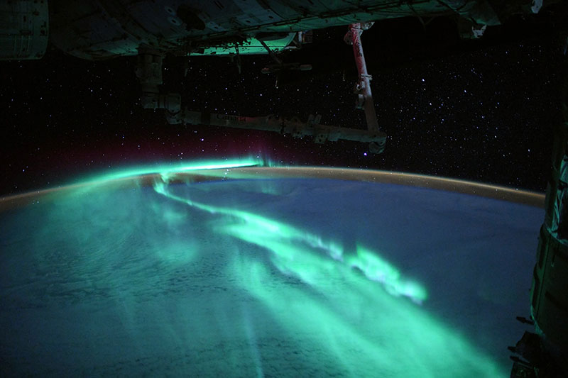
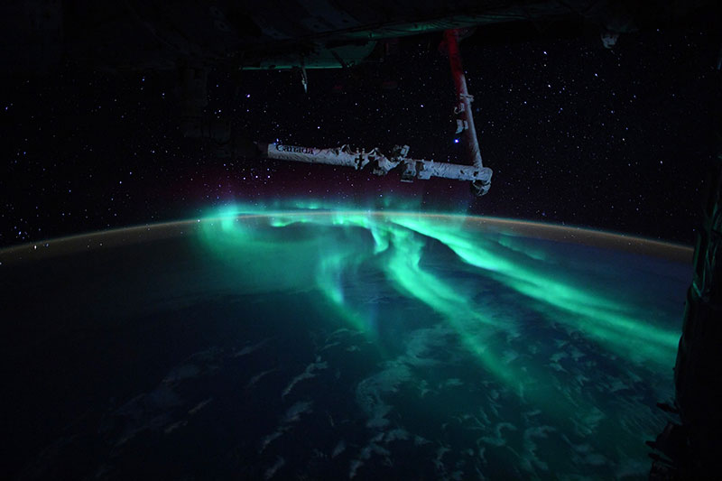
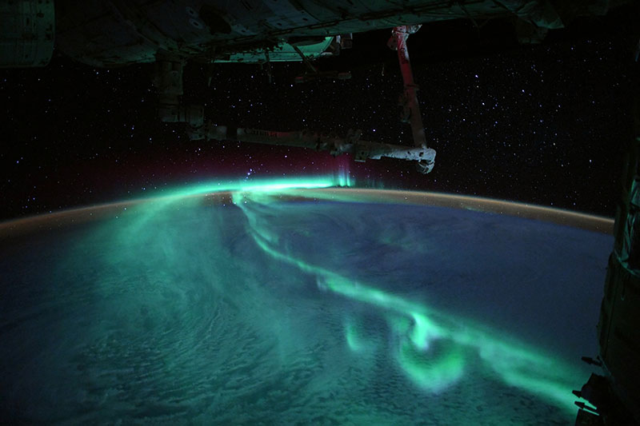
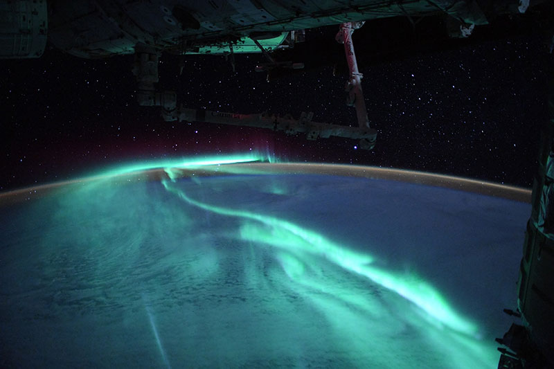

[Lit](https://lit.dev/)

 谷歌推出的基于 Web Components 的前端框架，非常小巧（5KB），用法很优雅。

[webpack-to-vite: 将 webpack 项目转换为 vite 项目](https://github.com/originjs/webpack-to-vite)

将 Webpack 项目转为 Vite 项目

[TypeIt (typeitjs.com)](https://typeitjs.com/)

一个 JS 库，用来在网页上生成打字机输入文字的动画效果。

[An Astronaut Captured the Southern Lights Under a Full Moon and They’re Stunning » TwistedSifter](https://twistedsifter.com/2021/09/southern-lights-under-full-moon-from-space-iss/)

一位欧洲宇航员在国际空间站，拍到了地球南极的极光照片

最难得的是，那天是满月，所以光照非常好，可以清晰地看到云层和地面，非常壮观。

