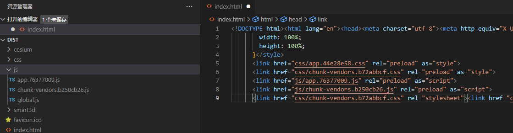

[TOC]

## [Fastify - 快速并且低开销的 web 框架，专为 Node.js 平台量身打造 | Fastify 中文网](https://www.fastify.cn/)

Fastify 是一个高度专注于以最少的开销和强大的插件架构为开发人员提供最佳开发体验的 Web 框架。

### 核心功能

以下列出的是 Fastify 已经实现的主要功能及原理：

- **高性能：** 据我们所知，Fastify 是这一领域中最快的 web 框架之一，另外，取决于代码的复杂性，Fastify 最多可以处理每秒 3 万次的请求。
- **可扩展：** Fastify 通过其提供的钩子（hook）、插件和装饰器（decorator）提供完整的可扩展性。
- **基于 Schema：** 即使这不是强制性的，我们仍建议使用 [JSON Schema](http://json-schema.org/) 来做路由（route）验证及输出内容的序列化，Fastify 在内部将 schema 编译为高效的函数并执行。
- **日志：** 日志是非常重要且代价高昂的。我们选择了最好的日志记录程序来尽量消除这一成本，这就是 [Pino](https://github.com/pinojs/pino)!
- **对开发人员友好：** 框架的使用很友好，帮助开发人员处理日常工作，并且不牺牲性能和安全性。
- **支持 TypeScript：** 我们努力维护一个 [TypeScript](https://www.typescriptlang.org/) 类型声明文件，以便支持不断成长的 TypeScript 社区。


### vue-router4

history 路由模式导致请求资源路径不一致

```js
createWebHistory(process.env.BASE_URL)
```

baseUrl 是静态资源请求前缀, 

可以在run build后看html里加载文件的路径

1. hash模式
2. 
3. 直接链接到相对路径, 可以加上不同的前缀路径
4. 
