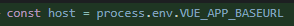

[TOC]

### 日常饮食谣言

**1.** 隔夜烧开的水、“千滚水”只要干净都可以喝。即使是烧开多次的水，**亚硝酸盐含量也远比不上泡菜，**不会中毒，更不会致癌。

**2.** 隔夜茶也可以喝。隔夜茶变色是因为茶多酚氧化了，口感差一些，并不会致癌。

**3. 隔夜菜也可以吃，前提是放冰箱。**室温下的肉菜隔夜没事，下一顿热透就行，但叶菜的亚硝酸盐会大量增加，最好6小时内吃完。

**4.** 隔夜泡发木耳、银耳、蘑菇才是真危险，常温下会产生米酵菌酸毒素，会让人昏迷甚至死亡，**煮熟了也灭不掉。**所以泡发干货最好别超4小时！

**5.** 热饭菜别急着马上放冰箱，可能影响制冷效果，但也不用完全放凉。可以先盖紧凉一会，产生负压减少细菌进入，再放进冰箱。

**6.** 西红柿放冰箱不会“变成毒”，只是风味会变淡；洋葱、香蕉、蜂蜜都不适合放冰箱。酱油常温容易氧化，反而更适合放冰箱。

**7.** 2050年香蕉不会灭绝，只是产量可能减少。黑斑香蕉是正常氧化，果肉没变黑就可以吃。

**8.** 乙烯利催熟的香蕉、反季节水果不会导致性早熟，蜂胶、蜂王浆也不会导致性早熟。真正让孩子性早熟的，**是营养过剩引起的肥胖！**

**9.** 成熟的柿子可以空腹吃，也可以跟鸡蛋海鲜一起吃。不太熟的涩柿子才有上述禁忌，因含大量鞣酸，可能和蛋白质反应产生胃结石。

**10. 红皮鸡蛋和白皮鸡蛋的营养价值几乎没差别。**蛋壳颜色主要是母鸡品种决定的，买鸡蛋不需要看“颜值”，别被“高科技富营养”的鸡蛋忽悠了。

### 身体护理谣言

**11.** 指甲长倒刺不是因为缺维生素，而是因为干燥或手指劳动摩擦所致，比如洗衣服，打字等等，做好保湿、及时用指甲剪剪掉即可。

**12.** 口腔溃疡可能跟缺乏维生素有关，但常吃蔬菜水果的人补维生素作用不大。不妨把牙刷换成软头，使用口腔溃疡贴片，避免炎症加重。（[☞查看详情](https://link.zhihu.com/?target=https%3A//mp.weixin.qq.com/s%3F__biz%3DMzg2NDEzNTk4OA%3D%3D%26mid%3D2247486542%26idx%3D3%26sn%3Ddcef03a71cea621c7130936dac8c2ae0%26scene%3D21%23wechat_redirect)）

**13. 口臭和幽门螺杆菌的关系并不明确。**80~90%的口臭是口腔问题（如牙菌斑）导致的，电动牙刷不能去掉牙结石，所以每年定期洗牙最有效。

**14.** 黑眼圈主要和遗传有关，熬夜后会加重，**但睡眠只能缓解、不能让它消除。**眼霜可能对部分黑眼圈有作用，但要想完全消除，只能用医美手段。

**15.** 长痘痘可以吃牛肉、海鲜这些高蛋白质食物。所谓的“发物”定义并不科学。长痘痘**真正应该避免的是高脂肪、高糖、高乳制品的饮食**。

**16.** 黑头贴并不能去黑头，反而容易损伤毛囊皮脂腺周围的组织，让黑头更明显。想要去黑头，使用酸类外用药、激光等手段效果好，但要在医生指导下进行。

**17.** 无硅油的洗发水不一定最好。所谓“硅油”是一种柔顺剂，安全性高，对头皮、头发都无害。中性、干性头发可以用有硅油的洗发水，油性头发可以用无硅油的。（[☞查看详情](https://link.zhihu.com/?target=https%3A//mp.weixin.qq.com/s%3F__biz%3DMzg2NDEzNTk4OA%3D%3D%26mid%3D2247488085%26idx%3D3%26sn%3D865b1c40a7af13b74e3e0a22079a45f6%26scene%3D21%23wechat_redirect)）

**18.** 指甲月牙和健康状况、贫血没有必然联系。想判断是否贫血，可以看下指甲颜色是否苍白，有没有乏力、心慌、头晕、记忆力下降等表现。

**19.** 戴眼镜不会导致“凸眼”。**眼睛变凸，是由于近视没控制好、度数又涨了。**不想眼睛变凸，可以在医生指导下，使用低浓度阿托品滴眼液、角膜塑形镜。

**20.** 运动并不是出汗越多越好，关键还是看心率。一般人的最高心率=220-年龄，在一定范围内，心率越快，运动强度越大、耗氧量越高。

### **疾病防治**

**21.** 突发心梗时，咳嗽和拍胳膊不能自救，**反而可能耽误急救时间而送命。**

**22.** 真性近视是无法治愈的，只能通过眼镜或近视激光手术等视光学的方法矫正。民间流传的各种“针灸”“眼罩”“绿色视频”“近视茶”降低近视度数，都是骗人的。

**23.** 塑料不是白血病和癌症的元凶。**只要用食品级塑料盒、塑料袋盛装食品，都是安全的。**

**24.** 得了鼠疫，并非必死无疑。病人如果能早期就诊，并得到规范有效治疗，**治愈率非常高。**可疑接触者也可通过预防性服药而避免发病。

**25.** 大蒜并不能防癌。大蒜虽然有活性成分，但抗癌效果的临床证据并不够充分。另外，大蒜中的活性成分也可能随时间、处理和加工而失去效果。

**26.** 糖尿病患者可以吃水果，不过**每天的摄入量要控制在100-200克之间，**种类上最好选择糖含量少，升糖慢的水果，比如石榴、樱桃、猕猴桃、草莓等。

**27.** 痛风患者可以吃豆腐。大豆虽然嘌呤含量高，但做成豆腐后，会去除一部分嘌呤，如果不是在痛风急性发作期，可以适量少吃。

**28.** 肾结石患者也可以吃豆腐。豆腐、牛奶等高钙食物能在消化道和草酸结合，**反而降低了尿钙和草酸结合产生肾结石的风险。**

**29.** 预防感冒，补充维生素c、喝板蓝根并没有用。还不如多洗手，减少接触病毒；少熬夜，保证充足的睡眠。

**30.** 测血糖不要在指尖采血，要选择手指两侧。因为手指两侧的痛觉感受器分布较少，采起血来，就不会那么疼。

### **女性健康**

**31.** HPV疫苗安全性经过多年验证，不会导致女性生殖功能下降，更不会诱发宫颈癌。**所谓“严重不良反应”是反疫苗组织的阴谋论。**

**32.** 单纯HPV感染、盆腔积液不用治。“宫颈糜烂”甚至不是病，更不用治。

**33.** 女性乳头和私处颜色深是性激素水平高的表现，和年龄、发育成熟度、怀孕、哺乳有关，和性经历没有半毛钱关系。

**34.** 子宫肌瘤并不是“不生娃便生瘤“，而是和雌激素、家族遗传有关。生育次数多只是让雌激素在孕期、哺乳期长时间内处于低水平，但并非绝对因素。

**35.** 来月经出现肉一样的血块并不是所谓的“宫寒”。当月经量大时，抗凝物质生成不够快，就有凝固的血块，也可能是脱落的子宫内膜碎片，都是正常现象。

**36.** 胖女人不见得好生养，**肥胖甚至和一些不孕疾病有关。**屁股大也不见得更容易顺产，而是由骨盆等多方面因素有关，太胖还会增加难产风险。

**37.** “今天人流、明天上班”都是骗人的。人流对身体损伤大，至少要2周才能恢复。**而“无痛人流”只是手术中减轻疼痛，术后还是会痛。**

**38.** 北京协和医院的维生素E乳不叫“协和牌“。维生素E乳虽然有一定保湿补水作用，但并没有祛斑、修复疤痕的神效，也不是人人都适用。

**39.** **“口呼吸会变丑”只是英国某民科医生的个人观点，**医学证据不足，也从来没得到主流医学的认可，嘴上贴胶布也没有好处。

**40.** 抗糖化产品不靠谱，健康的年轻人也不需要抗糖。

### 男性健康

**41.** 打鼾的人用鼻夹没用，因为鼾声主要是嘴里发出来的。习惯仰睡的人建议侧卧，避免舌头和软腭掉进咽喉后壁发出鼾声。

**42.** 生姜、黑芝麻、按摩、防脱洗发水都不能治脱发。男性脱发大多数是遗传、雄激素高导致，不会导致性能力下降，防脱发药物也不会让男性变“娘”。

**43.** 经常刮胡子不会让胡子长得更快、更浓、更硬。胡子的颜色、质地、生长速度只和基因和激素水平有关，不受刮胡子的影响。

**44.** 鼻毛不能随便拔，会导致鼻毛倒生和毛囊炎。鼻毛对鼻腔有保护作用，建议用圆头鼻毛剪集中修剪，不必剪得太短。

**45.** **男人太“快”不一定就是早泄。**只有几乎每次都坚持不到1分钟，或者之前还行、最近明显缩短到3分钟内，而且过程不受控也不开心，才可能是早泄。

**46.** 住了不干净的酒店、泡了公共浴池和温泉不会感染性病。**“在洗浴中心染上梅毒”的借口，**皮肤科医生早已看透。

**47.** “啤酒肚”的罪魁祸首并不是啤酒，而是喝酒时吃了很多高热量的食物，再加上年龄增长代谢下降、遗传和缺乏运动造成的肥胖。但经常喝酒容易得酒精性脂肪肝。

**48.** 每天少量饮酒不是好习惯，小酌也会伤身。最安全的方法是**一滴酒也别沾。**

**49.** **“尼古丁抗癌”是彻头彻尾的谣言。**电子烟中的尼古丁同样容易上瘾，并不比卷烟更健康，也没有证据表明它能帮烟民戒烟，反而让青少年消费者成年后更想吸食卷烟。

**50.** 确实有人经常运动、不抽烟也得了肺癌。但在男性肺癌患者中，抽烟的患者占了80%以上，烟草仍然是肺癌的头号危险因素。


### npx

http://www.ruanyifeng.com/blog/2019/02/npx.html

------

npm的m是Management，npx的x可以理解为eXecute。

当执行npx xxx的时候，npx先看xxxz在$PATH里有没有，如果没有，找当前目录的node_modules里有没有，如果还是没有，就安装这个xxx 来执行。

npx也可以理解为少些package.json里一个script而诞生的。


------


说到**npm**那当然就离不开社区文化，那我们就从社区文化开始说起：

社区文化的意思是：拥有共同职业或兴趣的人群，自发组织在一起，通过分享信息和资源进行合作与交流。虚拟社区的参与者经常会在线讨论相关话题，或访问某些网站。

前端程序员也有社区，世界上最大的前端社区应该就是 GitHub 了。前端通过 GitHub 来分享源代码（线上代码仓库） 也会通过问题清单（Issue列表），是一个收集学习资源的网站。加入社区最大的好处之一是，你可以使用别人贡献的代码，你也可以贡献代码给别人用。 

那么在 GitHub 还没有兴起的年代前端是怎么共享代码的呢？

是通过网址来共享代码。比如你想使用 jQuery，那么你点击 jQuery 网站上提供的链接就可以下载 jQuery，放到自己的网站上使用。

GItHub 兴起之后，社区中也有人使用 GitHub 的下载功能：

当一个项目依赖的代码越来越多，程序员发现这是一件很麻烦的事情：

1.去 jQuery 官网下载 jQuery

2.去 BootStrap 官网下载 BootStrap

3.去 Underscore 官网下载 Underscore

......

有些程序员就受不鸟了，一个拥有三大美德的程序员 Isaac Z. Schlueter （以下简称 Isaaz）给出了一个解决方案：用一个工具把这些代码集中到一起来管理吧！这个工具就是他用 JavaScript （运行在 Node.js 上）写的 npm，全称是 Node Package Manager。

npm的思路大概是这样的：

1. 买个服务器作为代码仓库（repository），在里面放所有需要被共享的代码

2. 发邮件通知 jQuery 、Bootstrap 、Underscore 的作者使用 npm publish 把代码提交到 repository 上，分别取名 jquery、bootstrap 和 underscore（注意大小写）。

3. 社区里的其他人如果想使用这些代码，就把 jquery、bootstrap 和 underscore 写到 package.json 里，然后运行 npm install ，npm 就会帮他们下载代码。

4. 下载完的代码出现在 node_modules 目录里，就可以随意使用了。

这些可以被使用的代码被叫做（包package），这就是 **npm名字的由来：Node Package(包) Manager(管理器)。**

**npx又是什么？**

npx是一个工具，npm v5.2.0引入的一条命令（npx），一个npm包执行器，指在提高从npm注册表使用软件包时的体验 ，npm使得它非常容易地安装和管理托管在注册表上的依赖项，npx使得使用CLI工具和其他托管在注册表。它大大简化了一些事情。

就像npm极大地提升了我们安装和管理包依赖的体验，在npm的基础之上，npx让npm包中的命令行工具和其他可执行文件在使用上变得更加简单。它极大地简化了我们之前使用纯粹的npm时所需要的大量步骤。

主要特点：

1、临时安装可执行依赖包，不用全局安装，不用担心长期的污染。

2、可以执行依赖包中的命令，安装完成自动运行。

3、自动加载node_modules中依赖包，不用指定$PATH。

4、可以指定node版本、命令的版本，解决了不同项目使用不同版本的命令的问题。

以上就是npx与npm的区别。

### splitChunks 分离配置文件

https://webpack.docschina.org/plugins/split-chunks-plugin/

#### `splitChunks` 默认配置

```js
splitChunks: {
    // 表示选择哪些 chunks 进行分割，可选值有：async，initial和all
    chunks: "async",
    // 表示新分离出的chunk必须大于等于minSize，默认为30000，约30kb。
    minSize: 30000,
    // 表示一个模块至少应被minChunks个chunk所包含才能分割。默认为1。
    minChunks: 1,
    // 表示按需加载文件时，并行请求的最大数目。默认为5。
    maxAsyncRequests: 5,
    // 表示加载入口文件时，并行请求的最大数目。默认为3。
    maxInitialRequests: 3,
    // 表示拆分出的chunk的名称连接符。默认为~。如chunk~vendors.js
    automaticNameDelimiter: '~',
    // 设置chunk的文件名。默认为true。
    // 当为true时，splitChunks基于chunk和cacheGroups的key自动命名。
    name: true,
    // cacheGroups 下可以可以配置多个组，每个组根据test设置条件，符合test条件的模块，就分配到该组。模块可以被多个组引用，但最终会根据priority来决定打包到哪个组中。默认将所有来自 node_modules目录的模块打包至vendors组，将两个以上的chunk所共享的模块打包至default组。
    cacheGroups: {
        vendors: {
            test: /[\\/]node_modules[\\/]/,
            priority: -10
        },
        // 
    default: {
            minChunks: 2,
            priority: -20,
            reuseExistingChunk: true
        }
    }
}
```


### import js 导入的变量推断为any类型导致报错


#### **TS循环数组的时候提示Parameter 'item' implicitly has an 'any' type.**

**2021-07-28 10:16:34**

TS循环数组的时候Parameter 'xxx' implicitly has an 'any' type.， 出现的原因是你定义的数据没有定义类型 ，隐式具有“any”类型

解决方法

方法一： 显示的定义

```javascript
const reportWebVitals = item => {
//修改为：
const reportWebVitals = (item : any) => {
```

方法二: tsconfig.json添加"noImplicitAny": false，或者 “strict”: true,改为false

```json
{
  "compilerOptions": {   
    "target": "ES2018",
    "module": "ESNext",
    "moduleResolution": "Node",
    "strict": false, //<---或者修改这个
    "noImplicitAny": false // <-----
  }
}
```


### docker

[文件 · test · SmartMap / Web3D / web3d-frontend-docker · GitLab](http://172.16.11.133/SmartMap/Web3D/web3d-frontend-docker/tree/test?tdsourcetag=s_pctim_aiomsg)

docker打包出来的访问路径和app-config里的内容是这样


打包正常, 打包出来 是占位符就是正常
然后docker部署去去找到app-config.js替换里面的占位符(docker只替换app-config)



这里也是占位符
但不会被替换
我们docker只替换app-config

好像是需要用 process.env上的变量来设置axios的baseUrl才能正确打包docker


如果有docker变量配置, 可以通过替换占位符内容来进行测试

如何在非app-config中使用的环境变量则不会替换


**资料拓展**

[Docker 入门教程 - 阮一峰的网络日志 (ruanyifeng.com)](http://www.ruanyifeng.com/blog/2018/02/docker-tutorial.html)


### 自定义process.env上的变量


[vue-cli 模式和环境变量](https://cli.vuejs.org/zh/guide/mode-and-env.html#模式)

#### 环境变量

你可以在你的项目根目录中放置下列文件来指定环境变量：

```bash
.env                # 在所有的环境中被载入
.env.local          # 在所有的环境中被载入，但会被 git 忽略
.env.[mode]         # 只在指定的模式中被载入
.env.[mode].local   # 只在指定的模式中被载入，但会被 git 忽略
```

一个环境文件只包含环境变量的“键=值”对：

```text
FOO=bar
VUE_APP_NOT_SECRET_CODE=some_value
```

> 环境变量会随着构建打包嵌入到输出代码，意味着任何人都有机会能够看到它。

只有 `NODE_ENV`，`BASE_URL` 和**以 `VUE_APP_` 开头的变量**将通过 `webpack.DefinePlugin` 静态地嵌入到**客户端侧**的代码中。这是为了避免意外公开机器上可能具有相同名称的私钥。

#### 在客户端侧代码中使用环境变量

只有以 `VUE_APP_` 开头的变量会被 `webpack.DefinePlugin` 静态嵌入到客户端侧的包中。你可以在应用的代码中这样访问它们：

```js
console.log(process.env.VUE_APP_SECRET)
```

在构建过程中，`process.env.VUE_APP_SECRET` 将会被相应的值所取代。

在 `VUE_APP_SECRET=secret` 的情况下，它会被替换为 `"secret"`。

除了 `VUE_APP_*` 变量之外，在你的应用代码中始终可用的还有两个特殊的变量：

- `NODE_ENV` - 会是 `"development"`、`"production"` 或 `"test"` 中的一个。具体的值取决于应用运行的[模式](https://cli.vuejs.org/zh/guide/mode-and-env.html#模式)。
- `BASE_URL` - 会和 `vue.config.js` 中的 `publicPath` 选项相符，即你的应用会部署到的基础路径。

所有解析出来的环境变量都可以在 `public/index.html` 中以 [HTML 插值](https://cli.vuejs.org/zh/guide/html-and-static-assets.html#插值)中介绍的方式使用。


### 排除文件压缩

```js
// vue.config.js
module.exports = {
    configureWebpack: config => {
        const configs = {};
        ...
        const terserPlugin = config.optimization.minimizer.find(it => it.constructor.name === 'TerserPlugin');
        if (terserPlugin) {
            // 排除 split-chunk 分离出的配置文件
            terserPlugin.options.exclude = [/app-config/, 'app-config.js'];
        }
        return configs;
    }
}
```

[TerserWebpackPlugin | webpack](https://webpack.js.org/plugins/terser-webpack-plugin/)

[TerserWebpackPlugin | webpack 中文文档 (docschina.org)](https://webpack.docschina.org/plugins/terser-webpack-plugin/)
