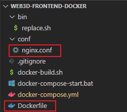

[TOC]

## Vue-cli webpack相关

[#](https://cli.vuejs.org/zh/guide/webpack.html#添加一个新的-loader)

Vue CLI 内部的 webpack 配置是通过 [webpack-chain](https://github.com/mozilla-neutrino/webpack-chain) 维护的。

[webpack-chain v5中午文档](https://github.com/Yatoo2018/webpack-chain/tree/zh-cmn-Hans)

这个库提供了一个 webpack 原始配置的上层抽象，使其可以定义具名的 loader 规则和具名插件，并有机会在后期进入这些规则并对它们的选项进行修改。

`.rule` 是定义名称, 用于后续访问

### 添加一个新的 Loader

```js
// vue.config.js
module.exports = {
  chainWebpack: config => {
    // GraphQL Loader
    config.module
      .rule('graphql')
      .test(/\.graphql$/)
      .use('graphql-tag/loader')
        .loader('graphql-tag/loader')
        .end()
      // 你还可以再添加一个 loader
      .use('other-loader')
        .loader('other-loader')
        .end()
  }
}
```


## Vue-cli 构建目标

[#](https://cli.vuejs.org/zh/guide/build-targets.html#应用)

当你运行 `vue-cli-service build` 时，你可以通过 `--target` 选项指定不同的构建目标。

它允许你将相同的源代码根据不同的用例生成不同的构建

多个模式:

1. 应用 (默认) 模式
2. 库模式
3. Web Components 模式
4. 异步Web Components 模式


## Vue-cli 部署

## 通用指南

如果你用 Vue CLI 处理静态资源并和后端框架一起作为部署的一部分，那么你需要的仅仅是确保 Vue CLI 生成的构建文件在正确的位置，并遵循后端框架的发布方式即可。

如果你独立于后端部署前端应用——也就是说后端暴露一个前端可访问的 API，然后前端实际上是纯静态应用。那么你可以将 `dist` 目录里构建的内容部署到任何静态文件服务器中，但要确保正确的 [publicPath](https://cli.vuejs.org/zh/config/#publicpath)。

### 本地预览

`dist` 目录需要启动一个 HTTP 服务器来访问 (除非你已经将 `publicPath` 配置为了一个相对的值)，所以以 `file://` 协议直接打开 `dist/index.html` 是不会工作的。在本地预览生产环境构建最简单的方式就是使用一个 Node.js 静态文件服务器，例如 [serve](https://github.com/zeit/serve)：

```bash
npm install -g serve
# -s 参数的意思是将其架设在 Single-Page Application 模式下
# 这个模式会处理即将提到的路由问题
serve -s dist
```

### 使用 `history.pushState` 的路由

如果你在 `history` 模式下使用 Vue Router，是无法搭配简单的静态文件服务器的。

例如，如果你使用 Vue Router 为 `/todos/42/` 定义了一个路由，开发服务器已经配置了相应的 `localhost:3000/todos/42` 响应，但是一个**为生产环境构建架设的简单的静态服务器**会却会返回 404。

为了解决这个问题，你需要配置生产环境服务器，将任何没有匹配到静态文件的请求回退到 `index.html`。

Vue Router 的文档提供了[常用服务器配置指引](https://router.vuejs.org/zh/guide/essentials/history-mode.html)


### CORS

如果前端静态内容是部署在与后端 API 不同的域名上，你需要适当地配置 [CORS](https://developer.mozilla.org/zh-CN/docs/Web/HTTP/Access_control_CORS)。

### PWA

如果你使用了 PWA 插件，那么应用必须架设在 HTTPS 上，这样 [Service Worker](https://developer.mozilla.org/zh-CN/docs/Web/API/Service_Worker_API) 才能被正确注册。

## 平台指南

### 云开发 CloudBase

todo...

### 混合部署

todo...


### Github Pages

#### 手动推送更新

1. 在 `vue.config.js` 中设置正确的 `publicPath`。

   如果打算将项目部署到 `https://.github.io/` 上, `publicPath` 将默认被设为 `"/"`，你可以忽略这个参数。

   如果打算将项目部署到 `https://.github.io//` 上 (即仓库地址为 `https://github.com//`)，可将 `publicPath` 设为 `"//"`。

   举个例子，如果仓库名字为“my-project”，那么 `vue.config.js` 的内容应如下所示：

   ```js
   module.exports = {
     publicPath: process.env.NODE_ENV === 'production'
       ? '/my-project/'
       : '/'
   }
   ```

2. 在项目目录下，创建内容如下的 `deploy.sh` (可以适当地取消注释) 并运行它以进行部署：

   ```sh
      #!/usr/bin/env sh
      
      # 当发生错误时中止脚本
      set -e
      
      # 构建
      npm run build
      
      # cd 到构建输出的目录下 
      cd dist
      
      # 部署到自定义域域名
      # echo 'www.example.com' > CNAME
      
      git init
      git add -A
      git commit -m 'deploy'
      
      # 部署到 https://<USERNAME>.github.io
      # git push -f git@github.com:<USERNAME>/<USERNAME>.github.io.git master
      
      # 部署到 https://<USERNAME>.github.io/<REPO>
      # git push -f git@github.com:<USERNAME>/<REPO>.git master:gh-pages
      
      cd -
   ```

   

#### 使用 Travis CI 自动更新

1. 仿照上面在 `vue.config.js` 中设置正确的 `publicPath`。

2. 安装 Travis CLI 客户端：`gem install travis && travis --login`

3. 生成一个拥有“repo”权限的 GitHub [访问令牌](https://help.github.com/cn/articles/creating-a-personal-access-token-for-the-command-line)。

4. 授予 Travis 访问仓库的权限：`travis set GITHUB_TOKEN=xxx` (`xxx` 是第三步中的个人访问令牌)

5. 在项目根目录下创建一个 `.travis.yml` 文件。

   ```yaml
   language: node_js
   node_js:
     - "node"
   
   cache: npm
   
   script: npm run build
   
   deploy:
   provider: pages
   skip_cleanup: true
   github_token: $GITHUB_TOKEN
   local_dir: dist
   on:
     branch: master
   ```

6. 将 `.travis.yml` 文件推送到仓库来触发第一次构建。

   

### GitLab Pages

根据 [GitLab Pages 文档](https://docs.gitlab.com/ee/user/project/pages/)的描述，所有的配置都在根目录中的`.gitlab-ci.yml` 文件中。下面的范例是一个很好的入门:

```yaml
# .gitlab-ci.yml 文件应放在你仓库的根目录下 

pages: # 必须定义一个名为 pages 的 job
  image: node:latest
  stage: deploy
  script:
    - npm ci
    - npm run build
    - mv public public-vue # GitLab Pages 的钩子设置在 public 文件夹
    - mv dist public # 重命名 dist 文件夹 (npm run build 之后的输出位置)
  artifacts:
    paths:
      - public # artifact path 一定要在 /public , 这样 GitLab Pages 才能获取
  only:
    - master
```

通常, 你的静态页面将托管在 https://yourUserName.gitlab.io/yourProjectName 上, 所以你可以创建一个 initial `vue.config.js` 文件去 [更新 `BASE_URL`](https://github.com/vuejs/vue-cli/tree/dev/docs/config#baseurl) 要匹配的值 ：

```javascript
// vue.config.js 位于仓库的根目录下
// 确保用 GitLab 项目的名称替换了 `YourProjectName`

module.exports = {
  publicPath: process.env.NODE_ENV === 'production'
    ? '/yourProjectName/'
    : '/'
}
```

请阅读在 [GitLab Pages domains](https://docs.gitlab.com/ee/user/project/pages/getting_started_part_one.html#gitlab-pages-domain) 的文档来学习更多关于页面部署 URL 的信息。注意，你也可以[使用自定义域名](https://docs.gitlab.com/ee/user/project/pages/getting_started_part_three.html#adding-your-custom-domain-to-gitlab-pages)。

在推送到仓库之前提交 `.gitlab-ci.yml` 和 `vue.config.js` 文件。GitLab CI 的管道将会被触发: 当成功时候, 到 `Settings > Pages` 查看关于网站的链接。


### **#Render#**

[Render](https://render.com/) 提供带有全托管 SSL，全球 CDN 和 GitHub 持续自动部署的[免费静态站点托管](https://render.com/docs/static-sites)服务。

### Amazon S3

### Firebase

### Vercel

### Heroku

### Surge

### Bitbucket Cloud

### **Docker (Nginx)**

在 Docker 容器中使用 Nginx 部署你的应用。

1. 安装 [Docker](https://www.docker.com/get-started)

2. 在项目根目录创建 `Dockerfile` 文件

   ```
   // Dockerfile
   FROM node:10
   COPY ./ /app
   WORKDIR /app
   RUN npm install && npm run build
   
   FROM nginx
   RUN mkdir /app
   COPY --from=0 /app/dist /app
   COPY nginx.conf /etc/nginx/nginx.conf
   ```

3. 在项目根目录创建 `.dockerignore` 文件

   设置 `.dockerignore` 文件能防止 `node_modules` 和其他中间构建产物被复制到镜像中导致构建问题。

   ```text
   **/node_modules
   **/dist
   ```

4. 在项目根目录创建 `nginx.conf` 文件

   `Nginx` 是一个能在 Docker 容器中运行的 HTTP(s) 服务器。它使用配置文件决定如何提供内容、要监听的端口等。参阅 [Nginx 设置文档](https://www.nginx.com/resources/wiki/start/topics/examples/full/) 以了解所有可能的设置选项。

   下面是一个简单的 `Nginx` 设置文件，它会在 `80` 端口上提供你的 Vue 项目。`页面未找到` / `404` 错误使用的是 `index.html`，这让我们可以使用基于 `pushState()` 的路由。

   ```text
   user  nginx;
   worker_processes  1;
   error_log  /var/log/nginx/error.log warn;
   pid        /var/run/nginx.pid;
   events {
     worker_connections  1024;
   }
   http {
     include       /etc/nginx/mime.types;
     default_type  application/octet-stream;
     log_format  main  '$remote_addr - $remote_user [$time_local] "$request" '
                       '$status $body_bytes_sent "$http_referer" '
                       '"$http_user_agent" "$http_x_forwarded_for"';
     access_log  /var/log/nginx/access.log  main;
     sendfile        on;
     keepalive_timeout  65;
     server {
       listen       80;
       server_name  localhost;
       location / {
         root   /app;
         index  index.html;
         try_files $uri $uri/ /index.html;
       }
       error_page   500 502 503 504  /50x.html;
       location = /50x.html {
         root   /usr/share/nginx/html;
       }
     }
   }
   ```

5. 构建你的 Docker 镜像

   ```bash
   docker build . -t my-app
   # Sending build context to Docker daemon  884.7kB
   # ...
   # Successfully built 4b00e5ee82ae
   # Successfully tagged my-app:latest
   ```

6. 运行你的 Docker 镜像

   这个例子基于官方 `Nginx` 镜像，因此已经设置了日志重定向并关闭了自我守护进程。它也提供了其他有利于 Nginx 在 Docker 容器中运行的默认设置。更多信息参阅 [Nginx Docker 仓库](https://hub.docker.com/_/nginx)。

   ```bash
   docker run -d -p 8080:80 my-app
   curl localhost:8080
   # <!DOCTYPE html><html lang=en>...</html>
   ```



**拓展资料**

 [Docker](https://www.docker.com/get-started)

[Nginx 设置文档](https://www.nginx.com/resources/wiki/start/topics/examples/full/) 
