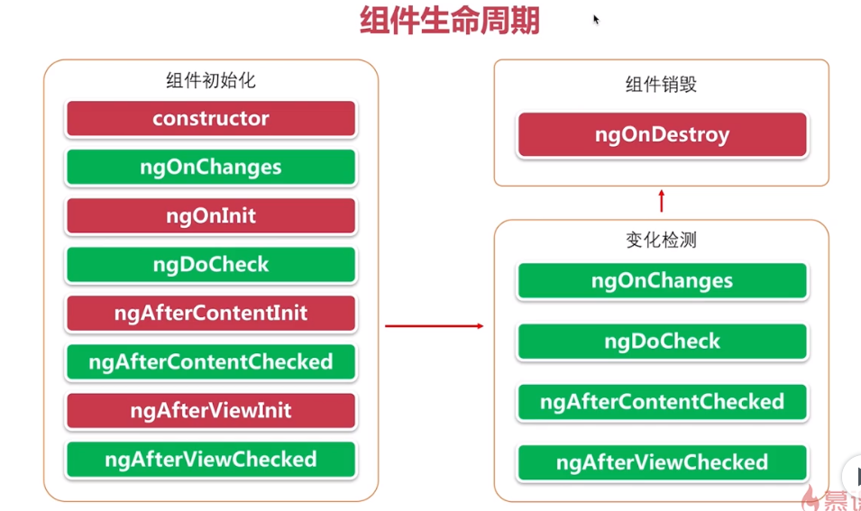

[TOC]

## Kubernetes (K8S)

[科技爱好者周刊（第 181 期）：移动支付应该怎么设计？ - 阮一峰的网络日志 (ruanyifeng.com)](https://www.ruanyifeng.com/blog/2021/10/weekly-issue-181.html)

3、[Kubernetes：令人惊讶的个人项目平台](http://www.doxsey.net/blog/kubernetes--the-surprisingly-affordable-platform-for-personal-projects)（英文）

流行的观点认为，Kubernetes 是一种过于复杂的技术，只适用于非常大的机器群。我认为这可能是错的，Kubernetes 适用于小型项目。

4、[Kubernetes 用于个人项目？不用了，谢谢！](https://carlosrdrz.es/kubernetes-for-small-projects/)（英文）

本文是对上一篇文章的反驳。

[eip-work/kuboard-press: Kuboard](https://github.com/eip-work/kuboard-press)

Kuboard 是基于 Kubernetes 的微服务管理界面。同时提供 Kubernetes 免费中文教程，入门教程

## KubeSphere

开源的国产 K8s 管理平台：[KubeSphere](https://github.com/kubesphere/kubesphere)。

最大特点就是易用和高度产品化，有一个体验非常优秀的控制台，让不熟悉容器的用户以非常低的成本上手，快速使用各种高级功能。整个操作过程都是向导式图形化的 UI。

# Svelte for Sites, React for Apps

[Svelte for Sites, React for Apps (swyx.io)](https://www.swyx.io/svelte-sites-react-apps/)

[Svelte 搭网站，React 做应用 (nextfe.com)](https://nextfe.com/svelte-for-sites-react-for-apps/)

## 新股破发

简而言之就是最新的股票跌破发行价。主要原因是多方面的，有股市大背景下的行情不好。也有本只股票盈利率不被看好。

## PostCSS

## 如何监听url的改变

## angular 组件生命周期

[Angular - @angular/core](https://angular.cn/api/core)

| hook                  |                                                              |
| --------------------- | ------------------------------------------------------------ |
| `AfterContentChecked` | 一个生命周期钩子，它会在默认的变更检测器对指令的所有内容完成了变更检查之后调用。 |
| `AfterContentInit`    | 一个生命周期钩子，它会在 Angular 完全实例化了指令的所有内容之后调用。 定义一个 `ngAfterContentInit()` 方法来处理额外的初始化任务。 |
| `AfterViewChecked`    | 一个生命周期钩子，它会在默认的变更检测器完成了对组件视图的变更检测之后调用。 |
| `AfterViewInit`       | 一个生命周期钩子，会在 Angular 完全初始化了组件的视图后调用。 定义一个 `ngAfterViewInit()` 方法来处理一些额外的初始化任务。 |
| `DoCheck`             | 一个生命周期钩子，除了使用默认的变更检查器执行检查之外，还会为指令执行自定义的变更检测函数。 |
| `OnChanges`           | 一个生命周期钩子，当指令的任何一个可绑定属性发生变化时调用。 定义一个 `ngOnChanges()` 方法来处理这些变更。 |
| `OnDestroy`           | 一个生命周期钩子，它会在指令、管道或服务被销毁时调用。 用于在实例被销毁时，执行一些自定义清理代码。 |
| `OnInit`              | 一个生命周期钩子，它会在 Angular 初始化完了该指令的所有数据绑定属性之后调用。 定义 `ngOnInit()` 方法可以处理所有附加的初始化任务。 |

## 生命周期钩子的作用及调用顺序

1. ngOnChanges - 当数据绑定输入属性的值发生变化时调用
2. ngOnInit - 在第一次 ngOnChanges 后调用
3. ngDoCheck - 自定义的方法，用于检测和处理值的改变
4. ngAfterContentInit - 在组件内容初始化之后调用
5. ngAfterContentChecked - 组件每次检查内容时调用
6. ngAfterViewInit - 组件相应的视图初始化之后调用
7. ngAfterViewChecked - 组件每次检查视图时调用
8. ngOnDestroy - 指令销毁前调用
