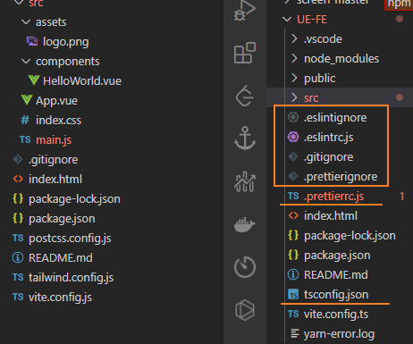
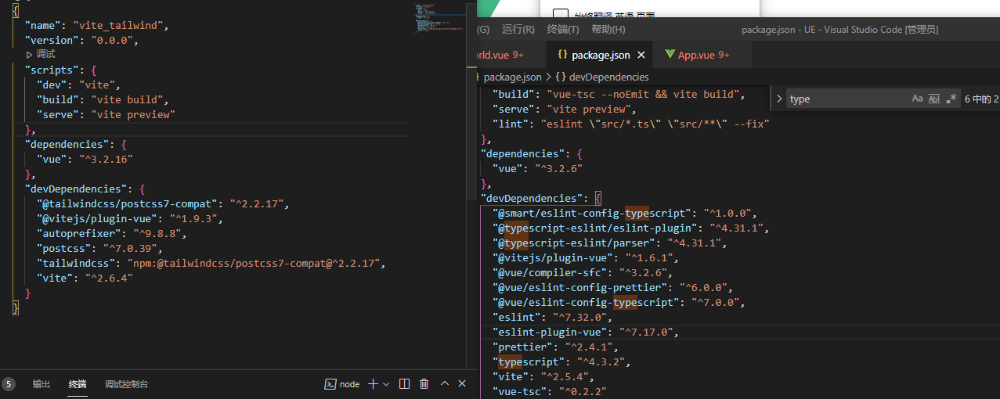
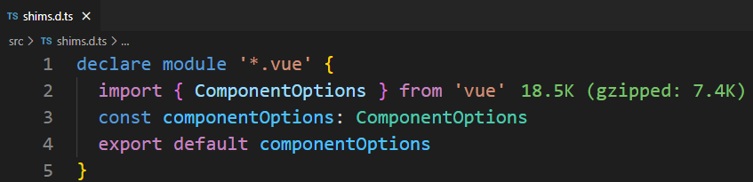
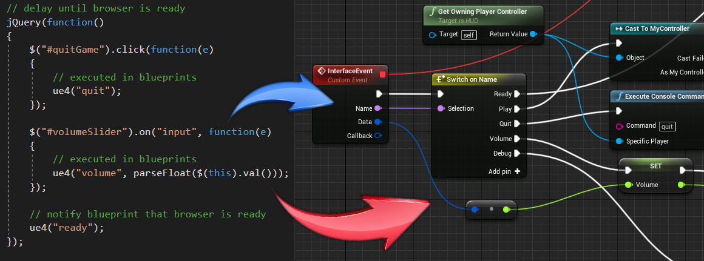
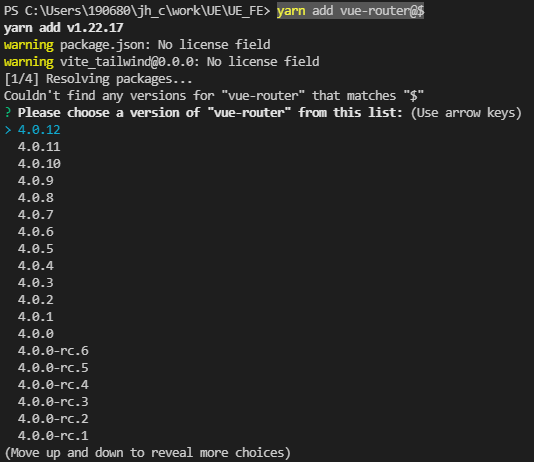

[TOC]

### svi 更改配置地址

`svi -h`

`svi config get config url` url 指向gitlab的地址

查看vue3+ts模板的配置文件与vite init生成模板的差异





svi 生成的模板eslint报错

1. eslint检测语法基于vue2, vue3的setup不识别
2. 行尾序列需要改成LF


```
svi config set registry http://172.16.11.133 
svi init vue3-app project-name
```


### vue3+ts环境搭建建议

[Vue3 全家桶 + TS](https://juejin.cn/post/6959174069577220110)


```ts
// src/shim.d.ts
/* eslint-disable */
declare module '*.vue' {
  import type { DefineComponent } from 'vue'
  const component: DefineComponent<{}, {}, any>
  export default component
}
```



vue3 报错解决：找不到模块‘xxx.vue’或其相应的类型声明。

### UE 关联github

[连接 (epicgames.com)](https://www.epicgames.com/account/connections#accounts)

登录ue网址后, 打开github (注github未登录无法显示网页、需要Epic账号关联github)

https://github.com/tracerinteractive/UnrealEngine/releases



*Trigger UE4 events with optional JSON data from JavaScript*


### yarn add xx@$

yarn add vue-router@$




### vite 源码

https://github.com/vitejs/vite/blob/main/packages/create-app/index.js


### echarts 按需引入

`import * as echarts from 'echarts'; // 引入所有 ECharts 中所有的图表和组件`


```js
// 引入 echarts 核心模块，核心模块提供了 echarts 使用必须要的接口。
import * as echarts from 'echarts/core';
// 引入柱状图图表，图表后缀都为 Chart
import { BarChart } from 'echarts/charts';
// 引入提示框，标题，直角坐标系，数据集，内置数据转换器组件，组件后缀都为 Component
import {
  TitleComponent,
  TooltipComponent,
  GridComponent,
  DatasetComponent,
  DatasetComponentOption,
  TransformComponent
} from 'echarts/components';
// 标签自动布局，全局过渡动画等特性
import { LabelLayout, UniversalTransition } from 'echarts/features';
// 引入 Canvas 渲染器，注意引入 CanvasRenderer 或者 SVGRenderer 是必须的一步
import { CanvasRenderer } from 'echarts/renderers';

// 注册必须的组件
echarts.use([
  TitleComponent,
  TooltipComponent,
  GridComponent,
  DatasetComponent,
  TransformComponent,
  BarChart,
  LabelLayout,
  UniversalTransition,
  CanvasRenderer
]);

// 接下来的使用就跟之前一样，初始化图表，设置配置项
var myChart = echarts.init(document.getElementById('main'));
myChart.setOption({
  // ...
});
```

**在 TypeScript 中按需引入**

提供了类型接口来组合出最小的`EChartsOption`类型

```ts
import * as echarts from 'echarts/core';
import {
  BarChart,
  // 系列类型的定义后缀都为 SeriesOption
  BarSeriesOption,
  LineChart,
  LineSeriesOption
} from 'echarts/charts';
import {
  TitleComponent,
  // 组件类型的定义后缀都为 ComponentOption
  TitleComponentOption,
  GridComponent,
  GridComponentOption,
  // 数据集组件
  DatasetComponent,
  DatasetComponentOption,
  // 内置数据转换器组件 (filter, sort)
  TransformComponent
} from 'echarts/components';
import { LabelLayout, UniversalTransition } from 'echarts/features';
import { CanvasRenderer } from 'echarts/renderers';

// 通过 ComposeOption 来组合出一个只有必须组件和图表的 Option 类型
type ECOption = echarts.ComposeOption<
  | BarSeriesOption
  | LineSeriesOption
  | TitleComponentOption
  | GridComponentOption
  | DatasetComponentOption
>;

// 注册必须的组件
echarts.use([
  TitleComponent,
  TooltipComponent,
  GridComponent,
  DatasetComponent,
  TransformComponent,
  BarChart,
  LabelLayout,
  UniversalTransition,
  CanvasRenderer
]);

const option: ECOption = {
  // ...
};
```

**动态排序图**

Apache ECharts 5 新增支持动态排序柱状图（bar-racing）以及动态排序折线图（line-racing），帮助开发者方便地创建带有时序性的图表，展现数据随着时间维度上的变化，讲述数据的演变过程。
