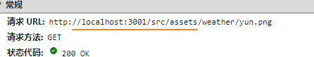

[TOC]

### 工作油腻警告

我不得不说小码农是真的很好盘（方言，意思就是很好忽悠）。给一周时间他能搞定，给三天他也能搞定，周五跟他说周一上线他还能搞定，不盘这种人盘哪种人呢？

很多小码农都认为项目延期是自己的责任。这可真是太把自己当回事了。

update：这个答案不知道怎么就火了，我只是指出延期也是一种工作方式，要敢于延期善于延期。

假设整个项目周期 6 个月，上面开会讨论了一个月，后来因为没想好改来改去又浪费一个月，最后留给小码农的时间不到 3 个月。你代码写到后期又突然给你加个需求，如果这个时候乖巧的小码农还能如期完成任务，我只能说活该你加班。

像我这种老油条，我一定会确保项目延期，让管理层知道**项目出问题是因为上游决策者不够专业，而不是我不专业**。**加班，我一定会拉满；但问题，我一定会让它暴露出来。**

我的具体步骤如下：

我会在**前期预警**，方便后期甩锅。我会早早地发公开邮件（或微信）说目前工期很紧（你会说你说了也没人用，但我的用处放在后面说）后面的 buffer 几乎没有了，我会全力加班。
每次需求变动，我会**追加邮件预警**，方便后期甩锅（原本就很紧，现在改需求又浪费一周。每改一次，又多浪费一周。）
**班我会加给大家看，但项目一定会延期**，并且延期的锅一定不在我（因为我预警多次了，我也全力加班了，所以我可以甩锅了）
管理层追责我就把前期的**会议纪要、风险预警、加班记录**都放出来，证明我这里已经尽力了，有问题找上游吧。

这样一来，上游就会逐渐知道下游的程序员不是那么好盘的，并约束自己。


这其中的关键你学会了吗？我们再复习一次：

我该加的班都加了，不该加的也加了，但还是延期了（我故意的，但我不说。我要确保有问题的项目延期）
把延期的锅往根源上甩。
领导完全找不到我的问题，前中后期我的表现都堪称完美，态度又积极。只能问上游怎么回事。

这叫用专业的方法暴露问题并甩锅，保证延期是本方法的精髓。

这位课代表总结得很好：

从公司的视角来看，你是最兢兢业业的人，但项目出了问题必须找出原因，只能找其他人。


正所谓铁打的团队流水的项目。一两个项目的延期根本没什么，项目成员合作有系统性问题才是需要优先解决的。

很多小码农以为自己辛苦加班是为了团队好，实际上是在隐藏问题，企图用战术上的积极来掩盖战略上的失败，长此以往，整个团队效率会越来越慢。

看到现在，你应该明白我的思路了吧：有问题就想办法暴露，而不是隐藏。暴露了才会有人想办法解决，否则问题就会一直在那，直到你被压得受不了换公司，但问题还是没人去解决。

回到你的问题：公司取消 996，但是工作量没变，怎么办？

答案似乎很明显，如果管理层不愿意延长工期，那么我们就只能改变工作方式，减少不必要的消耗、会议、扯皮，提供每一个环节的效率。

把你做的所有努力量化出来，并公布给大家看。

如果你把该做的都做了，还是没有达到 KPI。那也是没有办法的事情，只要锅没有甩到你的身上就行……说白了就是虽然拿不到 10 个月的年终奖，但是 3~4 个月的年终奖还是要保一保的，千万别背锅然后一分钱都拿不到就行。

如果有人（其实是上游）害你的 KPI 达不到，那么你要确保他/她的 KPI 也达不到。千万别为了别人的 KPI 而加班。

当然，你如果想辛苦自己，成全他人，就当我没说。但你要搞清楚：一旦你辛苦这一次，那么下一次你会更加辛苦。


评论里说到裁员，很多程序员巴不得被裁，提前拿年终奖不爽吗。你那么怕被裁，就只能被上游压榨啦。尤其是大公司的程序员，被裁都会偷着乐，补偿一定会给到位。跳到另外一家公司工资只会更高。

可能还有些程序员会怕丢年终奖，这就看你要长期利益还是短期利益了。你上游挟年终奖以令诸码农，码农怎么就不能反向要挟呢，挟黑锅以诸令产品经理不行吗？当产品经理发现在这你改需求会让他背锅且年终奖不保，他还会动不动改需求吗？小码农倒好，让产品经理发现只要压一压小码农就有年终奖，傻子才不改需求压榨小码农呢。

不怕延期你就玩命压我工期吧，要死大家一起死，我惯着你我就是你孙子，然后你看看还有谁敢压你工期。

------

精髓就是要留下文字证据，别管是不是邮件。有你和你上游的聊天记录也行，就是你觉得要延期或者你觉得没有buffer的时候都要向上反映，上面不理你也要向上反映，防止锅甩到自己身上才是宗旨。
凡事少往自己身上反思，这就是职场减压第一奥义。
员工能力不足导致delay：为什么管理层会招这个人？
**员工能力可以但还是delay**：管理层怎么排的期？怎么立的项？
底层员工别把自己看那么重要，管理眼中你就是个轮子坏了就换，锅甩出去钱拿到手就完事儿了。


### 天气api

https://tianqiapi.com/free/day?version=v61&appid=16147246&appsecret=AAkH9d6R&cityid=101101015&vue=1

[文档](http://www.tianqiapi.com/index/doc)


### Vue3 script setup 访问异步数据

```js
const weather = ref('');
const temperature = ref([]);
onBeforeMount(async () => {
  const res = await axios.get('https://tianqiapi.com/free/day?version=v61&appid=16147246&appsecret=AAkH9d6R&cityid=101280101&vue=1')
  const { wea_img, tem_day, tem_night } = res.data;
  weather.value = `src/assets/weather/${wea_img}.png`; //
  temperature.value = [tem_night, tem_day];
})
```


### Vue3 img 地址

```js
weather.value = `src/assets/weather/${wea_img}.png`; 

```



本地服务相对是基于根目录


### vue 如何绑定伪类样式

:style=[style1]

style1: {

​	color: red;

}


### vue3 中setup中调用useStore()返回undefined

## 组合式函数[#](https://next.vuex.vuejs.org/zh/api/#组合式函数)

### useStore[#](https://next.vuex.vuejs.org/zh/api/#usestore)

- `useStore(injectKey?: InjectionKey> | string): Store;`

  在 `setup` 钩子函数中调用该方法可以获取注入的 store。当使用组合式 API 时，可以通过调用该方法检索 store。

  ```js
  import { useStore } from 'vuex'
  
  export default {
    setup () {
      const store = useStore()
    }
  }
  ```

不能在setup中的生命周期钩子中调用useStore
