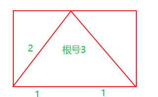

### ECHART


柱状堆叠图

关注属性` stack `

[Documentation - Apache ECharts](https://echarts.apache.org/zh/option.html#series-bar.stack)


### echart 图表比其容器小


### 三角形CSS

```CSS

.trangle[data-v-13992a7e]::after {
    content: "";
    display: inline-block;
    width: 0;
    height: 0;
    border-top: 0rem solid transparent;
    border-right: 1rem solid transparent;
    border-bottom: 1rem solid #2dffb3;
    border-left: 1rem solid transparent;
}
```


等腰三角形CSS

​	显示的对边宽度置为0

等边三角形

​	高是边的sqrt(3)/2倍，所以如果高为40的话，两边就是差不多23

​	

```vue
<script setup>
const trangleBorderWidth = 8 * (1/10);
const SQRT3 = Math.sqrt(3) // 比例
const borderX = `${trangleBorderWidth}rem solid transparent`
const borderY = `${trangleBorderWidth * SQRT3}rem solid #2dffb3` // 在js中计算得到结果
</script>

<style>
.trangle::after {
    @apply w-0 h-0 inline-block border-t-0 ml-8;
    content: "";
    border-bottom: v-bind(borderY); // 绑定setup中的变量
    border-right: v-bind(borderX);
    border-left: v-bind(borderX);
  }
</style>
```

不能在v-bind里面进行计算? 确实是这样

```css
border-bottom: v-bind(`${trangleBorderWidth * SQRT3}rem solid #2dffb3`);
```

因为CSS中不能识别编译这种表达式, 会将`trangleBorderWidth * SQRT3`识别为一个整体

