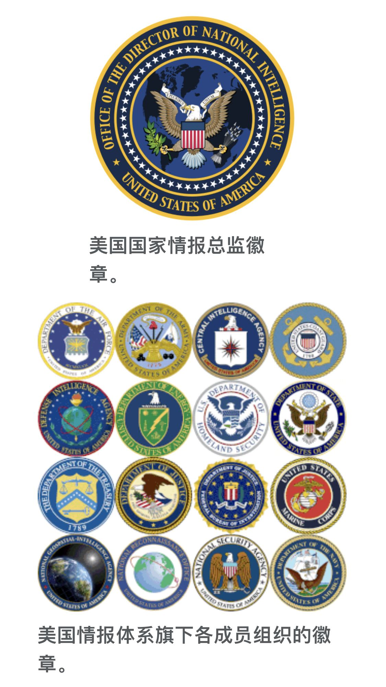

[TOC]

# 官员贪腐 2000 万退赃 8000 万获判从轻，多出的 6000 万是怎么回事？

**太长不看版：本案检方指控的犯罪金额是2000多万，被告人退赔了8000多万，因为被告人把犯罪所得拿去投资理财个人消费，金额还增长了6000多万。多退赔的部分不是因为有贪污罪行检察院没有指控，被告人已经在调查过程中如实供述。而且，根据刑法法理和刑事法律规定，犯罪所得的投资收益应该被追缴。**

## 一、检察方指控了贪污罪和受贿罪，共计金额2631.3335万元

**（一）贪污罪**

公诉机关指控，被告人历任黑龙江省、北安高速公路管理处处长，利用其职务便利，采取虚列工程支出、虚开发票的手段贪污公款共计人民币2030.5535万元。列举了三十二次贪污罪行。

**（二）受贿罪**

公诉机关指控，被告人祝某某于2000年11月至2015年5月，历任鹤伊公路管理处、哈伊高速公路管理处、北安高速公路管理处处长，利用其职务便利，在承揽工程、人员录用、提拔方面为他人提供帮助，先后索要、收受他人贿赂人民币600.78万元。列举了九处受贿罪行。

## 二、本案被告人因为投资理财所以多退赔6000万

法院经审理查明：被告人祝某某将上述贪污和受贿所得用于**投资、理财、购买房产及个人消费**。祝某某在接受调查期间，愿意主动上缴违法所得，并于2021年5月24日将贪污所得全部主动上缴。经调查，被告人祝某某于2021年2月21日在海南省三亚市被监察机关带回，到案后如实供述了监察机关未掌握的贪污罪行。

因此，本案被告人退赔比贪污受贿款项多了6000万，是因为（投资所得-个人消费）=6000万。有些答主认为这些是未掌握的贪污受贿款项，这是严重错误的。因为根据判决书，被告人在2021年2月21日已经如实供述了监察机关尚未掌握的贪污罪行，监察机关已经把这些原来未掌握的罪行记录并移交检察院，这些罪行已经被指控并被法院纳入定罪、量刑考虑范围。

## 三、为何本案被告人因为特别自首、坦白、认罪认罚，得以从轻处罚

本案被告人被处罚是有法律依据的。本案被告人到案后有两个行为，一个是主动上缴违法所得，一个是如实供述未掌握的贪污罪行。

**（一）法院在量刑部分既考虑了从重情节，也考虑了从轻情节**

- 特别自首：被告人祝某某到案后如实供述监察机关未掌握的贪污、受贿犯罪，系自首，可对其从轻、减轻处罚；
- 坦白：被告人祝某某在提起公诉前如实供述自己罪行、真诚悔罪、积极退赃，避免、减少损害结果的发生，对其从轻处罚；
- 前科+索贿：被告人祝某某有贪污犯罪同类前科、索贿情节，对其从重处罚；
- 认罪认罚从宽：被告人祝某某在侦查阶段即认罪认罚，可对其从宽处罚。

**（二）从轻处罚的依据**

**法院直接指明的依据：**

- 《刑事诉讼法》第十五条：“犯罪嫌疑人、被告人自愿如实供述自己的罪行，承认指控的犯罪事实，愿意接受处罚的，可以依法从宽处理。”这是关于认罪认罚从宽的规定。“
- 《刑法》第三百八十三条第三款【贪污罪从轻情节】：”犯第一款罪，在提起公诉前如实供述自己罪行、真诚悔罪、积极退赃，避免、减少损害结果的发生，有第一项规定情形的，可以从轻、减轻或者免除处罚；有第二项、第三项规定情形的，可以从轻处罚。“
- 《刑法》第三百八十六条 【受贿罪的处罚规定】：“对犯受贿罪的，根据受贿所得数额及情节，依照本法第三百八十三条的规定处罚。索贿的从重处罚。”
