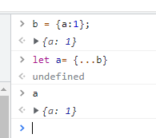
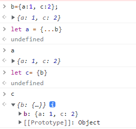
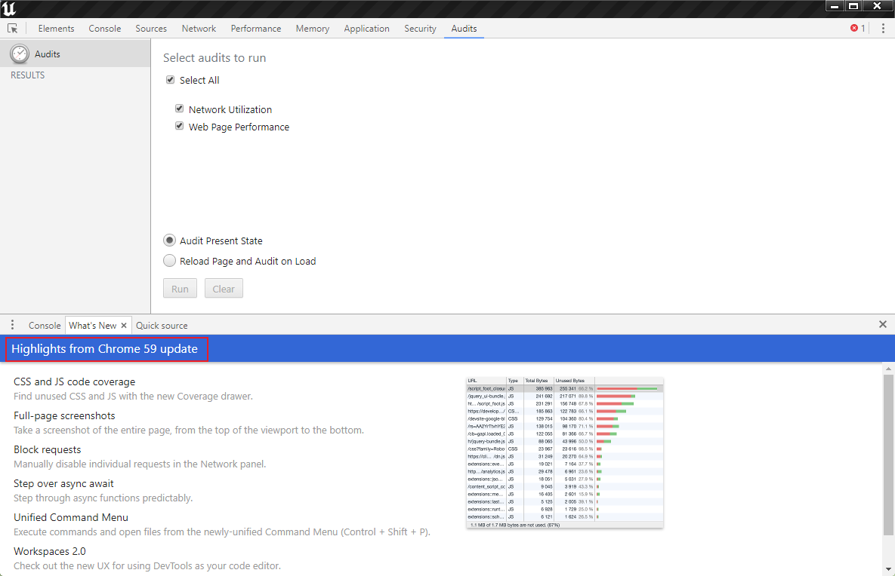
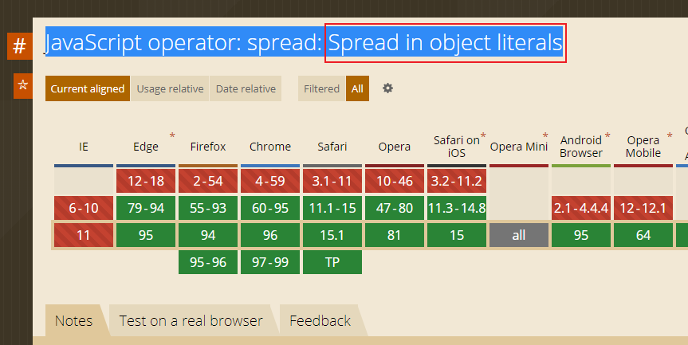
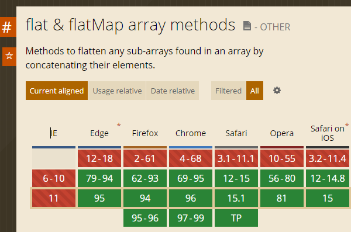

### vue3 + vue-router4 ?

不能这样搭配使用,  打包输出的内容不会渲染app节点 --- 主要是路由的问题

**能否单独将vue-router降级**, 不行是配套的


通过动态组件模拟路由, 单页面

```vue
<keep-alive><component :is="ComponentName"></component></keep-alive>
```


打包输出的文件有处语法为 

```js
let a = {...b} // 浏览器无法识别
```

导致报语法错误; **然而高版本浏览器是正确的**



UE使用的谷歌内核版本不够高





60才能用呢

报错的`flat`方法也是



怎么处理: flat 改为lodash.fatten; **手动移除{...n}语法中的...**  这部分是devtool使用的, 不影响

