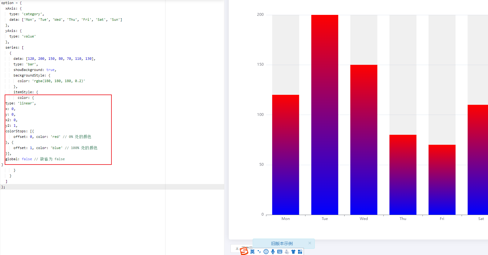

想问个问题，为啥在浏览器解析文件时CSS会堵塞JS的运行而不是JS让CSS挂起，和JS挂起HTML渲染线程一样

例如某个脚本文件中操作了css，但是浏览器还没有stylesheet，就无法操作样式，必须等到浏览器加载css构建好了样式表，才能继续执行JS，所以会堵塞JS


### echart 渐变色

https://echarts.apache.org/zh/option.html#color




### echart仪表盘环形得分

```js
option={series:[{type:"gauge",center:["50%","60%"],startAngle:90,endAngle:-270,radius:200,clockwise:false,min:0,max:60,itemStyle:{color:"#FFAB91"},progress:{show:true,width:10,},pointer:{show:false},axisLine:{lineStyle:{width:5}},axisTick:{show:false,},splitLine:{show:false,},axisLabel:{show:false,},anchor:{show:false},title:{show:false},detail:{show:false},data:[{value:20}]},{type:"gauge",center:["50%","60%"],startAngle:90,endAngle:-270,radius:150,clockwise:false,min:0,max:60,itemStyle:{color:"#FFAB91"},progress:{show:true,width:10,},pointer:{show:false},axisLine:{lineStyle:{width:5}},axisTick:{show:false,},splitLine:{show:false,},axisLabel:{show:false,},anchor:{show:false},title:{show:false},detail:{show:false},data:[{value:20}]},{type:"gauge",center:["50%","60%"],startAngle:200,endAngle:-20,min:0,max:60,itemStyle:{color:"#FD7347"},progress:{show:true,width:18,overlap:false},pointer:{show:false},axisLine:{lineStyle:{width:15}},axisTick:{show:false},splitLine:{show:false},axisLabel:{show:false},detail:{show:false},data:[{value:20}]}]};
```

