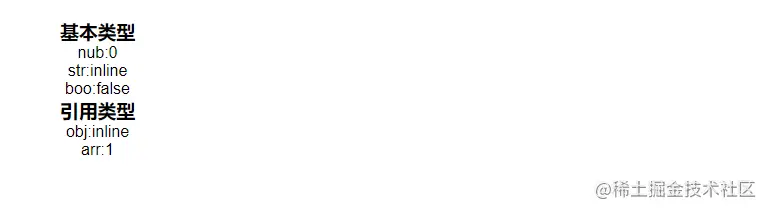

# vue3的setup还能这么用？

这是我参与11月更文挑战的第9天，活动详情查看：[2021最后一次更文挑战](https://juejin.cn/post/7023643374569816095)

## 一、前言

> 昨天讲了什么是`组合式API`，[# 马上都2202年了你还不知道什么是Vue3的组合式API吗？](https://juejin.cn/post/7028629804173770765)
>
> 今天就来听我吹一吹vue3的`setup`都能怎么用

借用官网一句话

> `setup` 选项是一个接收 `props` 和 `context` 的函数

也就是说它的基本写法应该是这样的

```js
export default{
    name: 'test',
    setup(props,context){

     return {}   // 这里返回的任何内容都可以用于组件的其余部分
    }
    // 组件的“其余部分”
}

```

接收一个`props`和`context`函数并且将`setup`内的内容通过`return`暴露给组件的其余部分。

## 二、`setup`注意点

- 由于在执行 setup函数的时候，还没有执行 Created 生命周期方法，所以在 setup 函数中，无法使用 data 和 methods 的变量和方法
- 由于我们不能在 setup函数中使用 data 和 methods，所以 Vue 为了避免我们错误的使用，直接将 setup函数中的this 修改成了 undefined

## 三、定义响应式数据

### `ref` `reactive`

vue3通过`ref` `reactive`来定义响应式数据

> ref和reactive一样, 也是用来实现响应式数据的方法
>
> 由于reactive必须传递一个对象, 所以导致在企业开发中如果我们只想让某个变量实现响应式的时候会非常麻烦所以Vue3就给我们提供了ref方法, 实现对简单值的监听

`ref`我们用来**将`基本数据类型`定义为响应式数据**（ref更适合定义基本数据类型），ref底层的本质其实还是reactive，系统会自动根据我们给ref传入的值将它转换成`ref(xx) -> reactive({value:xx})`

`reactive`用来**将`引用类型`定义为响应式数据**，其本质是基于`Proxy`实现对象代理

- **基本数据类型（单类型）**：除Object。 String、Number、boolean、null、undefined。
- **引用类型**：object。里面包含的 function、Array、Date。

定义

```js
<script>
import {ref, reactive} from "vue";
export default {
  name: "test",
  setup(){
    // 基本类型
    const nub = ref(0)
    const str = ref('inline')
    const boo = ref(false)
    // 引用类型
    const obj = reactive({
      name:'inline',
      age:'18'
    })
    const arr = reactive(['0','1','2'])

    return{
      nub,
      str,
      boo,

      obj,
      arr,
    }
  }
}
</script>
```

使用

```html
<template>
    <div>
      <h1>基本类型</h1>
      <p>nub:{{ nub }}</p>
      <p>str:{{ str }}</p>
      <p>boo:{{ boo }}</p>
    </div>
    <div>
      <h1>引用类型</h1>
      <p>obj:{{ obj.name }}</p>
      <p>arr:{{ arr[1] }}</p>
    </div>
</template>

```

结果

## 四、`toRefs`

如果我们用`reactive`的形式来定义`响应式`变量

```js
setup(){
  const obj = reactive({
    name:'inline',
    gender:'男',
    age:'18'
  })

  return{
    obj
  }
}

```

使用

```html
<div>
  <p>姓名:{{ obj.name }}</p>
  <p>性别:{{ obj.gender }}</p>
  <p>年龄:{{ obj.age }}</p>
</div>

```

这样我们是不是发现在模板内使用参数很麻烦，那我们想直接用`{{ name }}`的方式访问行不行，答案是可行的

这里我们使用`es6`的扩展运算符

```js
setup(){
  const obj = reactive({
    name:'inline',
    gender:'男',
    age:'18',
  })

  return{
    ...obj,
  }
}

```

使用

```html
<div>
  <p>姓名:{{ name }}</p>
  <p>性别:{{ gender }}</p>
  <p>年龄:{{ age }}</p>
</div>

<div>
  <button @click="name = 'juejin'">改变姓名</button>
  <button @click="gender = '女'">改变性别</button>
  <button @click="age = '20'">改变年龄</button>
</div>

```

结果


这里看到我们的参数都正常的显示到了页面上，但是我们去改变参数时发现视图并没有更新，这是为什么呢？？？

我们把扩展运算符写成它的等价格式

```js
const obj = reactive({
    name:'inline',
    gender:'男',A
    age:'18',
  })
// ...obj ==> name:obj.name

```

哎哎哎，等下 我的鼠标浮动上去怎么提示我`name`只是一个字符串？


那我们在看看我们用`ref`定义值时提示什么


奥奥，这个时候我们看到`name`是一个`Ref`，是一个`响应式`字符串。

这样我们就找到了为什么没有更新视图的原因，当我们用`...扩展运算符`时我们得到的只是一个普通类型的数值，并不是一个响应式数据

为了解决这个问题呢，vue3给我们提供了`toRefs`函数,来让我们看看效果如何

```js
setup(){
  const obj = reactive({
    name:'inline',
    gender:'男',
    age:'18',
  })

  return{
    ...toRefs(obj),
  }
}

<div>
  <p>姓名:{{ name }}</p>
  <p>性别:{{ gender }}</p>
  <p>年龄:{{ age }}</p>
</div>

<div>
  <button @click="name = 'juejin'">改变姓名</button>
  <button @click="gender = '女'">改变性别</button>
  <button @click="age = '20'">改变年龄</button>
</div>

```

参数都可以正常改变，成功改头换面


### toRefs总结

> `toRefs`会将我们一个`响应式`的对象转变为一个`普通`对象，然后将这个`普通对象`里的每一个属性变为一个响应式的数据


### ue通信协议简介

```js
// 控制头部/底部/两侧内容显示/隐藏
ue.interface.SetSectionShow
ue.interface.SetHeaderShow
ue.interface.SetFooterShow
// 参数: boolean, true为显示, false为隐藏
ue.interface.SetSectionShow(false) // 隐藏两侧内容

// 获取两侧内容一侧的宽度, 不包含间距; 单位px, 参数无
ue.interface.GetSectionWidth()
```


### Q: reactive和ref的区别?

ref：主要用于基本类型的响应，reactive：主要用于引用类型、更加复杂的数据类型响应， 使用的方式也不同， 不知道是否能帮到你


### 封装路径漫游


### Vue setup + provide/inject

[#](https://v3.cn.vuejs.org/guide/composition-api-provide-inject.html#%E4%BD%BF%E7%94%A8-provide)

### 使用Provide

在 `setup()` 中使用 `provide` 时，我们首先从 `vue` 显式导入 `provide` 方法。

这使我们能够调用 `provide` 来定义每个 property。

`provide` 函数允许你通过两个参数定义 property：

1. name (`<String>` 类型)
2. value

使用 `MyMap` 组件后，provide 的值可以按如下方式重构：

```vue
<!-- src/components/MyMap.vue -->
<template>
  <MyMarker />
</template>

<script>
import { provide } from 'vue'
import MyMarker from './MyMarker.vue'

export default {
  components: {
    MyMarker
  },
  setup() {
    provide('location', 'North Pole')
    provide('geolocation', {
      longitude: 90,
      latitude: 135
    })
  }
}
</script>
```

### 使用 inject

在 `setup()` 中使用 `inject` 时，也需要从 `vue` 显式导入。导入以后，我们就可以调用它来定义暴露给我们的组件方式。

`inject` 函数有两个参数：

1. 要 inject 的 property 的 name
2. 默认值 (**可选**)

使用 `MyMarker` 组件，可以使用以下代码对其进行重构：

```vue
<!-- src/components/MyMarker.vue -->
<script>
import { inject } from 'vue'

export default {
  setup() {
    const userLocation = inject('location', 'The Universe')
    const userGeolocation = inject('geolocation')

    return {
      userLocation,
      userGeolocation
    }
  }
}
</script>
```
