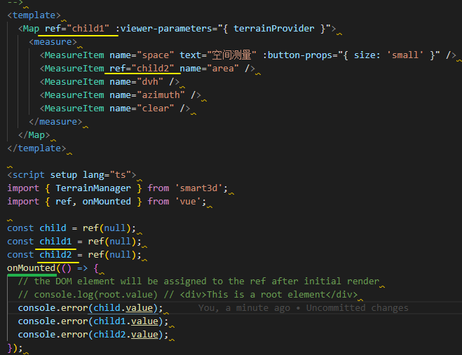
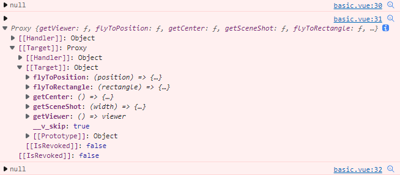
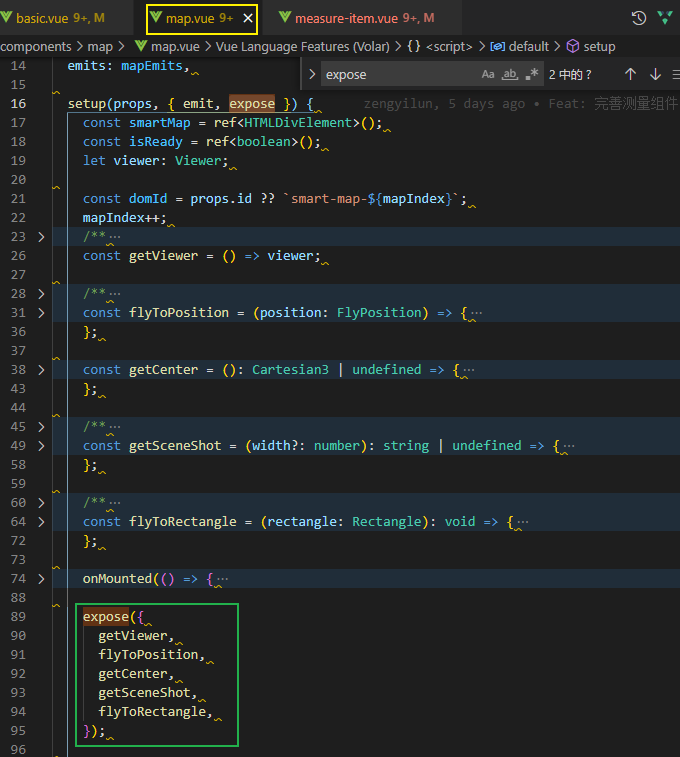
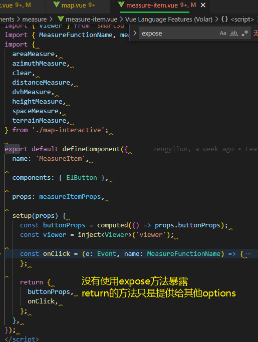
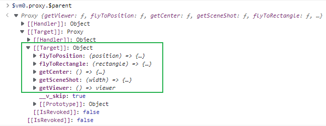

### vue3 setup使用ref访问子组件的方式

除了options中使用$refs访问 子组件的方式

```vue
<Child ref="child"></Child>
<script>
import { ref } from 'vue';
export default {
    setup() {
        const child = ref(); // 变量child对应模板ref的属性值
    }
}
</script>

```



控制台输出结果: 



第一个null为普通响应式数据

第二个输出代理对象为Map使用setup expose暴露的结果



第三个输出null是因为MeasureItem没有使用expose方法暴露任何的数据



> 需要在mounted之后才能访问对应的元素/组件


### ref增加带类型区分

为了区分普通响应式数据和组件/元素, 可以在使用ref时增加类型标识

```ts
const smartMap = ref<HTMLDivElement>();
const isReady = ref<boolean>();

<div :id="domId" ref="smartMap" class="smart-map"></div>
```

与ref同名的变量将访问HTML元素, 或者自定义组件类型用于标识

普通的ref则关联基础数据类型标识


## 通过$vm0.proxy.$parent来访问父组expose的内容



`$refs`, `$root` 均为同一性质
