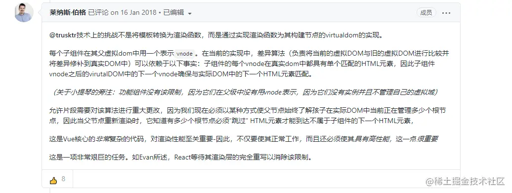

[TOC]

# 如何评价 Naïve UI? [#](https://www.zhihu.com/question/463736268/answer/1928240435)

[Naive UI - Naive UI](https://www.naiveui.com/zh-CN/os-theme/docs/introduction)

[6.7K Star 的知名开源项目源码，该怎么看？ (qq.com)](https://mp.weixin.qq.com/s/EGJmPAvdcxOqfG71RAElBw)


## [node_modules 困境 - 知乎 (zhihu.com)](https://zhuanlan.zhihu.com/p/137535779)


## iScene漫游中的速度设置

```ts
this.viewer.clock.multiplier = parseFloat(val);
```

通过修改时间倍数来实现


## 为什么emit没触发

```js
{
setup() {
    emit('fly', flyManager);
    function fly() {
        emit('flyStart', flyManager);
	}
}
}
```

在函数体内部的emit执行后不会执行绑定的监听函数

执行fly时并不能触发绑定在flyStart事件上的监听函数


### 顶层的绑定会被暴露给模板

当使用 `<script setup>` 的时候，任何在 `<script setup>` 声明的顶层的绑定 (包括变量，函数声明，以及 import 引入的内容) 都能在模板中直接使用

```vue
<script setup>
// 变量
const msg = 'Hello!'

// 函数
function log() {
  console.log(msg)
}
</script>

<template>
  <div @click="log">{{ msg }}</div>
</template>
```

Q: 函数表达式/箭头函数应该也同样是符合的吗?

如果从字面意思来看是不符合的




