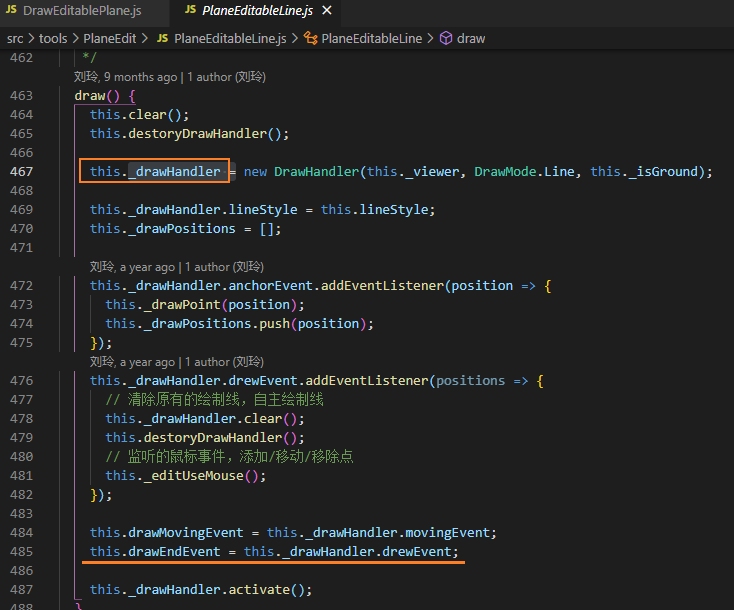
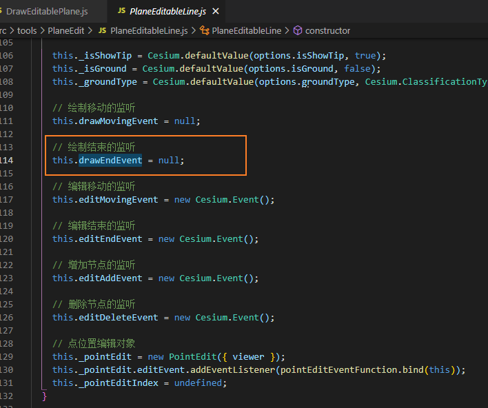
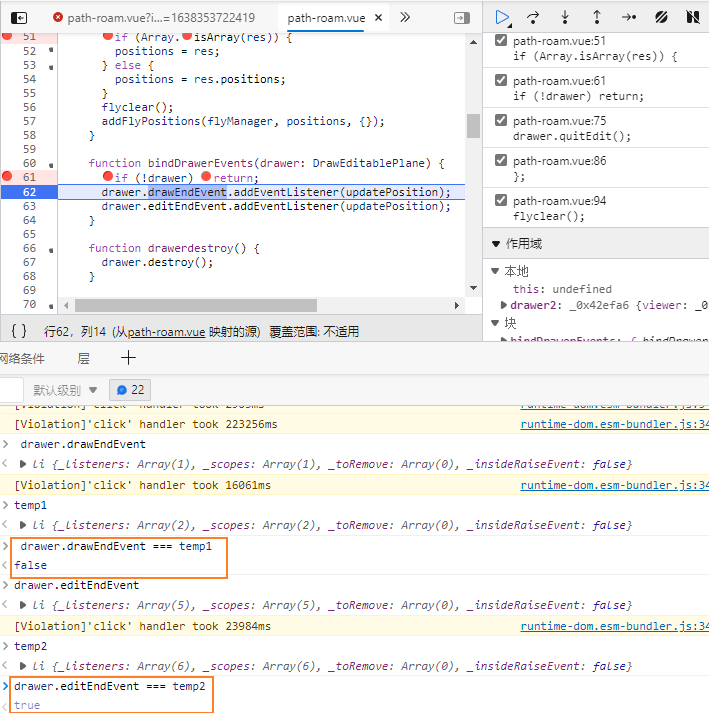
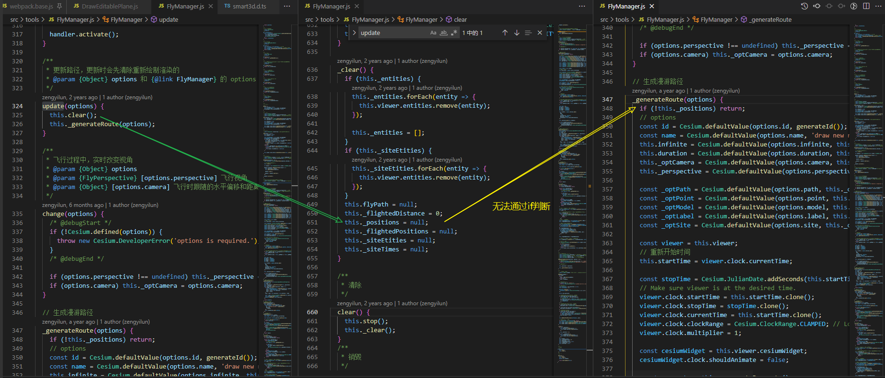

## smart3d.DrawEditablePlane

clear之后在draw无法激活drawEndEvent的事件,需要重新绑定;

从代码来理解draw后就是绑定的事件监听已经被重置了

但是editEndEvent事件却不用额外绑定, 表现不一; 使用起来有存在重复监听, 内存泄露的风险; 

​	

两种不同的事件有不一样的事件监听...

### 绘制API

绘制API中的各种事件表现不一致

部分会在使用时清除掉已经监听的事件对象, 再新建一个新的对象

有部分也是始终存在的

主要是事件的生成方式不统一

`new drawHander()` 后通过引用访问, 后又重新实例化了`drawHander`取引用来覆盖

`new Cesium.Event()` 则保持单一实例

### 飞行管理的更新API有逻辑问题

公开属性未更新声明文件...
