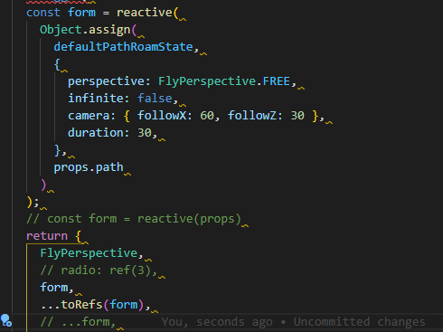
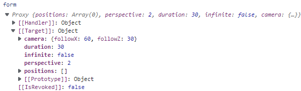
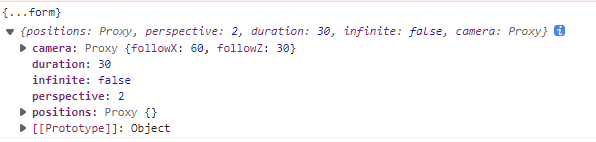
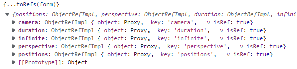
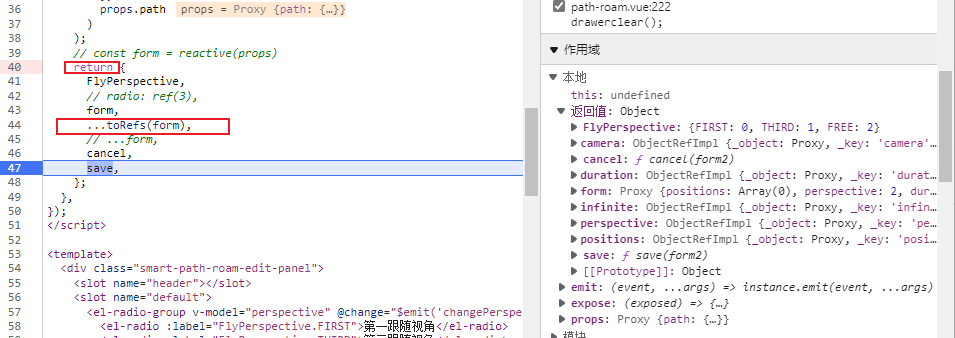
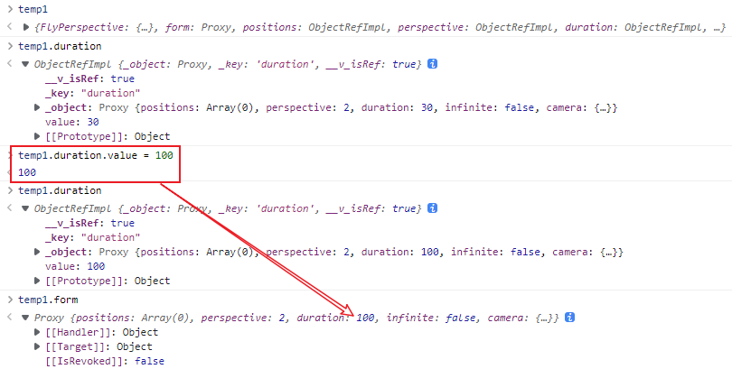

### Vue3 reactive对象作为响应式?



有个嵌套对象form, 如果在template中不使用form.前缀来访问其内部的对象, 要先将其属性全部返回.



form是一个代理对象

应该如何处理?

```ts
return {
    ...form; // 这样返回是不具有响应式的
}
```

使用拓展运算符直接对form解构的结果



子项属性不具有Vue的响应式处理

```ts
return {
    ...toRefs(form); // 这样返回
}
```



其属性都进行了响应式处理



**追问: 对子项属性更改后会影响到form吗?**

对setup返回的对象进行调试, 发现是可以同步数据的


